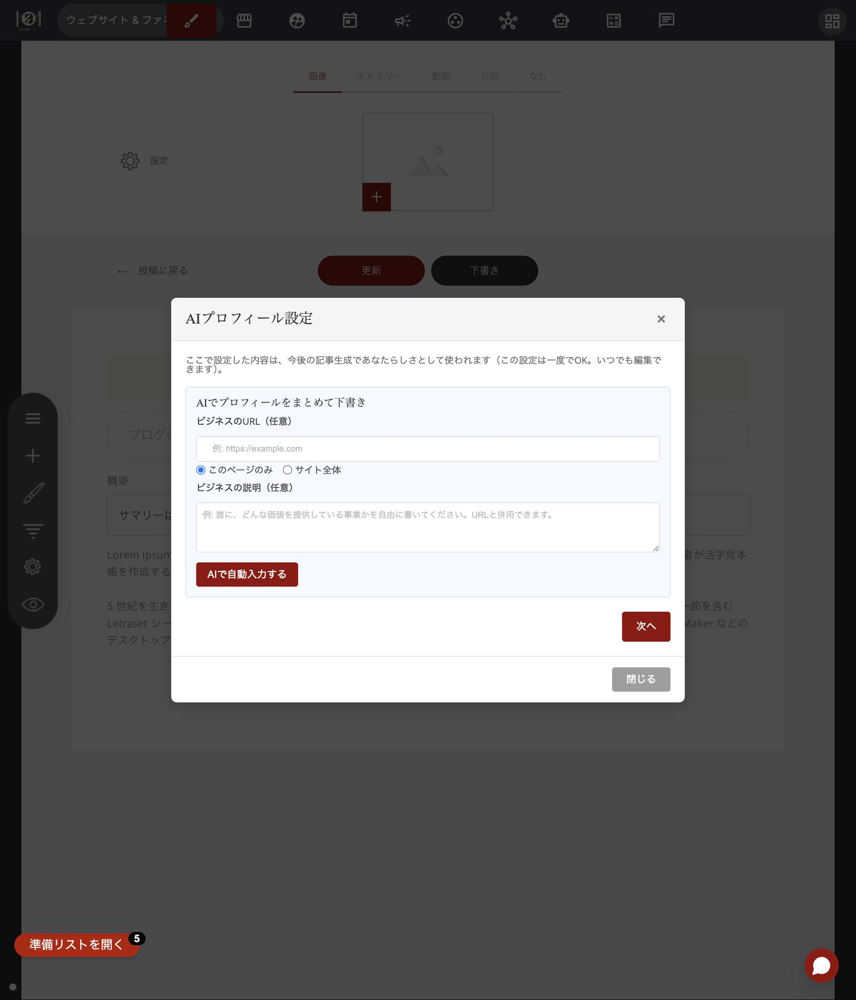

# AIプロフィール設定の使い方

## これは何のための機能？

AIプロフィール設定は、記事を作るたびに「毎回同じことを聞かれるのが面倒」を解消するための機能です。ブログ記事一覧画面の「**🧠 AIプロフィール設定**」ボタンから開きます。

ここで設定した肩書き・経歴・文体・NGワード（避けたい表現）などは、**以降のすべての記事生成に自動で反映**されます。一度設定すればOKです。記事を作るたびに「あなたはどんな仕事をしていますか？」といった同じ質問に答え直す必要がなくなり、[ブログ集客AI](premium-article-generator.md)のAIインタビューも、その記事に固有の質問だけになります。

画面は2ページ構成です。

1. **ページ1** — AIに8項目をまとめて下書きしてもらう
2. **ページ2** — 下書きされた内容を確認・編集して保存する

## ページ1｜AIにまとめて下書きしてもらう

8項目を自分でゼロから打ち込むのは大変です。そこでページ1では、材料を渡すだけでAIに下書きを任せられます。

「**ビジネスのURL**」欄にあなたのサイトのURLを入力すると、AIがそのページを読み取って、8項目を自動で下書きしてくれます。URLの参照範囲はラジオボタンで選べます。

* 「**このページのみ**」 — 入力したURLの1ページだけを読み取ります
* 「**サイト全体**」 — トップページから会社概要・サービス・料金などのページを自動で探して、あわせて読み取ります（最大5ページ程度）。より詳しい下書きが欲しいときにおすすめです

迷ったら「このページのみ」で十分なことが多いです。まずは軽く試して、物足りなければサイト全体で作り直してみてください。

<figure><figcaption>ページ1の画面。URL・参照範囲・ビジネスの説明を入力して「AIで自動入力する」を押します</figcaption></figure>

「**ビジネスの説明**」欄には、誰に・何を提供しているビジネスかを自由な文章で書けます。サイトを持っていない方はこちらだけでも大丈夫ですし、URLと併用すれば、サイトに書いていない情報をAIに補足できます。

URLも説明も空のままでも構いません。その場合は「**次へ**」ボタンでそのままページ2に進み、8項目を自分で手入力する流れになります。

材料を入れたら「**AIで自動入力する**」ボタンをクリックしてください。AIが内容を読み取って8項目を埋め、自動的にページ2へ進みます。

## ページ2｜内容を確認して保存する

ページ1から自動で（または「**次へ**」ボタンで）進んだ先の画面です。次の9項目が並んでいます。

| 項目 | 何を書く欄か |
| --- | --- |
| 肩書き・ひとことプロフィール | あなた（あなたのビジネス）を一言でいうと何か |
| 経歴・実績 | 信頼につながる経験や数字（例: 10年間で1,000人を指導） |
| 商品・サービス | 何を提供しているか |
| 主なターゲット読者 | 記事を届けたい相手はどんな人か |
| 文体・トーンの希望 | 記事の雰囲気（例: 親しみやすく、断定は控えめ） |
| 避けたい表現・NGワード | 使ってほしくない言い回しや業界NG表現 |
| 顧客からよく聞かれる質問 | お客様から実際によく受ける質問 |
| CTA候補 | 記事の最後に案内したい行動（例: 無料相談に申し込む） |
| 製品・サービスの詳細情報（参照用・任意） | 下で説明する特別な欄です |

最後の「**製品・サービスの詳細情報**」だけは、他の8項目と役割が違います。ここには、機能一覧・仕様・料金プラン・よくある誤解などを、詳しく貼り付けておきます。この欄は、AIが記事を書くときに、この内容を超えて機能や仕様を勝手に創作しないための「**正解データ**」として使われます。[ブログ集客AI](premium-article-generator.md)の公開前ファクトチェックでも、記事内の自社機能・仕様の記述がここに書いた内容と食い違っていないかの確認に使われます。最大4,000字まで入力できます。

特に、自社の商品・サービスそのものを紹介する記事を書くときに効果を発揮します。AIは実際にはない機能名をそれらしく書いてしまうことがあるため、この欄に正しい情報を貼っておくことで、そうした誤りを防ぎやすくなります。

<figure><figcaption>ページ2の確認・編集画面（内容は設定例です）。「製品・サービスの詳細情報」欄も含めて保存した内容が毎回の記事生成に使われます</figcaption></figure>


**大事なポイント:** AIが自動入力した内容は、あくまで「下書き」です。そのまま使わず、必ず一度目を通して、事実と違うところを直し、自分の言葉に整えてから保存することをおすすめします。ここに書いた内容が今後のすべての記事の土台になるからです。なお「**製品・サービスの詳細情報**」欄はAIの自動下書きの対象外で、ご自身で入力していただく項目です。


安心して使えるポイントも2つあります。

* AIは、**すでに何か入力されている項目には上書きしません**（空欄だけを埋める仕様です）。2回目以降に自動入力を使っても、書きかけの内容が消える心配はありません
* 「**← 戻る**」でページ1に戻っても、入力内容は消えません。「**保存**」を押して初めて内容が確定します

## 上手に使うコツ

* **最初はURLか説明文、どちらか一つでOK** — あとから「戻る」でやり直しても内容は消えません。気軽に試してください
* **AIの下書きは「叩き台」と考える** — 特にNGワードと文体は、あなた自身の言葉で調整するほど、生成される記事の精度が上がります
* **より具体的な下書きが欲しければ「サイト全体」** — 経歴や商品・サービスの記載が、1ページだけのときより具体的になりやすいです
* **一度保存しておくと、毎回の記事作りが時短になる** — 以降の記事生成・AIインタビューでは基本情報を聞かれなくなり、その記事に固有の質問だけに集中できます
