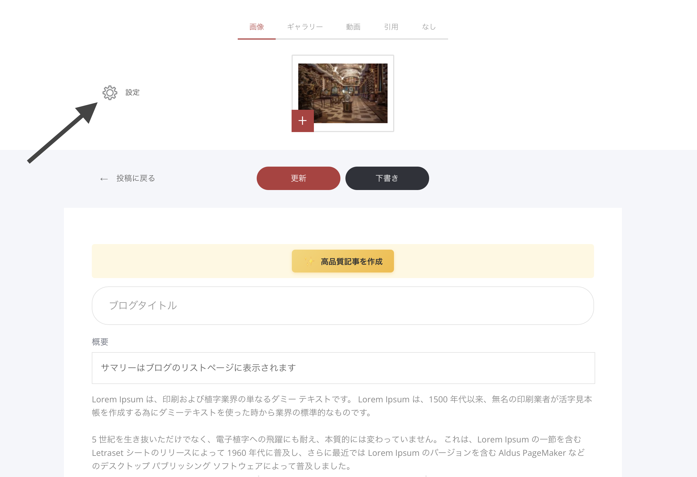

# 記事設定

ブログの記事ごとに、個別の設定ができます。記事の編集画面で、画面左上にある「設定（歯車アイコン）」をクリックしてください。

<figure><figcaption></figcaption></figure>

#### 記事設定メニューでできること

* サイドバーを表示／非表示にする
* ヘッダーを表示／非表示にする
* アイキャッチ画像／ギャラリーを拡大表示する
* コメントを有効にする（読者がコメント投稿できるようにする）
* コメント承認を有効にする（新しいコメントは承認後に記事ページへ表示されます）
* シェアボタンを追加／削除する
* タグを設定する（記事をグループ分けしやすくする）
* カテゴリーを設定する
* 記事URLを設定する
* 投稿者（著者）を設定する
* 投稿日を設定する
* コメント一覧を見る
