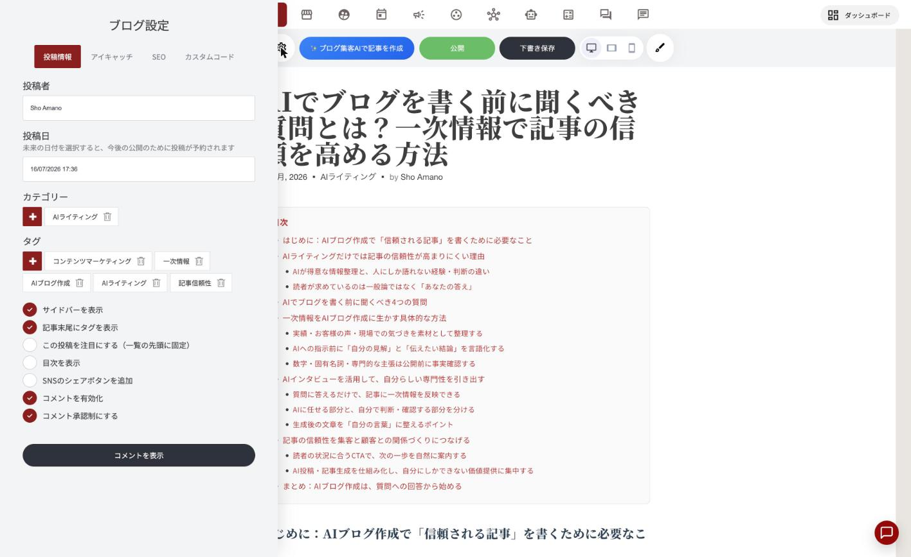

# 記事設定

ブログの記事ごとに、個別の設定ができます。記事の編集画面で、画面左上にある「設定（歯車アイコン）」をクリックしてください。

<figure><figcaption></figcaption></figure>

設定画面は4つのタブに分かれています。探している項目がどのタブにあるかは、下の表をご覧ください。

| タブ          | できること                                  |
| ----------- | -------------------------------------- |
| **投稿情報**    | 投稿者、投稿日、カテゴリー、タグ、サイドバーやコメントの表示切り替え     |
| **アイキャッチ**  | 記事のメイン画像（画像・ギャラリー・動画から選べます）と、画像の代替テキスト |
| **SEO**     | 記事URL（スラッグ）、メタディスクリプション                |
| **カスタムコード** | この記事だけに適用するコードの追加（上級者向け）               |

#### 記事設定メニューでできること

* サイドバーを表示／非表示にする
* 記事末尾にタグを表示する
* この投稿を注目にする（一覧の先頭に固定する）
* 目次を表示する
* シェアボタンを追加／削除する
* コメントを有効にする（読者がコメント投稿できるようにする）
* コメント承認を有効にする（新しいコメントは承認後に記事ページへ表示されます）
* タグを設定する（記事をグループ分けしやすくする）
* カテゴリーを設定する
* 記事URLを設定する
* 投稿者（著者）を設定する
* 投稿日を設定する
* コメント一覧を見る


**設定を変えたら、必ず保存してください**\
設定画面を閉じただけでは保存されません。画面の外側をクリックして設定画面を閉じたあと、［公開］または［下書き保存］を押してください。


***


**自分の場合はどう使えばいいか**

[ブログ集客AIの全体像](https://opusbooster.com/blog-ai)を見る。設計から相談したい方は[15分の無料相談](https://opusbooster.com/consultation)、まず触ってみたい方は[14日間の無料トライアル](https://opusbooster.com/register)（クレジットカード不要）から。

