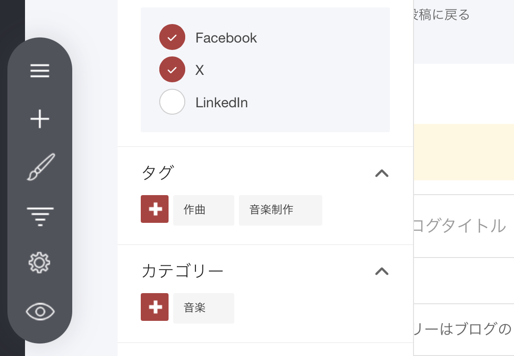
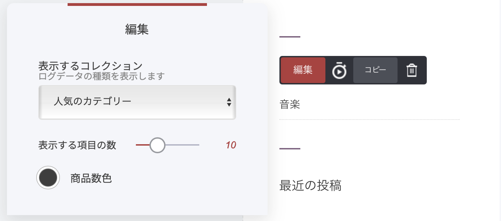

# ブログ記事のカテゴリー

カテゴリーを使うと、記事をテーマ別に整理できます。読者は、あなたが作成したカテゴリーで記事を絞り込めるようになります。なお、1つの記事（投稿）は複数のカテゴリーに設定できます。

#### 記事をカテゴリーに追加する方法

1. 対象の記事（投稿）を開きます
2. 記事の「設定」メニューを開きます
3. ［カテゴリー］メニュー内の「＋」ボタンをクリックします
4. カテゴリー名を入力するか、一覧から選択します
5. 保存します

#### カテゴリーをサイトに表示する方法

カテゴリーは、[ブログウィジェット](../../platform/wijetto/buroguwijetto.md)を使うことでサイドバー（またはサイト内の任意の場所）に表示できます。

1. ページ上の表示したい場所に、ブログウィジェットをドラッグ＆ドロップします
2. ウィジェット設定のドロップダウンから［人気のカテゴリー］を選択します

