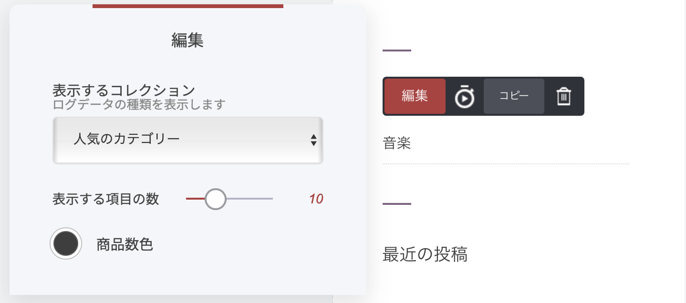

# ブログ記事のカテゴリー

カテゴリーを使うと、記事をテーマ別に整理できます。読者は、あなたが作成したカテゴリーで記事を絞り込めるようになります。なお、1つの記事（投稿）は複数のカテゴリーに設定できます。

#### 記事をカテゴリーに追加する方法

1. 対象の記事（投稿）を開きます
2. 画面左上の「設定（歯車アイコン）」をクリックします
3. ［**投稿情報**］タブの［カテゴリー］にある「＋」ボタンをクリックします
4. カテゴリー名を入力するか、一覧から選択します
5. 設定画面を閉じて、［公開］または［下書き保存］で保存します


**カテゴリーは1つ以上必要です**\
記事を保存するには、カテゴリーが少なくとも1つ設定されている必要があります。設定していない場合は保存時にお知らせが表示されますので、そのときに追加してください。


#### カテゴリーをサイトに表示する方法

カテゴリーは、[ブログウィジェット](../../platform/widgets/blog-widget.md)を使うことでサイドバー（またはサイト内の任意の場所）に表示できます。

1. ページ上の表示したい場所に、ブログウィジェットをドラッグ＆ドロップします
2. ウィジェット設定のドロップダウンから［人気のカテゴリー］を選択します

***


**自分の場合はどう使えばいいか**

[ブログ集客AIの全体像](https://opusbooster.com/blog-ai)を見る。設計から相談したい方は[15分の無料相談](https://opusbooster.com/consultation)、まず触ってみたい方は[14日間の無料トライアル](https://opusbooster.com/register)（クレジットカード不要）から。

