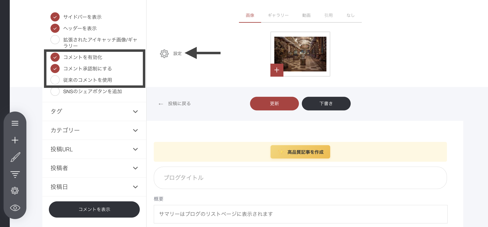
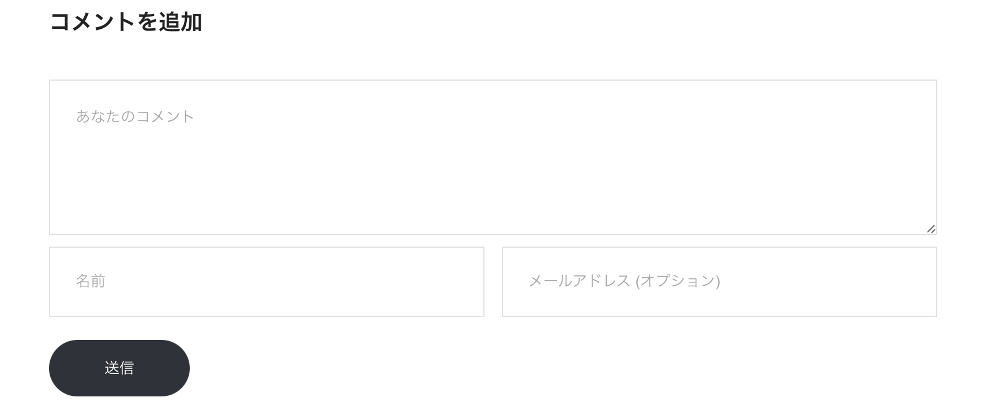
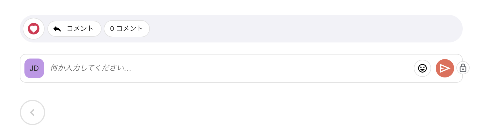

# ブログ記事のコメント機能

読者やコミュニティメンバーが記事にコメントできるようにすると、反応や会話が生まれ、エンゲージメントが高まります。コメント機能を使うには、ブログ設定でコメントを有効化してください。意見や感想を集めやすくなります。

### コメント機能を有効にする方法

コメントの表示形式は、次の2種類から選べます。

* **従来のコメント**：従来型のコメント欄（一般的な形式）
* **コメントウィジェット**：新しい形式のコメント機能（カスタマイズ可能で、ページに自然に組み込めます）

***

### 従来のコメント

従来のコメントは、**ログインなし**でサイト訪問者がコメントできる方式です。\
読者は、**メールアドレスを入力してもしなくても**コメントできるため、気軽に参加してもらいやすいのが特徴です。

#### 従来のコメントの管理（モデレーション）

承認機能をオンにしている場合は、コメントを公開する前に内容を確認できます（承認は任意です）。\
コメントの管理はブログ設定画面から行えます。

**コメント管理の手順**

* **［コメント］セクションを開く**：記事設定メニューの下部にあります
* **既存のコメントを確認する**：読者の反応をチェックできます
* **コメントを承認する**：有益なコメントを公開します
* **コメントを削除する**：不適切・不要なコメントを削除します

従来のコメントを有効にすると、気軽な参加を促しつつ、必要に応じて内容もコントロールできます。

***

### メンバーコメント

メンバーコメントは、レガシーコメントよりも管理性が高く、**認証済みのメンバーだけ**がコメントできる方式です。\
安全で質の高い議論の場を保ちやすくなります。

#### 主な特徴

* **アクセス制限**：コメントできるのは認証済みメンバーのみ
* **承認通知**：確認が必要な新規コメントがあると通知を受け取れます
* **返信機能**：管理画面（承認エリア）から直接返信できます

ブログ設定でメンバーコメントを有効にすると、コミュニティ内での「濃い交流」や「意味のあるやりとり」を育てやすくなります。

