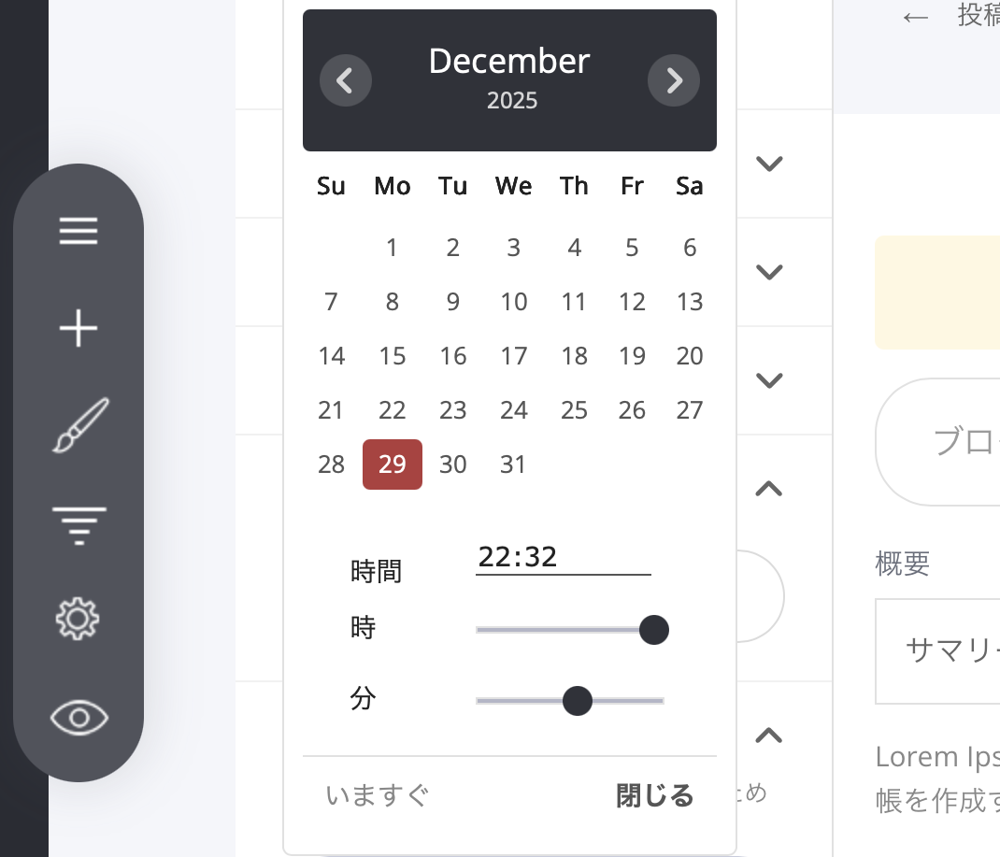

# ブログ記事の公開日

### 記事の公開日時を設定する方法

[記事設定メニュー](./)を開き、［**投稿情報**］タブの［投稿日］で、公開したい「日付」と「時刻」を選択します。

### 記事を未来の日時に予約投稿する方法

記事メニューの［投稿日］に、未来の「日付」と「時刻」を設定すると、その日時に自動で公開されるように予約されます。設定したら、そのまま保存するだけでOKです。

***


**自分の場合はどう使えばいいか**

[ブログ集客AIの全体像](https://opusbooster.com/blog-ai)を見る。設計から相談したい方は[15分の無料相談](https://opusbooster.com/consultation)、まず触ってみたい方は[14日間の無料トライアル](https://opusbooster.com/register)（クレジットカード不要）から。

