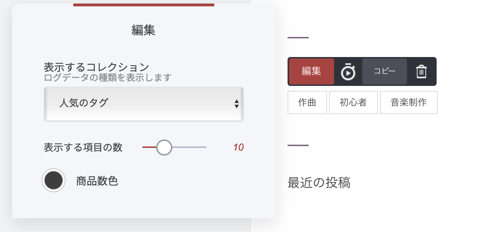

# ブログ記事のタグ

タグは、記事をテーマ別に整理するのに便利です。読者も、付けたタグを使って記事を絞り込めるようになります。タグは1つの記事に複数付けられます。

### 記事にタグを付ける方法

タグを追加するには、対象の記事（投稿）を開き、[記事設定メニュー](./)に進みます。［タグ］メニュー内の「＋」ボタンをクリックし、タグ名を入力するか一覧から選択して、保存してください。

#### タグの表示場所

タグは、記事の本文の下に表示されます。

#### タグを好きな場所に表示する

タグは、[ブログウィジェット](../../platform/wijetto/buroguwijetto.md)を使えばサイドバー（またはサイト内の任意の場所）にも表示できます。手順は以下の通りです。

1. 表示したい場所に「ブログ」ウィジェットをドラッグ＆ドロップします。
2. ウィジェット設定のドロップダウンから［人気のタグ］を選択します。

