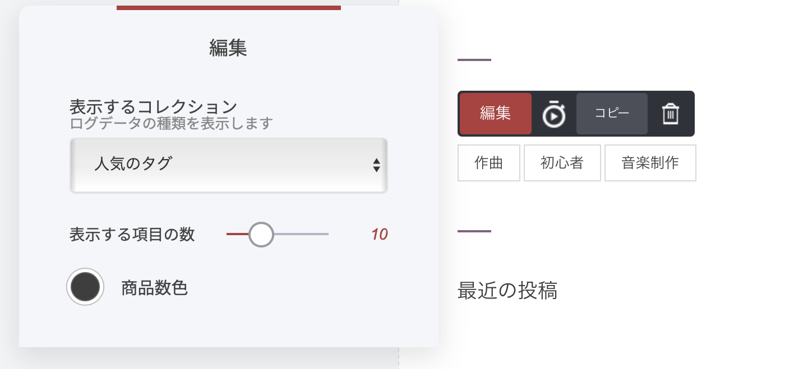

# ブログ記事のタグ

タグは、記事をテーマ別に整理するのに便利です。読者も、付けたタグを使って記事を絞り込めるようになります。タグは1つの記事に複数付けられます。

### 記事にタグを付ける方法

1. 対象の記事（投稿）を開きます
2. 画面左上の「設定（歯車アイコン）」をクリックします
3. ［**投稿情報**］タブの［タグ］にある「＋」ボタンをクリックします
4. タグ名を入力するか、一覧から選択します
5. 設定画面を閉じて、［公開］または［下書き保存］で保存します

#### タグの表示場所

タグは、記事の本文の下に表示されます。表示のオン／オフは、［投稿情報］タブの「記事末尾にタグを表示」で切り替えられます。

#### タグを好きな場所に表示する

タグは、[ブログウィジェット](../../platform/widgets/blog-widget.md)を使えばサイドバー（またはサイト内の任意の場所）にも表示できます。手順は以下の通りです。

1. 表示したい場所に「ブログ」ウィジェットをドラッグ＆ドロップします。
2. ウィジェット設定のドロップダウンから［人気のタグ］を選択します。

***


**自分の場合はどう使えばいいか**

[AI機能の全体像](https://opusbooster.com/ai)を見る。設計から相談したい方は[15分の無料相談](https://opusbooster.com/consultation)、まず触ってみたい方は[14日間の無料トライアル](https://opusbooster.com/register)（クレジットカード不要）から。

