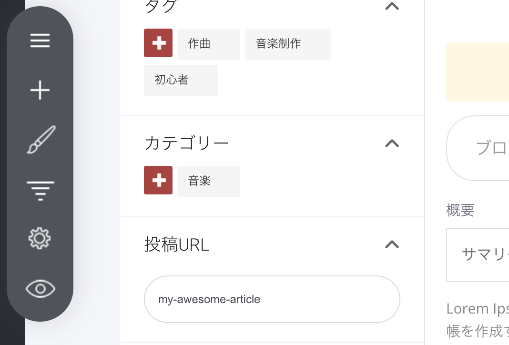

# ブログ記事のURL

ブログ記事（投稿）のURLを設定・変更するには、[記事設定メニュー](./)にある［投稿URL］の項目を開きます。

ここで、URLの最後の部分（スラッグ）を入力できます。通常は、記事名（タイトル）に近い内容にします。

**例**\
スラッグに「my-awesome-article」と入力した場合、記事のURLは\
「（あなたのドメイン）/blog/my-awesome-article」\
になります。
