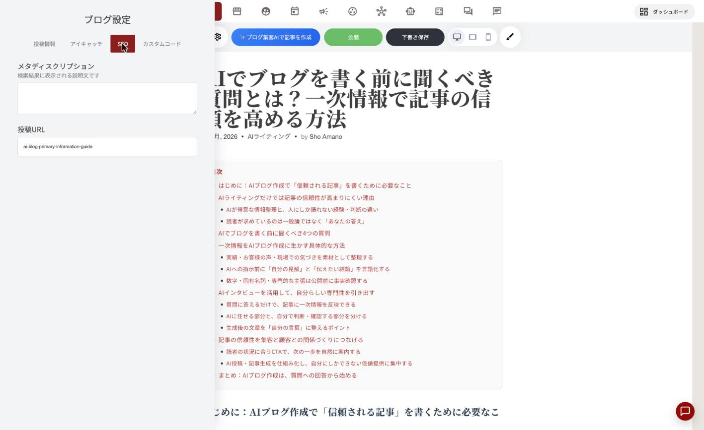

# ブログ記事のURL

ブログ記事（投稿）のURLを設定・変更するには、[記事設定メニュー](./)を開き、［**SEO**］タブにある［投稿URL］の項目を使います。

ここで、URLの最後の部分（スラッグ）を入力できます。通常は、記事名（タイトル）に近い内容にします。

**例**\
スラッグに「my-awesome-article」と入力した場合、記事のURLは\
「（あなたのドメイン）/blog/my-awesome-article」\
になります。


**日本語のままでも問題ありません**\
スラッグは英数字で入力するのが一般的ですが、日本語のままでも記事は正しく表示されます。英数字にする場合は、記事の内容がわかる短い単語をハイフンでつなぐと読みやすくなります。


***


**自分の場合はどう使えばいいか**

[AI機能の全体像](https://opusbooster.com/ai)を見る。設計から相談したい方は[15分の無料相談](https://opusbooster.com/consultation)、まず触ってみたい方は[14日間の無料トライアル](https://opusbooster.com/register)（クレジットカード不要）から。

