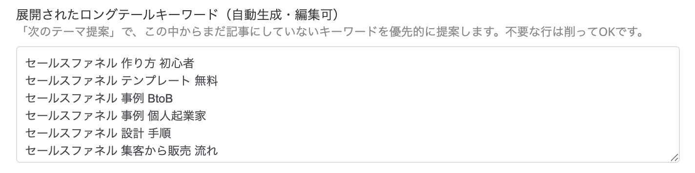
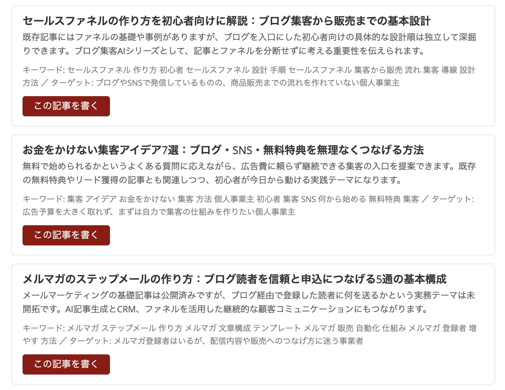

# ドリーム100キーワードの使い方｜何を書くかに迷わない仕組み

## なぜ「ドリーム100キーワード」が必要か（まず30秒で）

ブログを書き続けても集客が伸び悩む一番よくある原因は、「毎回、思いつきでネタを決めている」ことです。書くたびにゼロからテーマを考えていると、だんだん苦しくなってきます。

そこで役立つのが「**ドリーム100キーワード**」という考え方です。見込み客が検索する主要なキーワードを10個決め、そこから枝葉のキーワードを9個ずつ広げると、合計100個のキーワードリストができあがります。このリストがあれば、検索から見つけてもらいやすい記事を、狙いを持って積み上げていけます。

> 「ドリームキーワードを10個決めれば、そこから9個ずつロングテールを広げて100個になる。この100個があなたのSEO戦略の骨格になる。」（Russell Brunson『Traffic Secrets』Secret 12より要約）

OpusBoosterでは、この考え方を**AIプロフィール設定に10個入力するだけで100個に自動展開**し、[「次のテーマ提案」](premium-article-generator.md)で**まだ書いていないキーワード**を優先的に提案する形で実装しています。つまり、「毎回ゼロからネタを考える」状態から、「戦略に沿って積み上げる」状態に変わります。

## ドリームキーワードとは（10個の選び方）

まず、2つの言葉を押さえておきましょう。

* **ドリームキーワード** — 見込み客が最初にGoogleに打ち込みそうな、主要なテーマワード。1〜3語程度の短めの言葉が目安です
* **ロングテールキーワード** — ドリームキーワードに具体的な条件・悩み・目的を足した、より長い検索フレーズ（例:「セールスファネル 作り方 初心者」）。検索している人の意図が絞られているぶん、記事1本で答えやすく、成約にもつながりやすいのが特徴です

10個の選び方に迷ったら、次の3つの視点で書き出してみてください。

* 自分の商品・サービスと直結する言葉を3〜5個
* 見込み客が抱えている「悩み」「困りごと」を言語化した言葉を3〜5個
* 業界の一般用語や、周辺分野の言葉を1〜2個

たとえばOpusBoosterユーザーの場合、「セールスファネル」「集客」「メルマガ」「オンライン講座」「LP 作り方」「コーチング 集客」「Zoom セミナー」といった言葉が挙げられます。

迷ったら、[AIプロフィール設定](ai-profile-settings.md)の「肩書き」「商品・サービス」「主なターゲット」に書いた内容を眺めて、そこに出てくる名詞を並べてみましょう。あとで足しても消してもよいので、まずは思いつく5〜10個で始めてみてください。

## ドリームキーワードを入力する

ブログ記事一覧画面の「**🧠 AIプロフィール設定**」を開き、**2ページ目**の下の方までスクロールしてください（「AIで自動入力する」を使わずに手入力で進む場合も、同じ場所に欄があります）。

「**🌱 ドリームキーワード（最大10個・任意）**」欄に、キーワードを**改行区切り**または**カンマ区切り**で入力します。

```
セールスファネル
集客
メルマガ
オンライン講座
```

大文字/小文字や全角/半角スペースの違いは自動で吸収され、同じキーワードは自動で1つにまとめられます。11個以上入れても、最初の10個までが有効です。

<figure><figcaption>AIプロフィール設定2ページ目の「ドリームキーワード」欄。改行かカンマ区切りで入力します</figcaption></figure>

## 「🌱 100キーワードに展開」ボタンで一気に広げる

ドリームキーワードを入力したら、その下の「**🌱 100キーワードに展開**」ボタンを押しましょう。

AIが、入力した各ドリームキーワードから**9個ずつのロングテールキーワード**を生成します（最大で10×9=90個ほど。多少前後することがあります）。生成された結果は、すぐ下の「**展開されたロングテールキーワード**」欄に自動で流し込まれます。

生成には数十秒かかることがあります（画面が「展開中…」と表示されます）。生成後は必ず内容を目で確認し、「これは違うな」というキーワードがあれば行ごと削ってしまって構いません。「**保存**」を押して初めて内容が確定します。

## ロングテールキーワードを育てる（追記・整理）

一度で完璧なリストにする必要はありません。まずは1回展開して「保存」してください。

後日、新しいドリームキーワードを追加してもう一度「**🌱 100キーワードに展開**」を押すと、**既存のリストに追記**されます（重複は自動で除去されます）。ロングテール欄は普通のテキストエリアなので、いつでも手動で1行ずつ書き加えたり、不要な行を削ったりできます。

目安として**50〜100個**ほどのロングテールが揃っていれば、その先1〜2年分の記事ネタになります。焦らず育てるつもりで大丈夫です。

<figure><figcaption>展開後の「ロングテールキーワード」欄。1つのドリームキーワードから複数のロングテールが生成されています</figcaption></figure>

## 「次のテーマ提案」がどう賢くなるか

ドリーム100を設定した状態で「**💡 次のテーマ提案**」を開くと、AIはこれまでと同じように公開済み記事の流れとプロフィール情報を分析しますが、**加えて「まだ記事にしていないキーワード」を最優先で提案する**ようになります。

5件の提案のうち、少なくとも2〜3件は、あなたが登録した未使用のロングテールキーワードで書けるテーマになります。提案ごとに「キーワード」欄が付いてくるので、そこに未使用キーワードが入っているかで確認できます。

OpusBoosterは、あなたの公開済み記事のタイトル・カテゴリ・タグを見て、そのロングテールキーワードがすでに扱われていれば「使用済み」とみなし、未使用のものを優先候補にします。難しい設定は必要なく、ドリーム100を登録しておくだけで自動的に働く仕組みです。

<figure><figcaption>「次のテーマ提案」モーダル。未使用のロングテールキーワードをもとにしたテーマが並んでいます</figcaption></figure>

## 上手に使うコツ

* **最初は5個から** — 10個埋めなくても大丈夫です。5個のドリームキーワードから45個のロングテールが出るだけでも、十分な出発点になります
* **ドリームキーワードは「見込み客の言葉」で** — 自分の業界用語ではなく、見込み客が使うであろう検索語で入れましょう（例: 業界人が使う「LTV最大化」ではなく、見込み客が使う「顧客単価 上げ方」）
* **ロングテールは「1記事で答えられる粒度」で** — 「集客」だけだと大きすぎます。「セールスファネル 作り方 初心者」のように、具体的な悩みが見える粒度が理想です
* **月に一度は見直す** — 実際に書いた記事と、まだ書いていないロングテールを見比べて、優先順位を付け直しましょう
* **公開したら「次のテーマ提案」で次を決める** — 記事を1本公開すると、未使用リストが自動的に減っていきます。書きっぱなしにせず、次のテーマ提案とセットで運用すると積み上がります
* **ドリームキーワード自体は本文生成に混入しません** — このリストは「次に書くテーマの選定材料」だけに使われます。本文の文体やトーンには影響しないので、安心して大量に入れて構いません

## よくある質問

**Q: 100個埋まらないとダメですか？**
A: いえ、5〜10個のロングテールでも十分効果はあります。育てる意識で気楽に始めてください。

**Q: ドリームキーワードを後で変えたら、ロングテールも作り直しですか？**
A: いえ、既存のロングテールはそのまま残り、追加のドリームキーワードから展開された分だけ末尾に追記されます。不要な行は手動で削れます。

**Q: 展開に失敗したエラーが出ました。**
A: しばらく待ってからもう一度「**🌱 100キーワードに展開**」を押してください。ネットワーク混雑時などに稀に失敗しますが、ボタンをもう一度押せば動きます。

## 次のステップ

ドリーム100が揃ったら、「**💡 次のテーマ提案**」を開いて、まずは1本、未使用キーワードのテーマから書き始めてみましょう。詳しい記事作成の流れは[ブログ集客AIの使い方](premium-article-generator.md)で解説しています。
