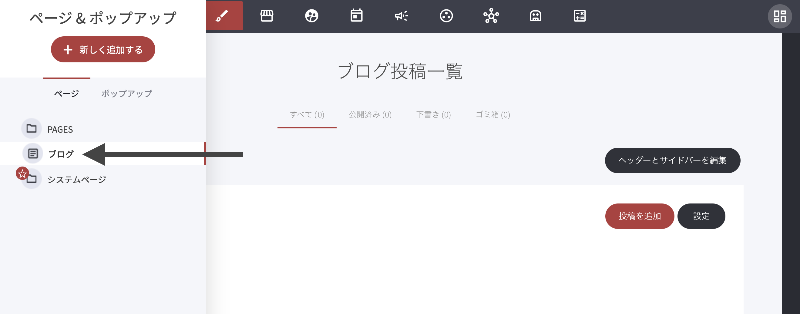
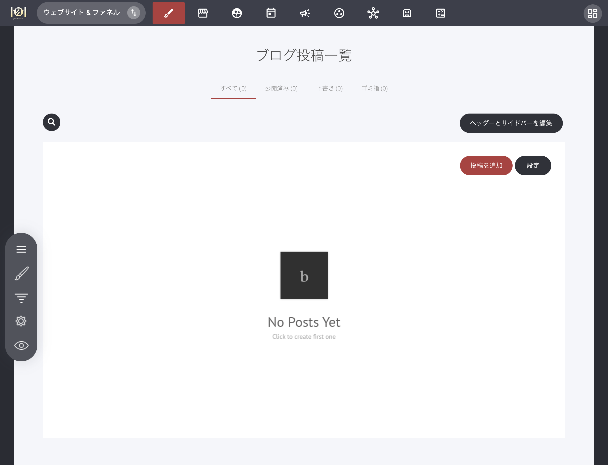

# 初期設定と基本手順

ブログの作業を始めるには、［ページ］メニューの中にある［ブログ］をクリックします。


［ブログ］が表示されていない場合は、\[+新しく追加する]をクリックし、\[ブログ]を追加してください。


すると、ブログ一覧のページが開き、新しい記事の追加などができるようになります。

この画面では、次の操作ができます。

* 表示を切り替える（すべて／公開済み／下書き／ゴミ箱）
* ブログのヘッダー・サイドバーを編集する
* 記事を追加する
* 選択した記事を削除する
* ブログ設定を変更する
* 記事一覧を確認する（コメント／著者／公開日も表示）
* 記事を複製する
* 記事をプレビューする
