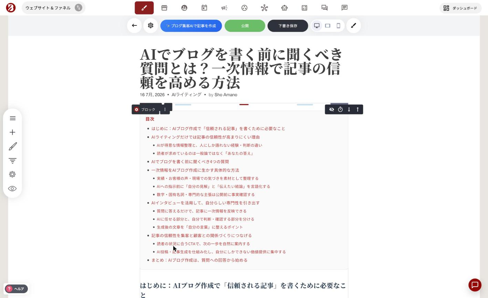

# 記事の基本

### 記事作成の流れ（概要）

ブログ記事を新しく作成するには［ブログ投稿を作成］をクリックします。既存の記事を編集する場合は、一覧から記事のタイトルをクリックしてください。

すると、記事エディターが開きます。

記事エディターでは、次の操作ができます。

* 記事のメイン画像（アイキャッチ）を変更する
* 記事タイトルを設定する（※これはSEOのH1見出しにもなります）
* 記事の概要（サマリー）を追加する
  * 概要はブログの一覧ページに表示されます
  * さらにSEOのメタディスクリプションとしても使われます
* ドラッグ＆ドロップのビルダーで記事本文を作成する
* 記事ごとの設定を調整する


**ブログ概要（サマリー）が思いつかないとき**\
何を書けばいいか迷う場合は、AIライティングアシスタントを使ってください。記事本文の内容をもとに、概要文を自動で作成してくれます。


### ［公開］と［下書き保存］の違い

どちらも「保存」ボタンですが、役割が違います。

#### 記事を公開する

［公開］を選ぶと、記事が公開され、サイトのブログに表示されます。\
すでに公開済みの記事の場合は、変更内容が反映されて更新されます。

#### 下書きとして保存する

あとで続きを書きたい場合は、［下書き保存］を押してください。公開はされず、下書きとして残ります。


**書いた内容は、どちらかのボタンを押すまで保存されません**\
記事エディターを離れる前に、必ず［公開］または［下書き保存］を押してください。


***


**自分の場合はどう使えばいいか**

[AI機能の全体像](https://opusbooster.com/ai)を見る。設計から相談したい方は[15分の無料相談](https://opusbooster.com/consultation)、まず触ってみたい方は[14日間の無料トライアル](https://opusbooster.com/register)（クレジットカード不要）から。

