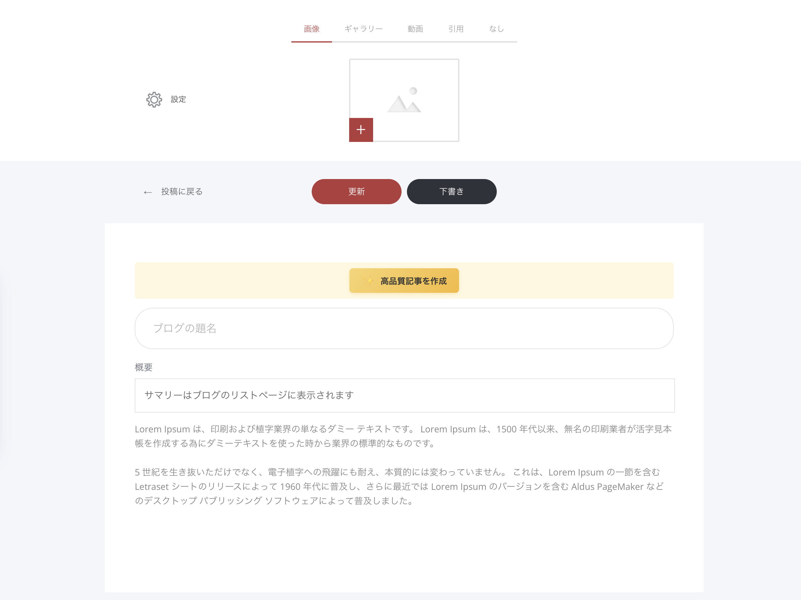
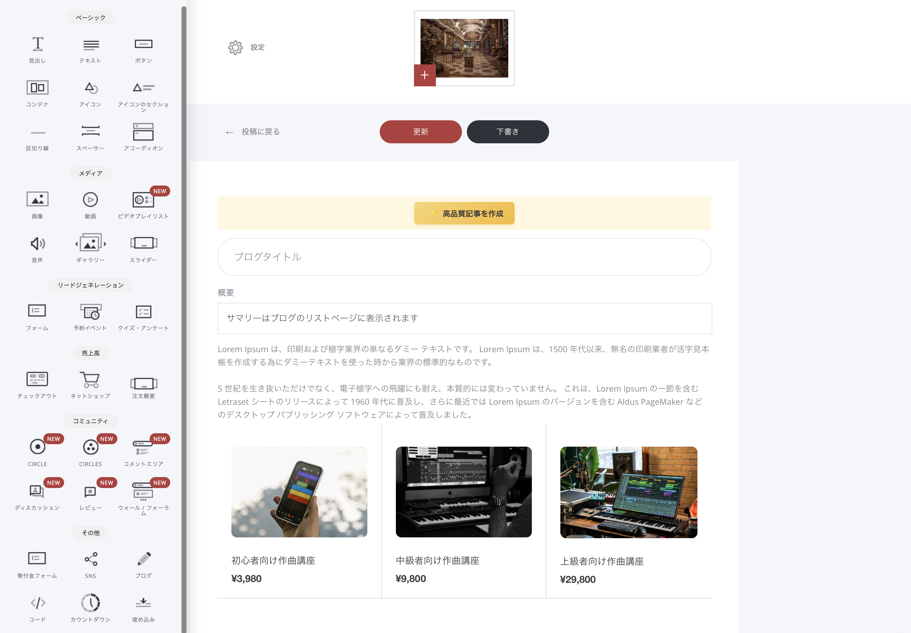
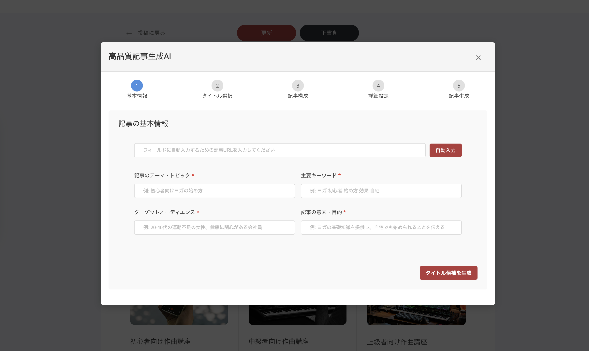

# 記事の内容

記事の内容は、概要欄の下にあるドラッグ＆ドロップ式のビルダーで作成できます。ページビルダーと同じように、ブロックやカラムを追加したり、ウィジェットメニューから好きなウィジェットを配置したりできます。

### AIに本文を書いてもらう

記事エディターの上部にある［**✨ ブログ集客AIで記事を作成**］ボタンから、AIに本文作成を任せることもできます。

<figure><figcaption></figcaption></figure>

テーマを入力すると、タイトル候補・記事構成・本文までを順番に作成します。カテゴリーやタグ、記事URLも自動で設定されます。

詳しい使い方は[ブログ集客AIの使い方](../premium-article-generator.md)をご覧ください。

---

<!-- cta:opusbooster -->

**自分の場合はどう使えばいいか**

[ブログ集客AIの全体像](https://opusbooster.com/blog-ai)を見る。設計から相談したい方は[15分の無料相談](https://opusbooster.com/consultation)、まず触ってみたい方は[14日間の無料トライアル](https://opusbooster.com/register)（クレジットカード不要）から。

