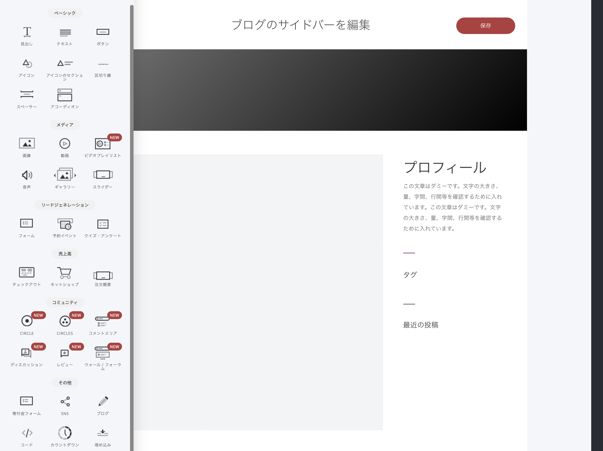

# ブログのヘッダー／サイドバー設定

ヘッダーとサイドバーは、各記事に共通で適用される基本テンプレートです。編集するには、［ヘッダーとサイドバーを編集］ボタンをクリックします。

リックするとドラッグ＆ドロップのエディターが開き、ブログのヘッダー部分と、（サイドバーを使用する場合は）サイドバーを編集できます。


必要に応じて、各種[ウィジェット](../../platform/wijetto/)を使い、ヘッダーやサイドバーに要素を追加できます。


