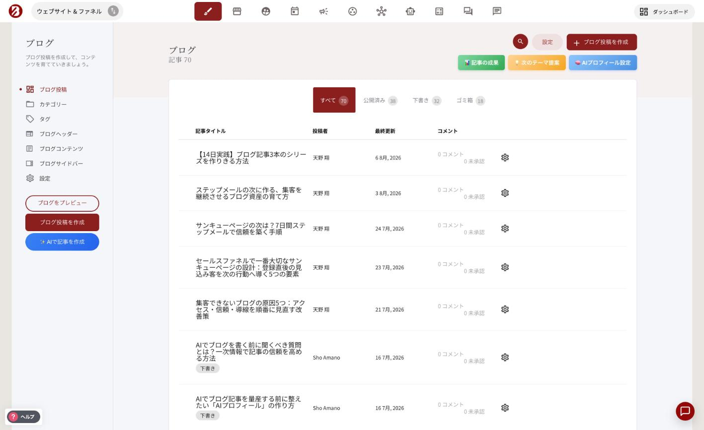
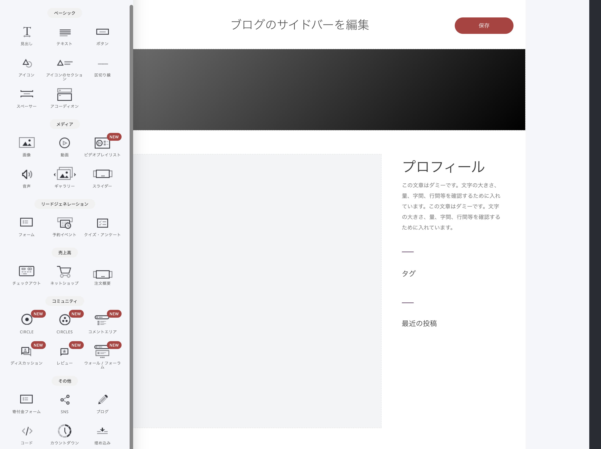

# ブログのヘッダー／サイドバー設定

ヘッダーとサイドバーは、各記事に共通で適用される基本テンプレートです。編集するには、［ヘッダーとサイドバーを編集］ボタンをクリックします。

リックするとドラッグ＆ドロップのエディターが開き、ブログのヘッダー部分と、（サイドバーを使用する場合は）サイドバーを編集できます。


必要に応じて、各種[ウィジェット](../../platform/widgets/)を使い、ヘッダーやサイドバーに要素を追加できます。


***


**自分の場合はどう使えばいいか**

[ブログ集客AIの全体像](https://opusbooster.com/blog-ai)を見る。設計から相談したい方は[15分の無料相談](https://opusbooster.com/consultation)、まず触ってみたい方は[14日間の無料トライアル](https://opusbooster.com/register)（クレジットカード不要）から。

