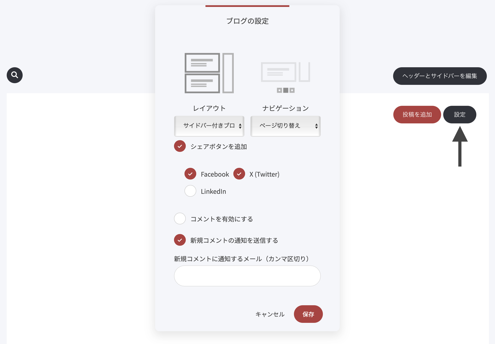

# ブログ設定

ブログの設定を変更するには、［設定］をクリックします。設定画面が開きます。

この画面では、次のことができます。

* ブログのメインページでの記事表示レイアウトを選ぶ
* ブログのメインページに表示するナビゲーション方法を選ぶ
* SNSシェアボタンを追加／削除する
* Disqusコメントを有効にする（外部のコメント機能。標準のコメント欄があるため基本的には不要です）
* 新しいコメントが届いたら、自分またはチームに通知を送る

---

<!-- cta:opusbooster -->

**自分の場合はどう使えばいいか**

[ブログ集客AIの全体像](https://opusbooster.com/blog-ai)を見る。設計から相談したい方は[15分の無料相談](https://opusbooster.com/consultation)、まず触ってみたい方は[14日間の無料トライアル](https://opusbooster.com/register)（クレジットカード不要）から。

