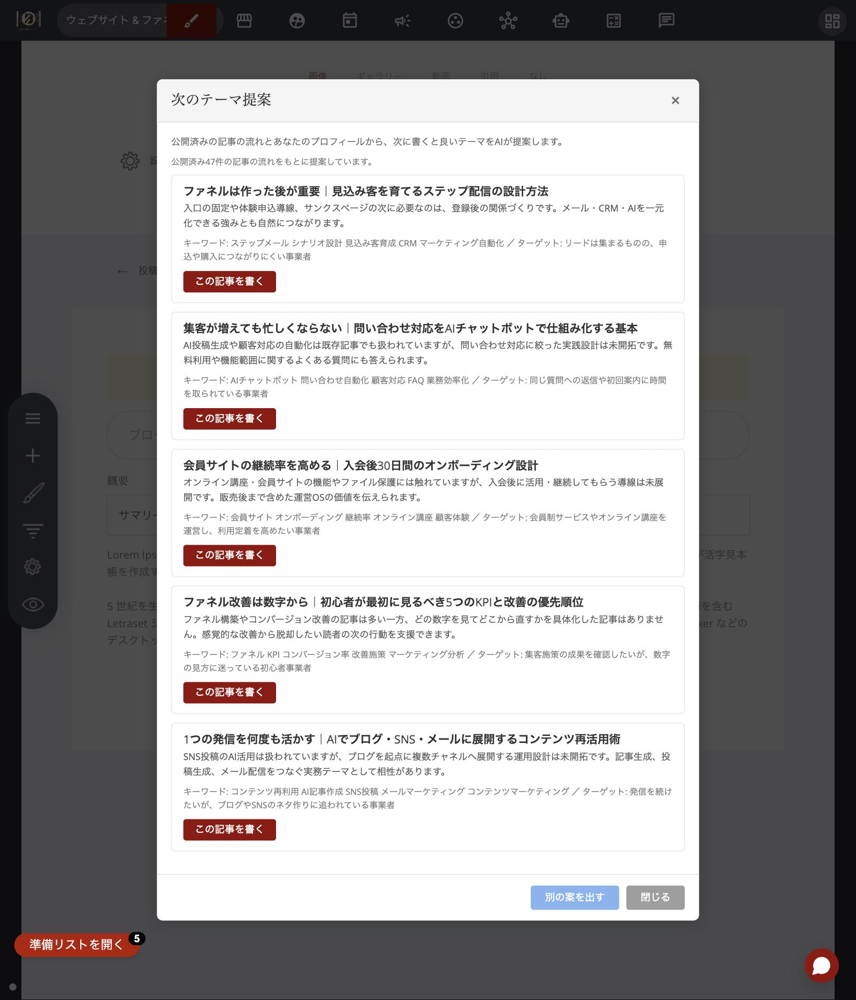
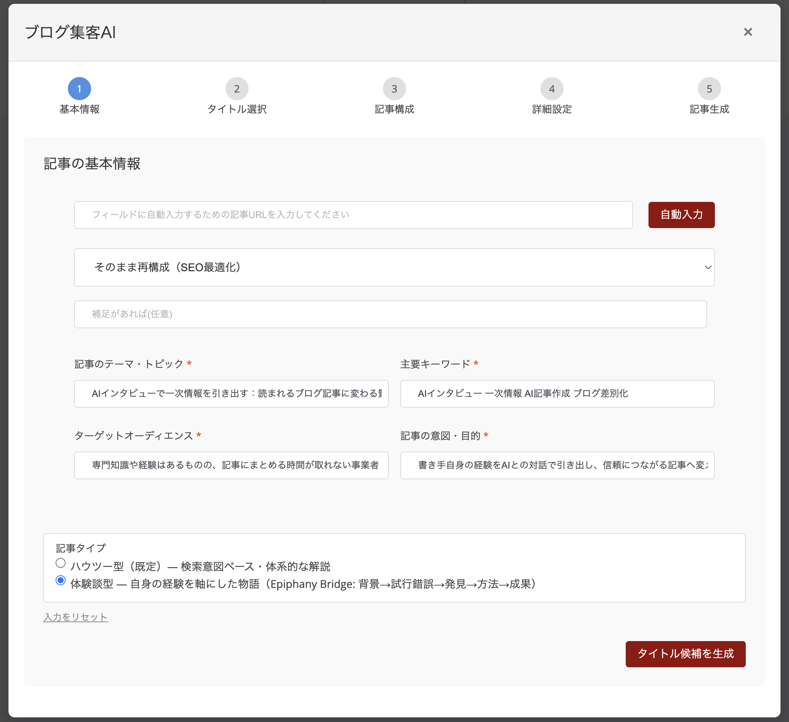
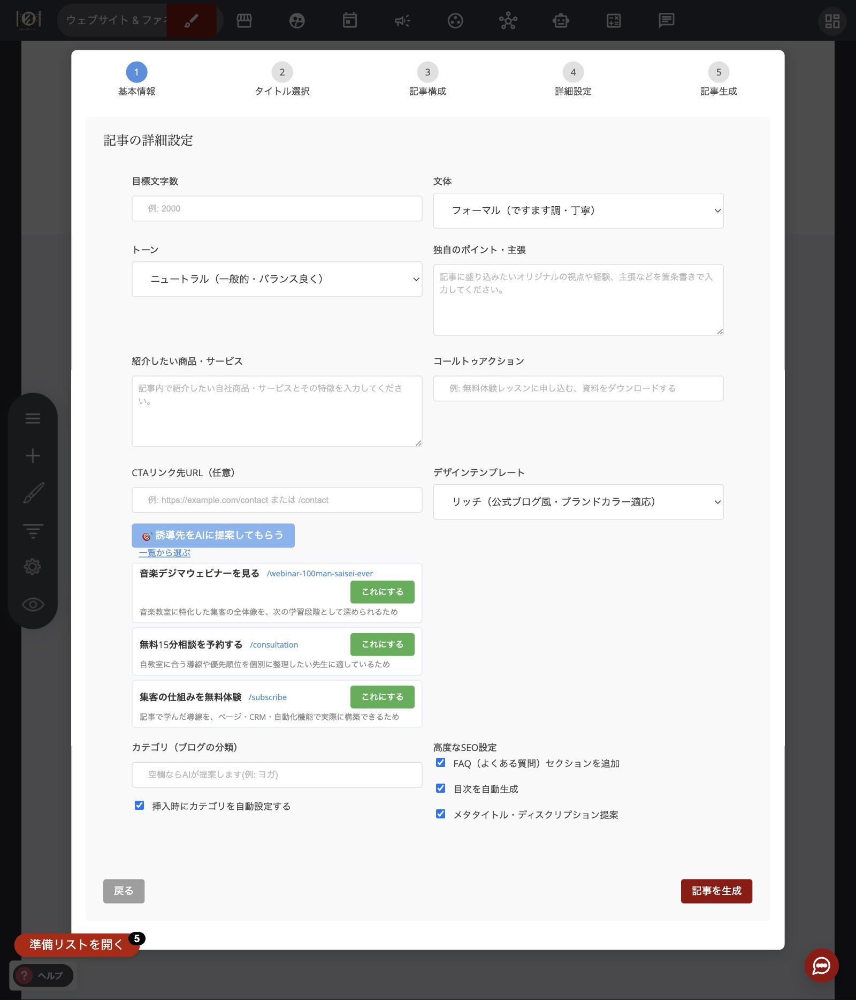
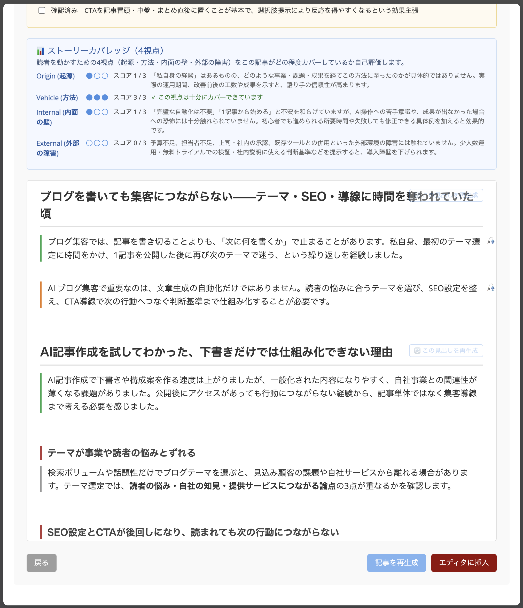
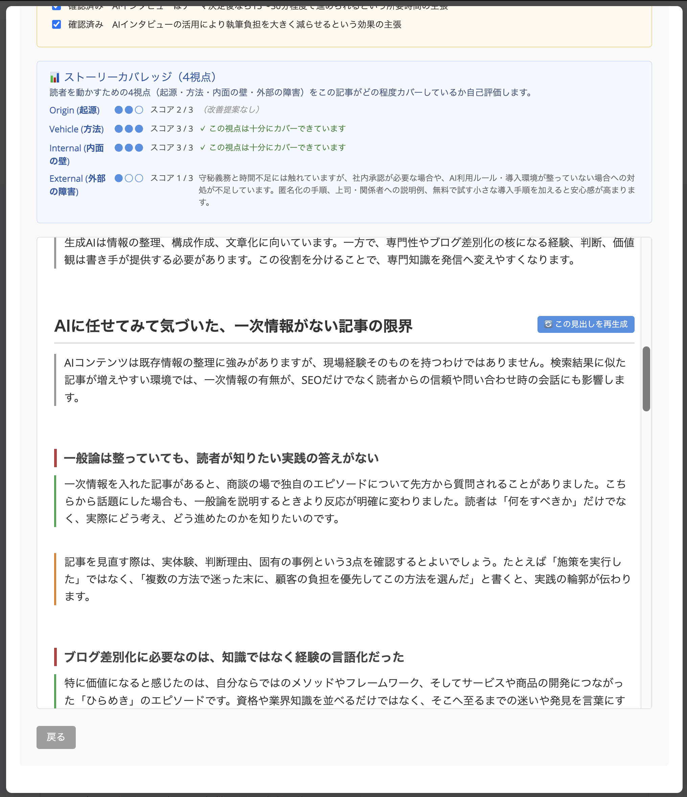
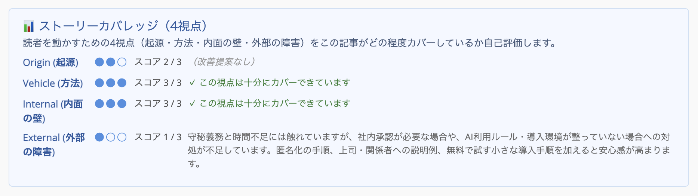

# ブログ集客AIの使い方


※本機能は「高品質記事生成」から「ブログ集客AI」に名前が変わりました


## この機能の考え方（まず30秒で）

ブログ集客AIは、「タイトル案 → 見出し構成 → 本文」の順に、AIと一緒にブログ記事を組み立てていくウィザード機能です。

ただ、この機能のゴールは「記事を速く量産すること」ではありません。目指しているのは、**あなたにしか書けない、読者に信頼される記事**を作ることです。そのために、よくある自動生成ツールにはない3つの柱を持っています。

1. **あなたの一次情報を引き出す** — AIインタビューと、情報源の色分け表示
2. **あなたらしさを覚える** — 一度設定すれば毎回の生成に反映される「AIプロフィール設定」
3. **公開前に事実を確認する** — ファクトチェックと、ストーリーカバレッジ

全体の流れは次のとおりです。

* **【準備】** AIプロフィール設定（最初の一度だけ）
* **【ネタ探し】** 次のテーマ提案（迷ったとき）
* **【作る】** ウィザード6ステップ（基本情報 → タイトル → 構成 → 詳細設定 → AIインタビュー → 生成）
* **【仕上げ】** アイキャッチ画像の生成
* **【確認】** 公開前ファクトチェック＋ストーリーカバレッジ
* **公開**
* **【公開後】** 記事の成果を見る

準備は最初の一度だけです。2回目からは、毎回ウィザードを回すだけで記事が作れます。

## 最初に一度だけ｜AIプロフィール設定（柱②）

ブログ記事一覧画面の「**🧠 AIプロフィール設定**」ボタンから開きます。あなたの肩書き・商品・ターゲット読者・文体の希望などを一度設定しておくと、**今後のすべての記事生成に自動で反映**されます。毎回同じことを入力し直す必要はありません。

自分で全部書かなくても大丈夫です。URLやビジネスの説明を入力するだけで、AIが各項目を下書きしてくれる機能もあります。

<figure><figcaption>AIプロフィール設定の確認画面。ここで保存した内容が毎回の記事生成に使われます</figcaption></figure>

設定項目や自動入力の使い方は、[AIプロフィール設定の使い方](ai-profile-settings.md)で詳しく解説しています。

## 何を書くか迷ったら｜次のテーマ提案

「そもそも何について書けばいいかわからない」というときは、ブログ記事一覧画面の「**💡 次のテーマ提案**」ボタンから始めてください。

AIが、あなたの公開済み記事の流れ（テーマの傾向・カテゴリの偏り・読者の反応）とプロフィール設定の内容を分析して、**次に書くと良いテーマを理由付きで5件**提案してくれます。それぞれの提案には、次の情報が付いてきます。

* **テーマ** — 記事タイトルの形での提案
* **理由** — 「〇〇の記事は多い一方、△△はまだ書かれていません」のような、これまでの記事とのギャップ分析
* **SEOキーワード** — その記事で狙う検索キーワード
* **想定読者** — 誰に向けた記事か

<figure><figcaption>次のテーマ提案の画面。5件の提案それぞれに理由・キーワード・ターゲットが付いています</figcaption></figure>

気に入った案の「**この記事を書く**」ボタンを押すと、そのまま新規投稿の作成画面に切り替わり、「**ブログ集客AI**」が自動で開きます。ステップ1（テーマ・キーワード・ターゲット・記事の狙い）は**入力済み**なので、あとは進むだけで記事作成が始まります。

さらに、テーマ提案からのタイトルは、ステップ2で候補の最上段に「**📌 テーマ提案からのタイトル**」としてピン留め表示されます。テーマ提案で気に入った表現が、そのまま記事タイトルとして使えます。もちろん、AIが生成する他の候補から選び直しても構いません。

しっくりくる案がなければ、「**別の案を出す**」で再提案してもらえます。

まだ公開記事が1本もなくても大丈夫です。その場合は、プロフィール設定の内容から「最初に書くと良い記事」を提案してくれます。**記事0本の状態から使える**ので、ブログを始めたばかりの方こそ活用してください。

## 起動方法

ブログ記事の編集画面を開き、「**✨ ブログ集客AIで記事を作成**」ボタンをクリックすると、ウィザードが開きます。

## 記事を作る（ウィザードの流れ）

### ステップ1｜基本情報を入力する（記事タイプもここで選ぶ）

まず、記事の土台になる4つの項目を入力します。

| 項目 | 何を書くか | 入力例 |
| --- | --- | --- |
| 記事のテーマ | 何についての記事か | 初心者向けヨガの始め方 |
| キーワード | 検索で使われそうな言葉 | ヨガ 初心者 自宅 |
| ターゲット読者 | 誰に読んでほしいか | 運動不足が気になる30〜40代の会社員 |
| 記事の狙い | 読者がどんな悩みで検索したか（検索意図） | 自宅で気軽に始められる方法を知りたい |

あわせて「**記事タイプ**」も選びます。

* **ハウツー型（既定）** — 検索意図に沿った体系的な解説記事（「〇〇する方法」「〇〇のコツ」など）。SEO集客や、調べものをしている読者向けです
* **体験談型（Epiphany Bridge）** — 自身の実体験を軸にした物語形式（背景 → 試行錯誤 → 気づき → 方法 → 成果）。読者に共感してもらいたい記事、自分らしさを伝えたい記事に向いています

迷ったら「ハウツー型」のままで問題ありません。

すでに他の場所に書いた記事がある場合は、「**参考URL**」欄が便利です。URLを入力すると、そのページの内容をAIが読み取って、上の各項目を自動で埋めてくれます。たとえばnoteや他のブログに書いた自分の記事を、OpusBoosterのブログに載せ直したいときにぴったりです。

その際は「再構成モード」を選べます。元の記事をそのまま整え直すだけでなく、「ターゲット読者だけ変える」「CTA（行動の呼びかけ）だけ最新のものに差し替える」といった作り方ができます。

<figure><figcaption>ステップ1の画面。参考URL・再構成モードに加えて、記事タイプ(ハウツー型/体験談型)を選べます</figcaption></figure>

入力できたら、次のステップに進みます。

### ステップ2｜タイトルを選ぶ

入力した情報をもとに、AIが複数のタイトル案を提示します。気に入ったものをクリックして1つ選んでください。しっくりくるものがなければ、再生成して作り直せます。

次のテーマ提案から来た場合は、最上段に「**📌 テーマ提案からのタイトル**」がピン留め表示されます。ピン留めのタイトルも、AIが新しく生成した候補も、どちらからでも自由に選べます。

### ステップ3｜記事構成（見出し）を整える

まず、記事の**目安文字数**を指定します（500字単位で調整できます）。ここが今の版で重要なポイントです。文字数を先に決めてから見出し構成を作ることで、見出しの数や粒度が、その文字数に見合ったものに自動で調整されます。

「**見出しを生成**」ボタンを押すと、AIがH2/H3の見出し構成を提案します。記事タイプによって構成が変わります。

* **ハウツー型** — 検索意図に沿った体系的な構造
* **体験談型** — 「背景 → 試行錯誤 → 気づき → 方法 → 成果」の5フェーズ構造

この構成はそのまま使うこともできますが、自由に手を入れられます。

* 見出しの文言を直接編集する
* 見出しを追加・削除する
* 見出しの順番を並べ替える

目安文字数をあとから変更したときは、見出しを再生成することをおすすめします。再生成しないまま次に進もうとすると、「次へ」ボタンが一時的に無効になるので気づけます。

「この流れで話が伝わるか」を確認して、必要なら整えてから次へ進みます。

### ステップ4｜詳細設定

記事の仕上がりを細かく調整するステップです。

* **文体・トーン** — 「シンプル（初心者向け）」「フォーマル」など、書き方の雰囲気
* **コールトゥアクション（CTA）** — 記事の最後に入れる行動の呼びかけ（例: 無料相談に申し込む）とリンク先URL
* **デザインテンプレート** — 「リッチ」を選ぶと、あなたのサイトのブランドカラーに合わせた公式ブログ風のデザインになります
* **高度なSEO設定** — 目次の自動生成、FAQ（よくある質問）の追加、メタ情報の提案のオン/オフ

AIプロフィール設定を済ませていれば、文体の希望や避けたい表現（NGワード）はここで入力し直さなくても自動で反映されます。

CTAの誘導先も、AIに提案してもらえます。「**🎯 誘導先をAIに提案してもらう**」ボタンを押すと、AIが**あなたのサイトに実在するファネルやページ**の中から、記事の内容に合った誘導先を最大3件、CTAボタンの文言と理由つきで提案してくれます。たとえば集客ノウハウの記事なら、「無料相談を予約する→相談ページ」「ウェビナーを見る→ウェビナー登録ファネル」のように、読者の温度感に合わせた選択肢が出てきます。気に入った案の「**これにする**」を押すだけで、CTAの文言とリンク先URLの両方が設定されます。

提案以外から選びたいときは、「**一覧から選ぶ**」でページ名・ファネル名を検索して絞り込みながら選べます。ページ数が多いサイトでも迷いません。

この機能があることで、「記事は書いたけど、どこにも誘導していない」を防げます。記事を書くたびに、自然と集客につながる導線ができあがります。

<figure><figcaption>ステップ4の詳細設定画面。CTAの誘導先候補が3件、理由つきで提案されています</figcaption></figure>

設定できたら「**記事を生成**」をクリックします。

### ステップ5｜AIインタビュー（柱①・ここが差別化）

本文の生成が始まる前に、AIが**その記事のテーマに合わせた質問**を数問、あなたにしてきます。この機能の肝はここです。

質問に対して、あなた自身の実体験・具体的な数字・現場でのエピソードを答えてください。たとえば「1日12時間パソコンに向かっていた時期に、右肩が固まって腕が上がらなくなった」のような具体的な話です。ここで答えた内容が本文に織り込まれることで、AIだけでは書けない「**あなたにしか書けない中身**」が記事に入ります。

* 答えられる質問だけで大丈夫です。空欄はスキップされ、その部分は一般的な内容で書かれます
* 全部飛ばしたい場合は「**インタビューをスキップして生成**」も選べます
* AIプロフィール設定を済ませていれば、肩書きや商品などの基本情報は聞かれず、**その記事に固有の質問だけ**になります

<figure><figcaption>AIインタビュー画面。答えるほど「あなたらしい」記事になります</figcaption></figure>

答え終わったら「**この内容で本文を生成**」をクリックします。

### ステップ6｜記事を生成する

インタビューの回答と、ここまでの設定をもとに、AIが本文を書き上げます。生成中は進捗が表示されるので、そのままお待ちください。

文字数は、ステップ3で決めた目安の**±20%以内**に自動で収まるように調整されます。もし大幅に外れた場合は、内部で自動的に1回だけ短縮版に作り直します。それでも収まらないときは、プレビュー下部に「**⚠️ 目標より大幅に長くなりました**」の警告が表示されるので、「記事を再生成」するか、本文を直接編集して調整してください。

生成が完了すると、記事のプレビューが表示され、次の操作ができます。

* 「**エディタに挿入**」 — 本文とタイトルだけでなく、**カテゴリ・URLスラッグ・SEOタグ・概要までまとめて**、編集中のブログ記事に設定します。SEOタグはAIが3〜5個提案し、既存のタグと重複するものは追加されません。概要が空欄の場合は、後述の説明文案の1つ目（説明1）が自動でセットされます。自分で設定済みのタグや概要は、上書きされないのでご安心ください
* 「**記事をコピー**」 — 記事の内容をクリップボードにコピーします
* 「**記事を再生成**」 — 同じ設定でもう一度作り直します

あわせて、生成後には「**SEOメタ情報の提案**」も表示されます。これは、検索結果に表示されるタイトルと説明文の候補を、AIが記事の内容から提案してくれるものです。

* **タイトル案が3件** 提案されます。気に入った案の「**タイトルに反映**」ボタンを押すと、記事タイトルがその場で差し替わります
* **説明文案が2件** 提案されます。「**概要に反映**」ボタンを押すと、編集画面の「概要」欄に挿入されます。概要には説明1が自動で入るので、このボタンは「**説明2など、別の案に差し替えたいとき**」に使ってください

手でコピペする必要はありません。反映したあとで「やっぱり別の案がいい」と思ったら、何度でも他の案に差し替えられます。

## プレビューで見える「情報源の色分け」と「役割バッジ」

生成された記事のプレビューでは、段落ごとに「情報源の色ボーダー」と「役割の絵文字バッジ」が表示されます。AIがどこから何を書いたか、記事の骨格がどうなっているかをひと目で確認できる、公開前レビューの新しい味方です。

**情報源の色ボーダー（左端）** は3種類あります。

* 🟢 **緑 = 一次情報** — AIインタビューでのあなたの回答・プロフィール・商品情報など、あなた固有の具体的事実
* ⚪ **グレー = 一般論** — 業界の一般知識・広く知られている情報
* 🟠 **オレンジ = 推論** — つなぎ・解釈・比喩・まとめ

🟢が少ない記事は、どこにでもある一般論寄りの記事です。🟢が多い記事ほど、「あなたにしか書けない記事」に近づきます。緑を増やしたければ、次回はAIインタビューで具体例を多めに答えてみてください。

**役割バッジ（右端の絵文字）** は2種類です。

* 🎣 **hook（フック）** — 冒頭の数段落。読者のスクロールを止める役割
* 🎯 **offer（オファー）** — 末尾のCTA関連段落。読者に次の行動を起こしてもらう役割

本文中の大多数を占める「story」段落にはバッジは表示されません（多すぎて視覚ノイズになるためです）。

どちらの表示も、プレビュー上部の「**🎨 ソース種別: ON/OFF**」「**🎯 役割表示: ON/OFF**」ボタンで切り替えられます。エディタに挿入するときは自動で外れるので、公開ページには残りません（プレビュー画面だけの表示です）。

<figure><figcaption>プレビュー画面。段落左端の色ボーダー(緑=一次情報/オレンジ=推論)と、上部の表示切り替えボタンが確認できます</figcaption></figure>

## 気に入らない見出しだけ作り直す｜見出し単位の部分再生成

記事プレビューで、各H2見出しの右上にホバーすると「**🔄 この見出しを再生成**」ボタンが現れます。クリックすると、その見出しのセクションだけをAIで作り直せます。

全体を再生成するのに比べて圧倒的に速く、他のセクションはそのまま維持されるのがメリットです。「4つの見出しのうち、3つ目だけしっくりこない」といったピンポイントの調整に最適です。

再生成後も、ソース種別の色ボーダー・役割バッジ・文字数目安はすべて自動で整合が取れた状態でプレビューが更新されます。再生成中は「再生成中…」の表示になり、他のセクションのボタンを押しても少し待つ形になります。完了までは数十秒です。

FAQセクションには再生成ボタンは付きません。FAQ全体を作り直したい場合は、「記事を再生成」で全体をやり直してください。

<figure><figcaption>見出しにホバーすると「この見出しを再生成」ボタンが表示されます</figcaption></figure>

## 仕上げ｜アイキャッチ画像を自動生成

記事の内容に合ったアイキャッチ画像（記事一覧やSNSシェアで表示される画像）を、AIでその場で作れます。

まず「**スタイル**」を選びます。写真風・イラスト・ミニマル・水彩画風・3Dの5種類から、記事の雰囲気に合うものを選んでください。イメージと違ったら、スタイルや設定を変えて、その場で何度でも再生成できます。

次に「**文字入れ**」で、画像に日本語の文字を入れるかを選びます。選択肢は4つです。

| 選択肢 | どんなときに使うか |
| --- | --- |
| **なし（SEO向け・標準）** | 文字のないきれいな画像。検索やGoogle Discoverからの流入を狙う記事はこちらが推奨です |
| **短い文字あり（SNS訴求）** | AIが記事タイトルを短いキャッチコピー（例:「朝で決まる／在宅集中力」のような2行）に圧縮して、画像に大きく入れます。SNSや記事一覧で目を引きたいときに |
| **カテゴリ名のみ** | カテゴリ名を小さなバッジとして入れます。ブランド感を保ちつつ、分類だけ伝えたいときに |
| **おまかせ（AIが判断）** | 記事のタイプから自動で判断します（How-to・比較・「〇〇選」→文字あり、コラム・事例→文字なし） |

迷ったら「なし」のままで大丈夫です。文字入りを使った場合は、生成された文字が正しく出ているか、公開前に一目だけ確認しておきましょう。

<figure><figcaption>スタイルと文字入れを選んで生成。「短い文字あり」ではキャッチコピーが画像に入ります</figcaption></figure>

生成された画像が気に入ったら「**この画像を使う**」ボタンをクリックするだけで、そのままブログ記事のアイキャッチに設定されます。ファイルマネージャーを開いて画像を探したり、別のツールで画像を作ってアップロードしたりする必要はありません。記事作成の流れの中で、画像まで完結します。

## 公開前チェック｜ファクトチェック（柱③・重要）

記事の生成が終わると、AIが本文の中から**事実確認をしたほうがよい主張（数字・固有名詞・日付・価格・効能など）を最大8件リストアップ**して表示します。公開する前に、一つずつ自分の目で確認するためのチェックリストです。

さらに、医療・健康効果・法律・金融/投資・税務・選挙/政治・安全性などに触れる記事では、「**高リスク**」の警告が表示され、必要に応じて専門家の確認を促されます。

今の版では、この「高リスク」の判定精度が向上しています。単にカテゴリに関係する言葉が本文に出てくるだけでは警告は出ません。AIがその領域について読者に対して主張・アドバイス・断定・推奨・警告をしている場合のみ、根拠となる引用つきで警告が表示されます（たとえば「医療・法律などのカテゴリではこの警告が出ます」というメタな言及だけでは警告は立ちません）。

<figure><figcaption>公開前チェックのパネル。健康に関する記事のため、高リスク警告が表示されています</figcaption></figure>

これは「AIの書いた内容を鵜呑みにせず、あなたの責任で確認してから公開する」ための安全機能です。間違った情報を載せてしまえば、失うのは読者からの信頼です。ひと手間かかりますが、**読者からの信頼を守る**ための大切なステップとして、公開前に必ず目を通してください。


**注意:** ファクトチェックは、数字・日付・固有名詞など「一般的に確認すべき点」を促す機能です。AIが本文中に書いた内容そのものの正誤——特に、あなたの商品・サービス・機能名などの固有情報——までは判定しません。自社の商品やサービスを紹介する記事では、AIが実在しない機能名やスペックを書いてしまうことがあります。公開前には、内容が事実と合っているかを必ずご自身の目で確認してください。


## 公開前チェック｜📊 ストーリーカバレッジ

ファクトチェックの下には、記事全体を4つの視点で自己評価してくれる「ストーリーカバレッジ」が表示されます。**体験談型**の記事では自動的に実行され、ハウツー型では「**📊 カバレッジをチェック**」ボタンから手動で起動できます。

評価される4つの視点は次のとおりです。

* **Origin（起源）** — なぜあなたがこの話をするか。読者があなたを信頼する入口になります
* **Vehicle（方法）** — 読者が自分でも再現できる、具体的な方法や仕組み
* **Internal（内面の障害）** — 「自分にできるかな…」という読者の内側の不安への回答
* **External（外部の障害）** — 「周りが反対する」「環境が整っていない」といった、外側の障害への回答

各視点は0〜3点でスコア表示され、不足があれば1〜2行の具体的な改善提案が出ます。「〇〇についての具体例を1つ足すと再現性が伝わりやすい」のようなかたちです。

<figure><figcaption>ストーリーカバレッジパネル。4視点それぞれのスコアと、不足があれば改善提案が表示されます</figcaption></figure>

これは「AIが書いた記事が、読者の心を動かせる構造になっているか」を確認するための機能です。特に体験談型の記事や、コーチ・専門家として発信する記事で威力を発揮します。

全視点が満点でなくても大丈夫です。1つでも改善提案を採り入れて次の稿に反映する、という使い方が一番続けやすいです。

## 公開したあとの成果を見る｜📊 記事の成果

記事は、公開して終わりではありません。ブログ記事一覧画面の「**📊 記事の成果**」ボタンから、公開した記事がどれくらい読まれ、どれくらい反応があったかをひと目でランキング表示できます。

上部には3枚のサマリーカードが並び、それぞれ「直近30日の合計表示回数」「公開記事の総数」「1記事あたり平均表示回数」を数字で示します。まずここで、ブログ全体の勢いをざっくり把握できます。

その下にはランキングが表示されます。

* **1位** — 🏆マーク付きの「今月のチャンピオン記事」として大きく強調され、「全体の◯%を稼いだ記事」というサブ情報も添えられます
* **2位・3位** — メダル型のカードで表示されます
* **4〜10位** — グリーンのバー付きの行で表示され、1位を100%とした相対的な強さがバーの長さで直感的にわかります
* **11位以下** — 「**11位以下も見る（〇件）**」で折りたたまれており、必要なときだけ展開できます

表示回数タブで見ているときは、各記事に「**勢いの矢印**」も付きます。直近7日とその前の7日を比べて、↑（緑）は伸びている、→は横ばい、↓は落ち着いてきた、を表します。矢印が↑になっている記事は、続編を書くのにちょうど良いタイミングです。

上部のタブでは、「**表示回数**」と「**コメント数**」を切り替えられます。切り替えると、ランキングの並び順もアニメーションで再配置されます。「一番読まれた記事」と「一番語られた記事」は別物なので、両方見比べてみると発見があります。

数字の期間には注意してください。**表示回数はサイト統計に基づく直近30日の集計**、**コメント数は公開以来の累計**です。集計は反映まで少し時間がかかる場合があります。

一度集計した結果は10分間キャッシュされるので、モーダルを閉じてすぐ開き直しても、すぐに表示されます。10分経つと自動で再集計され、「**再読み込み**」ボタンでいつでも最新の状態に更新できます。

なお、この機能に「シェアされた回数」はありません。OpusBoosterのプラットフォームでは、シェアされた回数を正確に集計する仕組みがないためです。誤解を招く数字を見せるより、正確な指標だけをお見せする方針にしています。

**この機能の使いどころ:**「なんとなくブログを書き続けている」状態から、「1位の記事の続編を書く」「バーが極端に短い記事はリライトの対象にする」「コメントが多い記事のテーマは深掘りする」など、次の一手を数字で決められるようになります。「次のテーマ提案」と組み合わせると、成果の良い流れをさらに伸ばす記事づくりができます。


※実際の画面はご自身の管理画面でご確認ください。本ヘルプでは画面例を載せていません。ご自身の記事ラインナップと数字で見たほうが実感が湧きやすいためです。


### 成果をSNSでシェアする｜📣 SNSでシェア

1位（チャンピオン記事）のカードにある「**📣 SNSでシェア**」ボタンを押すと、その記事の成果をSNSに投稿するための「画像」と「文章」がワンクリックで用意されます。うまくいった記事を手軽に自慢でき、それ自体がブログの宣伝にもなります。

背景デザインは5種類から選べます。「**祝祭**」「**オーロラ**」（落ち着いた濃色）、「**ミニマル**」「**ポップ**」「**イラスト**」（明るい色）のサムネイルが並び、クリックするだけでカードの見た目が切り替わります。記事の雰囲気やご自身の好みで選んでください。

でき上がる**画像**には、**記事タイトル・🏆マーク・あなたのサイト名**だけが入り、表示回数などの数字は入りません。**数字は「文章」のほうに入れて、画像はきれいに保つ設計**になっています(画像に数字を焼き込むと、あとから古くなってしまうためです)。タイトルが長い場合の改行位置も自然に調整されます。今の版では日本語の禁則処理が入っており、「」の前や句読点の後で切れるようになっているため、シェアカードで見栄えが崩れる心配は少なくなっています。

**文章**は、編集できるテキスト欄に自動で用意されます。「直近30日で◯回読まれました」のような成果の一文と、ハッシュタグが入っています。そのまま使ってもよいですし、ご自身の言葉に書き換えても構いません。

**投稿先ごとのボタンがあり、ワンクリックで投稿画面が開きます。**「**SNSに投稿**」の下に「**X で投稿**」「**Facebook**」「**LINE**」ボタンが並び、押すとそのSNSの投稿画面が、文章と記事へのリンクが入った状態で開きます(あとは投稿ボタンを押すだけです)。ボタンを押しても勝手に投稿されることはありません。必ずご自身で最終確認してから投稿できるので、安心して押してください。

**画像を一緒に載せたいとき**は、投稿先によって手順が少し異なります。

* **X（旧Twitter）:** 上のボタンで投稿画面を開くと、文章とリンクが入っています。画像は「**🖼 画像をダウンロード**」で保存して、投稿画面で手動で添付してください。リンクを付けた場合、Xでは記事のカード画像が自動で表示されることもあります。
* **Facebook:** ボタンで共有画面を開くと、記事リンクのプレビュー(記事の画像とタイトル)が表示されます。凝ったカード画像を使いたいときは、「**🖼 画像をダウンロード**」して手動で添付してください。
* **LINE:** ボタンで、文章とリンク入りの共有画面が開きます。
* **Instagram:** Instagramは仕組み上、パソコンから投稿画面を自動で開くことができません。「**🖼 画像をダウンロード**」で画像を保存し、「**📋 テキストをコピー**」で文章をコピーして、Instagramアプリから手動で投稿してください。
* **iPadなどのタブレットの場合:** 「**📱 画像ごとシェア**」ボタンが出ることがあります。これを使うと、画像・文章・リンクをまとめて共有先アプリに渡せます(お使いの端末が対応しているときだけ表示されます)。

「**🖼 画像をダウンロード**」「**📋 テキストをコピー**」は、上のどの投稿先でも共通で使える、手動投稿用の基本ボタンです。

難しい画像編集ソフトは不要です。デザインを選ぶ → 投稿先のボタンを押す(または画像を保存して貼る)だけ。まずは一番伸びた記事から、気軽に投稿してみましょう。

## 生成される記事に含まれるもの

* **構造化された本文** — 大見出し（H2）・小見出し（H3）で整理された読みやすい構成
* **目次** — 各見出しへのジャンプリンク付き（オンにした場合）
* **FAQセクション** — 記事内容に関連した「よくある質問」（オンにした場合）
* **コールトゥアクション** — 設定した行動の呼びかけを記事末尾に配置
* **リッチデザイン** — あなたのサイトのブランドカラーに自動で合わせた装飾
* **アイキャッチ画像** — AIで生成してそのまま設定

## 上手に使うコツ

* **最初にAIプロフィール設定を済ませておく** — 毎回の入力が減り、文体やNGワードのブレもなくなります。次のテーマ提案の精度も上がります
* **ネタに迷ったら「次のテーマ提案」から始める** — これまでの記事の流れに沿った積み上げができ、テーマの偏りも防げます
* **AIインタビューには具体的に答える** — 実体験・数字・エピソードを答えるほど、プレビューの緑ボーダー（一次情報）が増えます。つまり、あなたにしか書けない記事に近づきます
* **見出し1つが気に入らないときは、全体再生成せず「🔄 この見出しを再生成」を使う** — 時間もコストも大幅に節約できます
* **体験談型の記事は、ストーリーカバレッジの改善提案を1つでも採り入れる** — 稿を重ねるごとに深みが増していきます
* **ファクトチェックのリストは公開前に必ず確認する** — 特に高リスク警告が出た記事は、専門家の確認も検討してください
* **すでに書いた記事は参考URLで再構成する** — ゼロから書くより速く、過去の資産を活かせます
* **自社の商品・サービス・機能を紹介する記事は特に注意する** — AIが書いた内容が実際の仕様と合っているか、公開前に自分の目で確認してください。ファクトチェックが拾わない誤りもあります
* **公開したら終わりにしない** — 「**📊 記事の成果**」を月に一度は開いて、伸びた記事の続編を書く、伸びなかった記事のタイトルを見直すなど、改善サイクルに乗せましょう

## 料金について

記事や画像の生成にかかるAI利用料は、現在はキャンペーン期間のため、すべてOpusBoosterの月額料金に含まれています。追加の費用はかかりません。

ただし、今後は記事数の上限またはクレジット制などの制限を導入する予定です。たくさん試したい方は、いまのうちのご利用をおすすめします。
