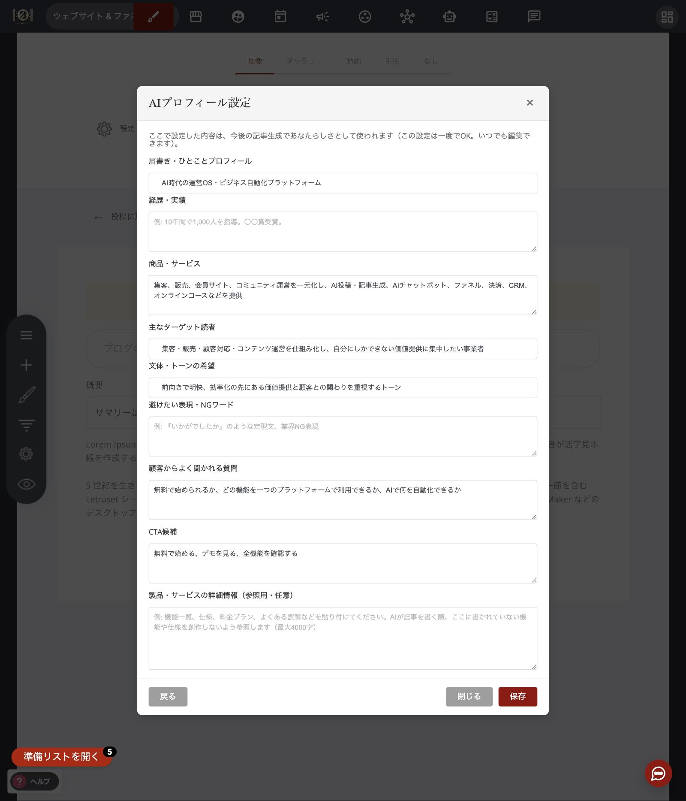
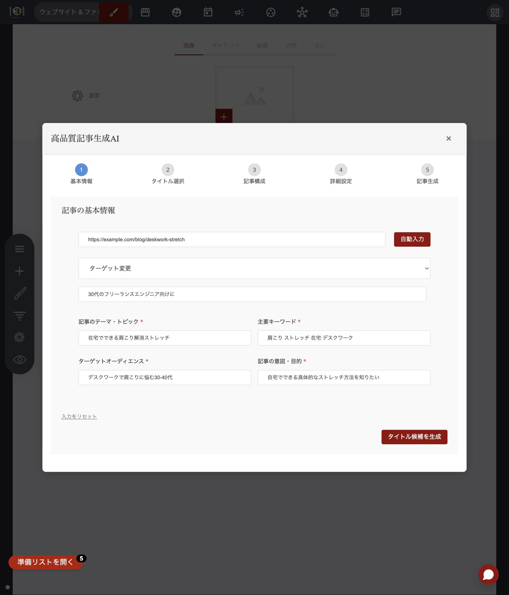
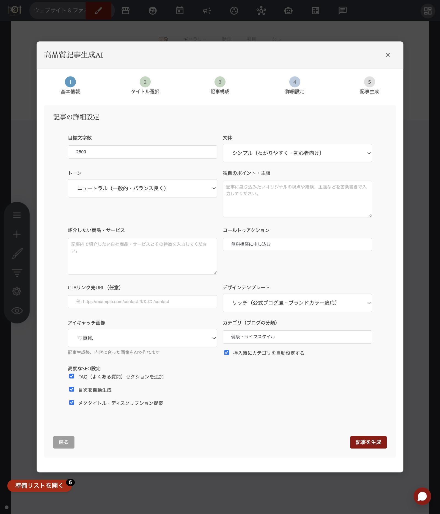
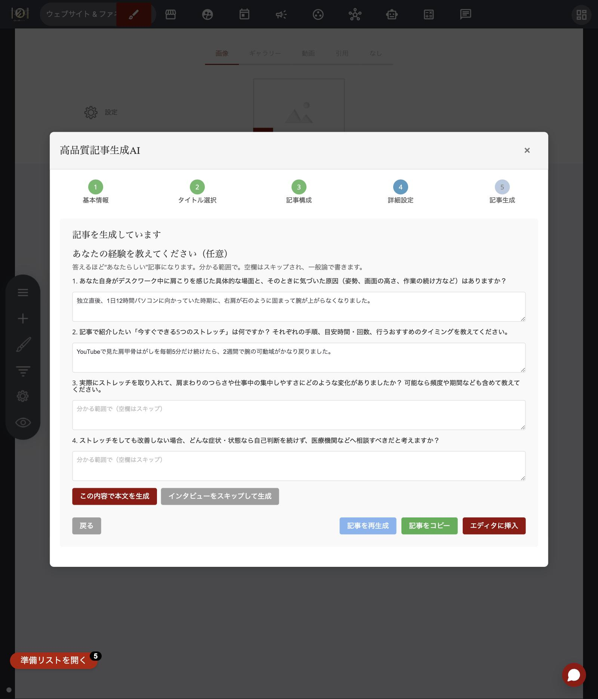
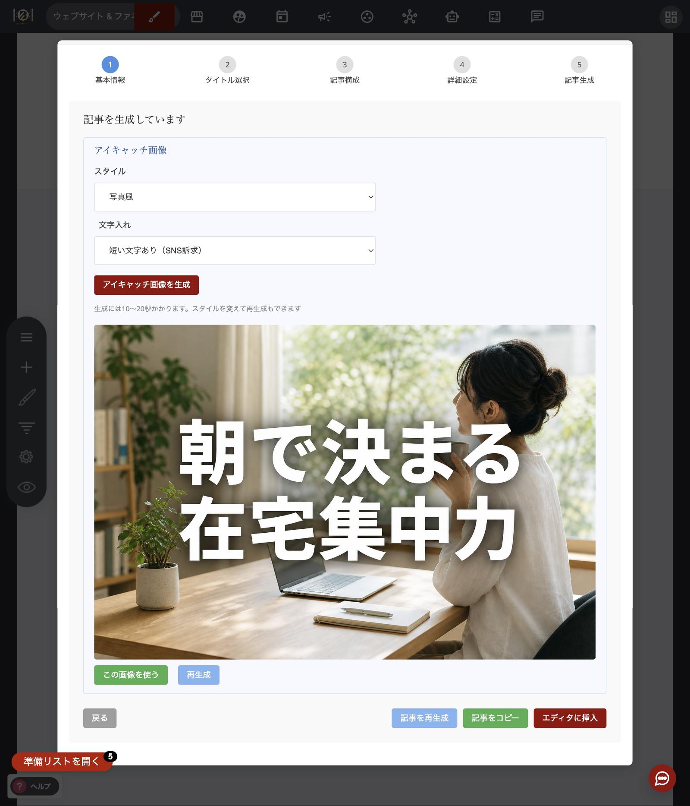
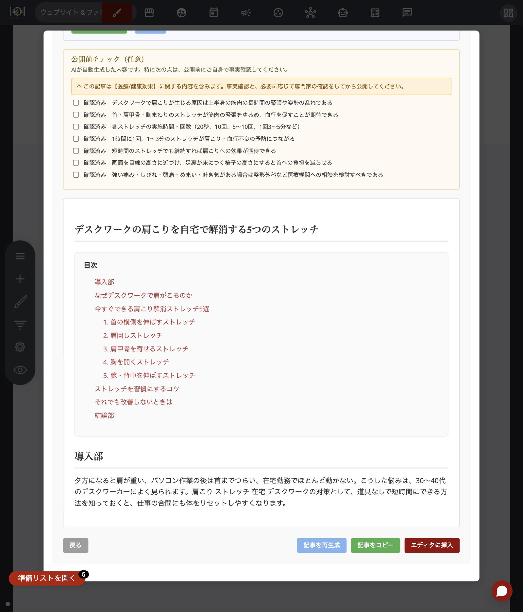

# 高品質記事生成AIの使い方

## この機能の考え方（まず30秒で）

高品質記事生成AIは、「タイトル案 → 見出し構成 → 本文」の順に、AIと一緒にブログ記事を組み立てていくウィザード機能です。

ただ、この機能のゴールは「記事を速く量産すること」ではありません。目指しているのは、**あなたにしか書けない、読者に信頼される記事**を作ることです。そのために、よくある自動生成ツールにはない3つの柱を持っています。

1. **あなたの一次情報を引き出す** — 本文を書く前に、AIがあなたに質問する「AIインタビュー」
2. **あなたらしさを覚える** — 一度設定すれば毎回の生成に反映される「AIプロフィール設定」
3. **公開前に事実を確認する** — AIが書いた内容を鵜呑みにしないための「ファクトチェック」

全体の流れは次のとおりです。

* **【準備】** AIプロフィール設定（最初の一度だけ）
* **【作る】** ウィザード6ステップ（基本情報 → タイトル → 構成 → 詳細設定 → AIインタビュー → 生成）
* **【仕上げ】** アイキャッチ画像の生成
* **【確認】** 公開前ファクトチェック
* **公開**

準備は最初の一度だけです。2回目からは、毎回ウィザードを回すだけで記事が作れます。

## 最初に一度だけ｜AIプロフィール設定（柱②）

ブログ記事一覧画面の「**🧠 AIプロフィール設定**」ボタンから開きます。あなたの肩書き・商品・ターゲット読者・文体の希望などを一度設定しておくと、**今後のすべての記事生成に自動で反映**されます。毎回同じことを入力し直す必要はありません。

自分で全部書かなくても大丈夫です。URLやビジネスの説明を入力するだけで、AIが各項目を下書きしてくれる機能もあります。

<figure><figcaption>AIプロフィール設定の確認画面。ここで保存した内容が毎回の記事生成に使われます</figcaption></figure>

設定項目や自動入力の使い方は、[AIプロフィール設定の使い方](ai-profile-settings.md)で詳しく解説しています。

## 起動方法

ブログ記事の編集画面を開き、「**高品質記事生成**」ボタンをクリックすると、ウィザードが開きます。

## 記事を作る（ウィザードの流れ）

### ステップ1｜基本情報を入力する（参考URLからの再構成もここ）

まず、記事の土台になる4つの項目を入力します。

| 項目 | 何を書くか | 入力例 |
| --- | --- | --- |
| 記事のテーマ | 何についての記事か | 初心者向けヨガの始め方 |
| キーワード | 検索で使われそうな言葉 | ヨガ 初心者 自宅 |
| ターゲット読者 | 誰に読んでほしいか | 運動不足が気になる30〜40代の会社員 |
| 記事の狙い | 読者がどんな悩みで検索したか（検索意図） | 自宅で気軽に始められる方法を知りたい |

すでに他の場所に書いた記事がある場合は、「**参考URL**」欄が便利です。URLを入力すると、そのページの内容をAIが読み取って、上の各項目を自動で埋めてくれます。たとえばnoteや他のブログに書いた自分の記事を、OpusBoosterのブログに載せ直したいときにぴったりです。

その際は「再構成モード」を選べます。元の記事をそのまま整え直すだけでなく、「ターゲット読者だけ変える」「CTA（行動の呼びかけ）だけ最新のものに差し替える」といった作り方ができます。

<figure><figcaption>ステップ1の画面。上部の参考URL欄と「自動入力」ボタン、再構成モードの選択もここにあります</figcaption></figure>

入力できたら、次のステップに進みます。

### ステップ2｜タイトルを選ぶ

入力した情報をもとに、AIが複数のタイトル案を提示します。気に入ったものをクリックして1つ選んでください。しっくりくるものがなければ、再生成して作り直せます。

### ステップ3｜記事構成（見出し）を整える

選んだタイトルに合わせて、AIが記事の見出し構成（大見出しH2と小見出しH3）を生成します。この構成はそのまま使うこともできますが、自由に手を入れられます。

* 見出しの文言を直接編集する
* 見出しを追加・削除する
* 見出しの順番を並べ替える

「この流れで話が伝わるか」を確認して、必要なら整えてから次へ進みます。

### ステップ4｜詳細設定

記事の仕上がりを細かく調整するステップです。

* **目標文字数** — 記事のおおよその長さ
* **文体・トーン** — 「シンプル（初心者向け）」「フォーマル」など、書き方の雰囲気
* **コールトゥアクション（CTA）** — 記事の最後に入れる行動の呼びかけ（例: 無料相談に申し込む）とリンク先URL
* **デザインテンプレート** — 「リッチ」を選ぶと、あなたのサイトのブランドカラーに合わせた公式ブログ風のデザインになります
* **高度なSEO設定** — 目次の自動生成、FAQ（よくある質問）の追加、メタ情報の提案のオン/オフ

AIプロフィール設定を済ませていれば、文体の希望や避けたい表現（NGワード）はここで入力し直さなくても自動で反映されます。

<figure><figcaption>ステップ4の詳細設定画面。設定できたら「記事を生成」をクリックします</figcaption></figure>

設定できたら「**記事を生成**」をクリックします。

### ステップ5｜AIインタビュー（柱①・ここが差別化）

本文の生成が始まる前に、AIが**その記事のテーマに合わせた質問**を数問、あなたにしてきます。この機能の肝はここです。

質問に対して、あなた自身の実体験・具体的な数字・現場でのエピソードを答えてください。たとえば「1日12時間パソコンに向かっていた時期に、右肩が固まって腕が上がらなくなった」のような具体的な話です。ここで答えた内容が本文に織り込まれることで、AIだけでは書けない「**あなたにしか書けない中身**」が記事に入ります。

* 答えられる質問だけで大丈夫です。空欄はスキップされ、その部分は一般的な内容で書かれます
* 全部飛ばしたい場合は「**インタビューをスキップして生成**」も選べます
* AIプロフィール設定を済ませていれば、肩書きや商品などの基本情報は聞かれず、**その記事に固有の質問だけ**になります

<figure><figcaption>AIインタビュー画面。答えるほど「あなたらしい」記事になります</figcaption></figure>

答え終わったら「**この内容で本文を生成**」をクリックします。

### ステップ6｜記事を生成する

インタビューの回答と、ここまでの設定をもとに、AIが本文を書き上げます。生成中は進捗が表示されるので、そのままお待ちください。

生成が完了すると、記事のプレビューが表示され、次の操作ができます。

* 「**エディタに挿入**」 — 本文とタイトルだけでなく、**カテゴリ・URLスラッグ・概要までまとめて**、編集中のブログ記事に設定します。概要が空欄の場合は、後述の説明文案の1つ目（説明1）が自動でセットされます。自分で概要を書いていた場合は、上書きされないのでご安心ください
* 「**記事をコピー**」 — 記事の内容をクリップボードにコピーします
* 「**記事を再生成**」 — 同じ設定でもう一度作り直します

あわせて、生成後には「**SEOメタ情報の提案**」も表示されます。これは、検索結果に表示されるタイトルと説明文の候補を、AIが記事の内容から提案してくれるものです。

* **タイトル案が3件** 提案されます。気に入った案の「**タイトルに反映**」ボタンを押すと、記事タイトルがその場で差し替わります
* **説明文案が2件** 提案されます。「**概要に反映**」ボタンを押すと、編集画面の「概要」欄に挿入されます。概要には説明1が自動で入るので、このボタンは「**説明2など、別の案に差し替えたいとき**」に使ってください

手でコピペする必要はありません。反映したあとで「やっぱり別の案がいい」と思ったら、何度でも他の案に差し替えられます。

## 仕上げ｜アイキャッチ画像を自動生成

記事の内容に合ったアイキャッチ画像（記事一覧やSNSシェアで表示される画像）を、AIでその場で作れます。

画像のスタイル（写真風など）はステップ4で選んでおけます。生成された画像が気に入ったら「**この画像を使う**」ボタンをクリックするだけで、そのままブログ記事のアイキャッチに設定されます。イメージと違ったら「**再生成**」で作り直せます。

ファイルマネージャーを開いて画像を探したり、別のツールで画像を作ってアップロードしたりする必要はありません。記事作成の流れの中で、画像まで完結します。

<figure><figcaption>アイキャッチ画像の生成画面。「この画像を使う」でそのまま設定されます</figcaption></figure>

## 公開前チェック｜ファクトチェック（柱③・重要）

記事の生成が終わると、AIが本文の中から**事実確認をしたほうがよい主張（数字・固有名詞・日付・価格・効能など）を最大8件リストアップ**して表示します。公開する前に、一つずつ自分の目で確認するためのチェックリストです。

さらに、医療・健康効果・法律・金融/投資・税務・選挙/政治・安全性などに触れる記事では、「**高リスク**」の警告が表示され、必要に応じて専門家の確認を促されます。

<figure><figcaption>公開前チェックのパネル。健康に関する記事のため、高リスク警告が表示されています</figcaption></figure>

これは「AIの書いた内容を鵜呑みにせず、あなたの責任で確認してから公開する」ための安全機能です。間違った情報を載せてしまえば、失うのは読者からの信頼です。ひと手間かかりますが、**読者からの信頼を守る**ための大切なステップとして、公開前に必ず目を通してください。

## 生成される記事に含まれるもの

* **構造化された本文** — 大見出し（H2）・小見出し（H3）で整理された読みやすい構成
* **目次** — 各見出しへのジャンプリンク付き（オンにした場合）
* **FAQセクション** — 記事内容に関連した「よくある質問」（オンにした場合）
* **コールトゥアクション** — 設定した行動の呼びかけを記事末尾に配置
* **リッチデザイン** — あなたのサイトのブランドカラーに自動で合わせた装飾
* **アイキャッチ画像** — AIで生成してそのまま設定

## 上手に使うコツ

* **最初にAIプロフィール設定を済ませておく** — 毎回の入力が減り、文体やNGワードのブレもなくなります
* **AIインタビューには具体的に答える** — 実体験・数字・エピソードを入れるほど、他では読めない記事になります
* **ファクトチェックのリストは公開前に必ず確認する** — 特に高リスク警告が出た記事は、専門家の確認も検討してください
* **すでに書いた記事は参考URLで再構成する** — ゼロから書くより速く、過去の資産を活かせます
* **見出し構成の段階でひと手間かける** — ステップ3で構成を整えておくと、本文の仕上がりが大きく変わります

## 料金について

記事や画像の生成にかかるAI利用料は、現在はキャンペーン期間のため、すべてOpusBoosterの月額料金に含まれています。追加の費用はかかりません。

ただし、今後は記事数の上限またはクレジット制などの制限を導入する予定です。たくさん試したい方は、いまのうちのご利用をおすすめします。
