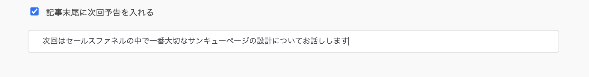
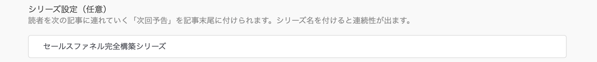
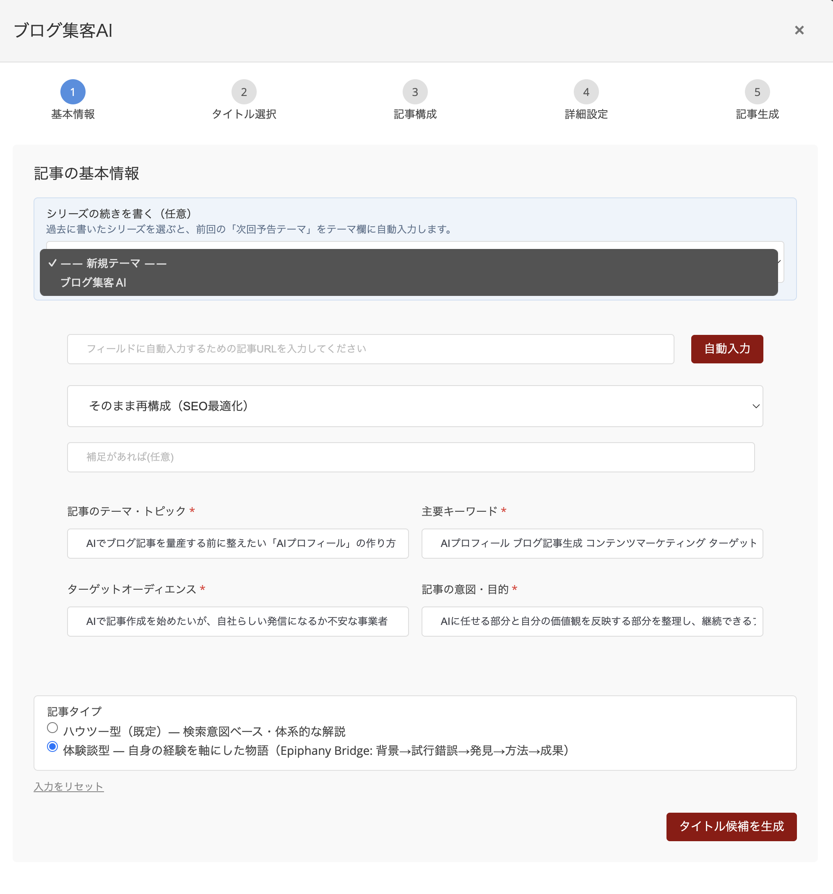
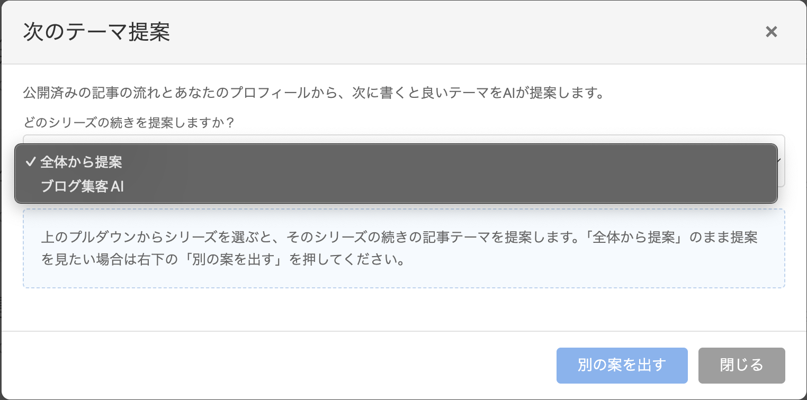

# シリーズ機能と次回予告（Open Loop）の使い方｜読者を次の記事まで連れていく

## なぜシリーズ化と「次回予告」が集客に効くのか（まず30秒で）

ブログの一番の課題は、実は「読まれないこと」より「1本しか読まれないこと」です。せっかく訪問してくれた読者の多くは、1本読んだだけでサイトを離れてしまいます。

連続ドラマや連載マンガは、毎回「次が気になるところ」で話を区切ります。次の展開が気になるからこそ、読者は自分から次の話を見に来てくれます。この「続きが気になる状態で終わらせる」技法は、Open Loop（オープンループ、直訳すると「開いたループ」）と呼ばれます。

> 「うまい連載は、必ず読者を『続きが気になる状態』で置き去りにする。そうすれば読者は自ら次のエピソードを取りに来てくれる。」（Russell Brunson『DotCom Secrets』Soap Opera Sequenceの項より要約）

ブログでも同じことが起きます。記事の最後に「次回はこの話をします」と一言添えるだけで、読者は「次の記事も読もう」と決めてくれるのです。

OpusBoosterでは、この「次回予告」を**チェック1つで自動的に本文末に入れられる**ようになっています。さらに、シリーズ名を付けておけば、次に記事を書くときに前回の予告を踏まえた続き記事が生成できます。

## シリーズ機能の全体像（3つのパーツ）

OpusBoosterのシリーズ機能は、3つのパーツで成り立っています。

1. **記事の最後に「📖 次回予告」を入れる**（ステップ4で設定） — Open Loop本体
2. **シリーズ名で記事同士を紐付ける**（ステップ4で設定） — 過去記事を後から呼び戻せる
3. **前回予告を踏まえた続きを書く**（ステップ1で選択） — 予告した内容を、次の記事として自然に書ける

この3つを順に使うと、単発だった記事が「1話・2話・3話」と積み上がっていきます。

## パーツ①：記事末に「次回予告」を入れる（ステップ4）

[ブログ集客AI](premium-article-generator.md)で記事を作成する**ステップ4**（詳細設定）まで進みます。

画面の一番下までスクロールすると「**シリーズ設定（任意）**」セクションがあります。「**☐ 記事末尾に次回予告を入れる**」チェックを**ON**にしてください。

ONにすると、その下に〔**次回テーマ**〕という入力欄が現れます。ここに、次の記事で扱いたいテーマを一言で書きます（例:「次回は、セールスファネルの中で一番大切なサンキューページの設計についてお話しします」）。

<figure><figcaption>ステップ4「記事末尾に次回予告を入れる」チェックと、次回テーマの入力欄</figcaption></figure>

空欄のまま生成すると、AIが本文の流れを読んで自動で予告テーマを決めてくれます。慣れないうちは空欄でも大丈夫です。


次回予告は「テキストだけ」の予告として本文末に自動追加されます。次の記事へのリンクは張られません（次の記事はまだ存在しないので当然です）。あくまで、読者に「気になる次回の話がある」ことを伝える役割です。


## パーツ②：シリーズ名で記事を紐付ける（ステップ4）

同じステップ4の「**シリーズ設定（任意）**」セクション内、次回予告チェックの上に〔**シリーズ名**〕の入力欄があります。

ここに任意のシリーズ名を入れると、その記事は**同じシリーズの一員として記録**されるようになります（例:「セールスファネル完全構築シリーズ」「初心者のためのメルマガ入門」など）。シリーズ名を付けなかった記事は、通常の単発記事として扱われます。

<figure><figcaption>ステップ4「シリーズ設定」のシリーズ名入力欄</figcaption></figure>

「次回予告」を入れる記事も入れない記事も、シリーズ名だけは付けておくのがおすすめです。後で続き記事を書きたくなったときに呼び戻せます。

命名に迷ったら、次のような単位で考えてみてください。

* 商品カテゴリ単位（例:「LP作成マスター講座シリーズ」）
* 対象読者単位（例:「起業3年目の壁を越えるシリーズ」）
* シーズン単位（例:「2026春の集客特集」）

どれでも構いません。あとで自分が見てわかる名前を付けましょう。

## パーツ③：前回予告を踏まえた続きを書く（ステップ1）

記事を1本公開し、その記事に**シリーズ名を付けていた場合**、次に記事を書くときに続きを書けます。

記事作成モーダルの**ステップ1**を開くと、過去にシリーズ名を付けた記事が1本以上あれば、「**📖 シリーズの続きを書く**」というプルダウンが自動的に表示されます（該当する記事がなければ、このプルダウンは表示されません）。

プルダウンから続きを書きたいシリーズ名を選択すると、直前の記事で予告していた「次回のテーマ」が自動的にテーマ欄に入り、本文生成時にはAIが「前回の予告を受けた続き」として構成を作ってくれます。そのままステップ2・3・4と進めば、シリーズ2話目が自然な流れで完成します。

<figure><figcaption>ステップ1の「シリーズの続きを書く」プルダウン。過去に付けたシリーズ名が選択肢に並びます</figcaption></figure>

## パーツ①+②+③を組み合わせた運用例

実際の運用イメージを、具体的な流れで見てみましょう。

**1話目を書く**

* テーマ:「セールスファネルとは何か？」
* ステップ4で次回予告をONにし、〔次回テーマ〕に「次回は、セールスファネルの中で一番大切なサンキューページの設計についてお話しします」と入力
* 〔シリーズ名〕に「セールスファネル完全構築シリーズ」と入力
* 公開すると、記事末に自動的に「📖 次回予告」ブロックが表示されます

**2話目を書く**

* ステップ1の「📖 シリーズの続きを書く」プルダウンから「セールスファネル完全構築シリーズ」を選択
* テーマ欄に「セールスファネルの中で一番大切なサンキューページの設計」が自動で入る
* ステップ4で、また次回予告をONにして3話目の予告を入力。〔シリーズ名〕は同じ「セールスファネル完全構築シリーズ」のまま
* 公開

3話目、4話目と続けていくことで、読者は「次も読みたい」となり、あなたのブログを回遊してくれるようになります。

## 「次のテーマ提案」からシリーズを選ぶ

[「💡 次のテーマ提案」](premium-article-generator.md)機能でも、シリーズ名を持つ過去記事がある場合、「**どのシリーズの続きを提案しますか？**」というプルダウンが上部に表示されます。

シリーズを1つ選ぶと、提案5件のうちいくつかは、選んだシリーズの続き記事として書けるテーマに差し替わります。「全体から提案」を選ぶと、これまで通り公開済み記事全体を見て提案されます（既定の動作です）。

「これから育てるシリーズがある」と決めているときは、そのシリーズを選んで提案してもらうと、迷いなく次の1本のテーマが決まります。

<figure><figcaption>「次のテーマ提案」モーダル上部の「どのシリーズの続きを提案しますか？」プルダウン</figcaption></figure>

## 表示のされ方（実際にどう見えるか）

記事末には、次のようなブロックが自動で入ります。

```
📖 次回予告（〈セールスファネル完全構築シリーズ〉）
次回は、セールスファネルの中で一番大切なサンキューページの
設計についてお話しします。お楽しみに。
```

リッチテンプレート（装飾ありテンプレート）で生成した場合は、囲みボックスと絵文字付きラベルで、視覚的にも「これは予告ですよ」とわかる形で表示されます。装飾なしのテンプレートを選んだ場合も、テキストとしてしっかり本文末に配置されます。

## 上手に使うコツ

* **「答えを全部出さない」** — 1話目で結論まで全部書いてしまうと、次回予告があっても続きを読む理由がなくなります。「一番大事な話は次回」の姿勢で書き分けるのがコツです
* **シリーズは3〜5話が理想** — 長すぎると読者も書き手も息切れします。1テーマにつき3〜5話でひと区切り、次のシリーズへ移るのが続けやすい単位です
* **予告テーマは具体的に** — 「次回もお楽しみに」だけでは弱いです。「次回は〇〇という失敗例をお話しします」など、次を読む理由が伝わる一文にしましょう
* **シリーズ名は思い切って変えて良い** — 途中でシリーズ名を変えたくなったら、次回作成時に別の名前で書き始めればOKです。古いシリーズ名の記事はそのまま残ります
* **1話目には必ずシリーズ名を付ける** — 次を書くときにプルダウンから呼び戻せるようにするための、いちばん大事な準備です
* **予告を入れなくてもシリーズ名だけ付けておく** — 後から「あの記事のシリーズを続けたい」と思ったときにすぐ再開できるので、迷ったら付けておくのがおすすめです

## よくある質問

**Q: 次回予告のリンクを実際に張れるようにできますか？**
A: 次の記事がまだ存在しない段階では張れませんが、後日、次の記事を書いた後に手動で内部リンクを張り足すことは可能です（記事の編集機能から）。

**Q: シリーズを途中で中断してもいいですか？**
A: もちろんです。読者にも書き手にも合わなかったら、別のシリーズに切り替えて構いません。書き終えたシリーズ名の記事はそのまま残ります。

**Q: シリーズ名は複数登録できますか？**
A: はい、記事ごとに違うシリーズ名を付けていけば、複数のシリーズが並行して育っていきます。プルダウンにはすべてのシリーズ名が表示されます。

**Q: シリーズプルダウンが表示されません。**
A: これまでにシリーズ名を付けた記事が1本もない場合は表示されません。1本、シリーズ名を付けて公開すると、次回作成時から表示されるようになります。

## 次のステップ

まずは1本、次回予告をONにして書いてみましょう。「予告があるとどれくらい書き味が変わるか」を体感するのが一番早い方法です。

記事のテーマそのものの決め方は[ブログ集客AIの使い方](premium-article-generator.md)を、より戦略的にテーマを積み上げていく方法は[ドリーム100キーワードの使い方](dream-100-keywords.md)を参照してください。
