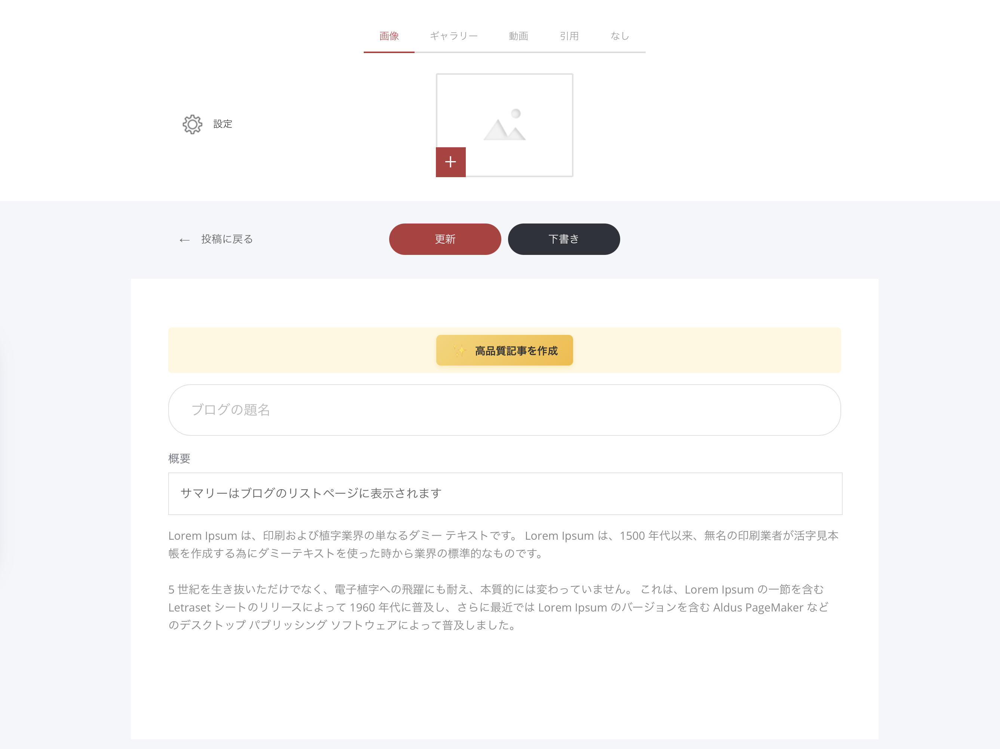

# 記事の基本

### 記事作成の流れ（概要）

ブログ記事を新しく作成したり、既存の記事を編集したりするには、［投稿を追加］をクリックするか、編集したい記事のタイトルをクリックします。

すると、記事エディターが開きます。

記事エディターでは、次の操作ができます。

* 記事のメイン画像（またはメディア）を変更する
* 記事タイトルを設定する（※これはSEOのH1見出しにもなります）
* 記事の概要（サマリー）を追加する
  * 概要はブログの一覧ページに表示されます
  * さらにSEOのメタディスクリプションとしても使われます
* ドラッグ＆ドロップのビルダーで記事本文を作成する
* 記事ごとの設定を調整する


**ブログ概要（サマリー）が思いつかないとき**\
何を書けばいいか迷う場合は、AIライティングアシスタントを使ってください。記事本文の内容をもとに、概要文を自動で作成してくれます。


### ［更新］と［下書き］の違い

どちらも「保存」ボタンですが、役割が違います。

#### 記事を公開する（更新）

［更新］を選ぶと、記事が公開され、サイトのブログに表示されます。\
すでに公開済みの記事の場合は、変更内容が反映されて更新されます。

#### 下書きとして保存する

あとで続きを書きたい場合は、［下書き］を押して保存してください。公開はされず、下書きとして残ります。
