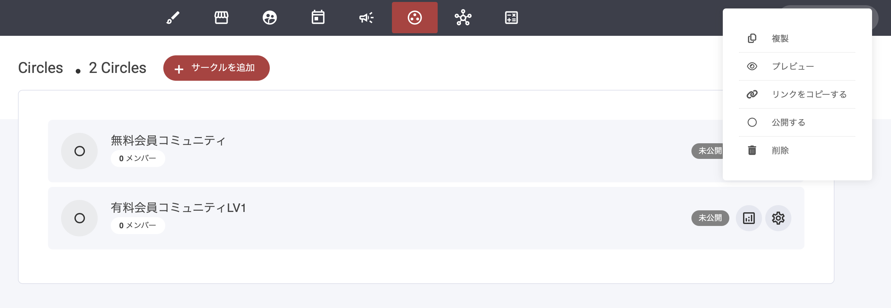
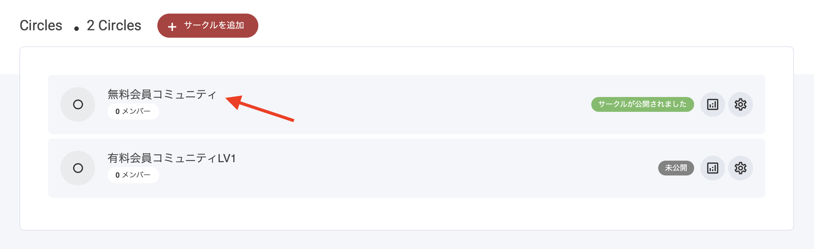

# サークル設定

## サークルの編集を開始する

サークルの編集を開始するには、上部ナビゲーションバーにある「コミュニティ」タブに移動してください。既にサークルの作成を開始している場合は、下記から選択できます。まだ作成していない場合は、最初の[サークルを作成](../community-setup/)してください。

<figure><figcaption></figcaption></figure>

このダッシュボードでは、サークルの右側にあるトップレベル設定を確認できます。ここから次の操作が行えます。

**複製**\
既存のサークルを、コンテンツを含めてそのままコピーします。

**プレビュー**\
サークルの表示をライブで確認します。

**リンクをコピーする**\
共有用の URL をコピーします。

**非公開**\
サークルを非公開にし、一般ユーザーやメンバーから見えない状態にします。

**削除**\
サークルを削除すると元に戻せません。100% 本当に削除が必要だと確信したときだけ削除してください。

## サークルへのアクセス方法

アクセスしたいサークルにカーソルを合わせて、左クリックするだけで開くことができます。

<figure><figcaption></figcaption></figure>

---

<!-- cta:opusbooster -->

**自分の場合はどう使えばいいか**

[コミュニティ機能の全体像](https://opusbooster.com/community)を見る。設計から相談したい方は[15分の無料相談](https://opusbooster.com/consultation)、まず触ってみたい方は[14日間の無料トライアル](https://opusbooster.com/register)（クレジットカード不要）から。

