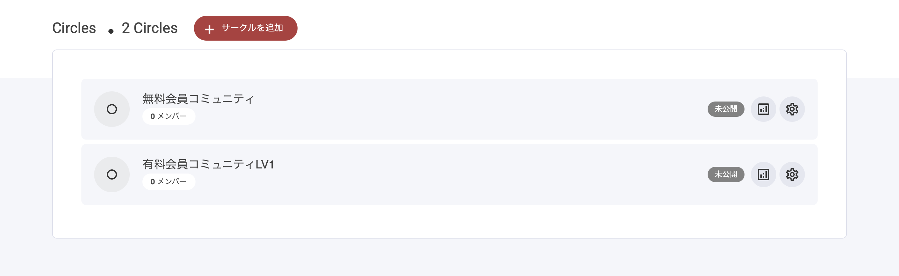

# コミュニティの作成

コミュニティタブを選択すると、**サークル**を作成できるようになります。


サークルは、メンバーごとに独立した環境を用意できるサブコミュニティ機能です。プランによって作成できるサークル数が決まっており、各サークルではコースやページなどを無制限に追加できます。ほとんどのユーザーにはサークル1つで十分ですが、コミュニティの種類や提供内容に応じて2～3個に分けることも可能です。


### 新しいサークルを作成する

新しいサークルを追加するには、「＋ サークルを追加」ボタンをクリックします。ボタンを押したら、サークル名を入力して［保存］をクリックしてください。これで新しいサークルが作成されます。

