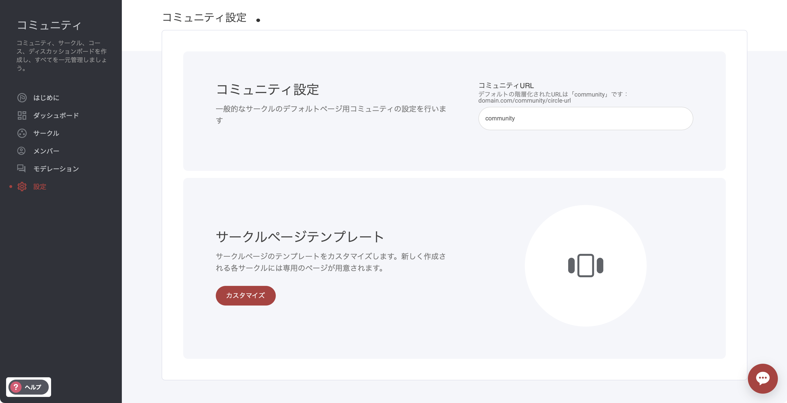
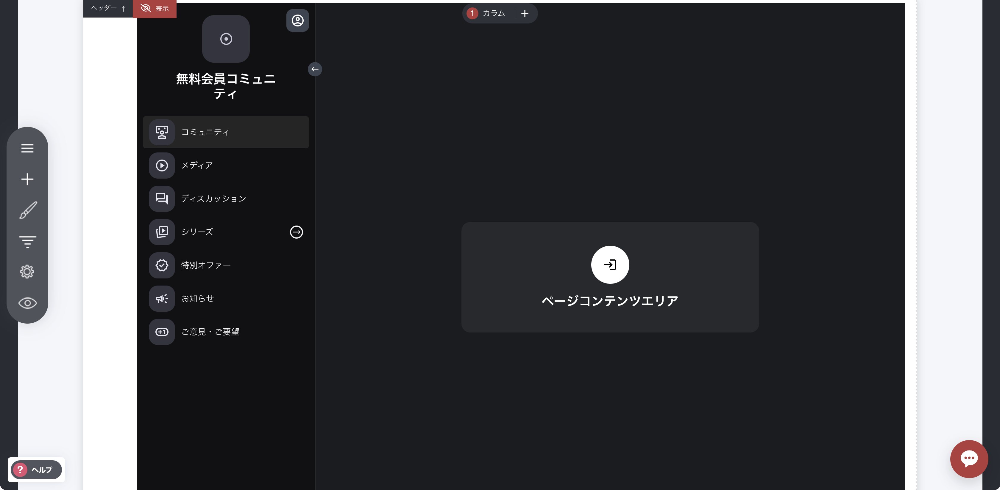

# コミュニティ設定

ここで必要に応じてコミュニティのURLを変更できます。


デフォルトでは、URL は www.yourdomain.com/**community** に設定されています。\
画像では、URLの末尾にサークルURLが付いているのが確認できます。各サークルには、メンバーをコミュニティに誘導するための独自のURLが設定されます。


### サークルページテンプレート 

サークルページテンプレートセクションは、他のシステムページと同様に機能し、メインコミュニティ／サークルの表示をカスタマイズできます。

システムページでは、ウィジェット・ブロック・コンテナの追加などを通じて、コミュニティの主要レイアウトページのデザインを変更できます。**注意**：ページやコースを追加するといったコミュニティ／サークル自体のコンテンツ編集はここでは行いません。コンテンツの追加・編集は、該当するサークルを編集する際に行ってください。
