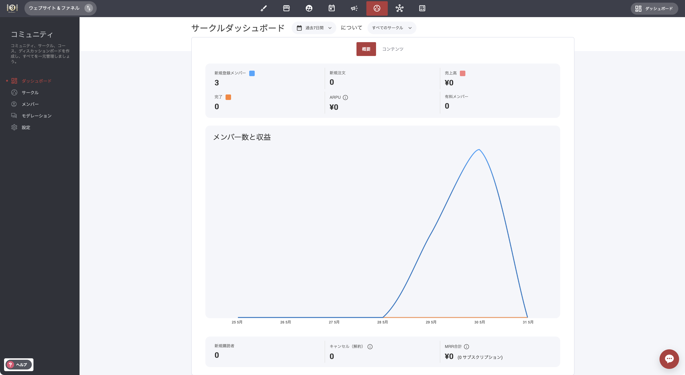

# コミュニティ・ダッシュボード

画面左側にある［コミュニティ・ダッシュボード］タブでは、各サークルの概要情報を確認できます。メンバー数、特定のコミュニティ／サークル内で発生した売上、動画などエンゲージメントの高いコンテンツのデータが表示されます。

### コンテンツ・タブ 

［コンテンツ］タブでは、トラッキング対象に設定したすべての動画コンテンツを一覧できます。有料でコミュニティやサークルへのアクセスを提供している場合は、その関連データもここで確認できます。


※ここで表示されるデータと分析は、全メンバーを対象とした概要です。特定のメンバーの詳細データが必要な場合は、CRMプロフィール内の該当タブで確認してください。

