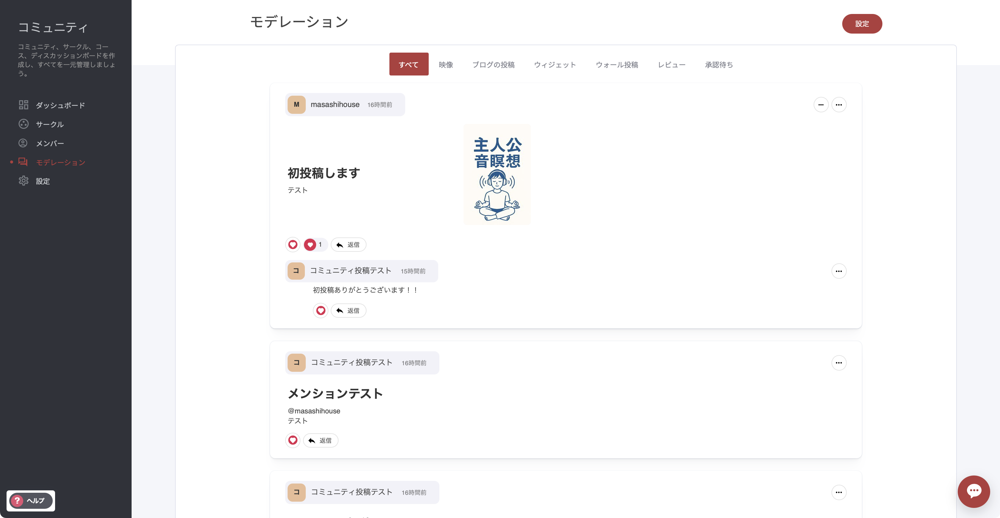
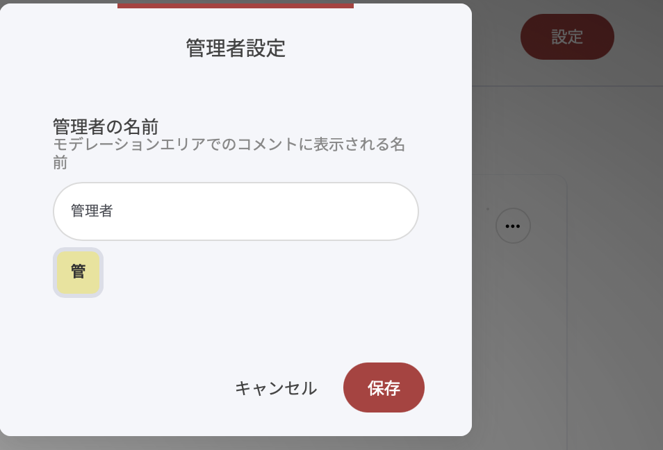

# コミュニティ・モデレーション

コミュニティモデレーション機能を使うと、コミュニティ内で共有された **投稿・コメント・返信** を1か所で確認・対応できます。安全で活発、そしてメンバーが「声を聞いてもらえた」と感じられる場をつくるために役立ちます。

***

<figure><figcaption></figcaption></figure>

### モデレーショントピック

| トピック   | 説明                                                    |
| ------ | ----------------------------------------------------- |
| すべて    | 投稿、コメント、レビューなど、コミュニティの全アクティビティを一覧表示します。               |
| 映像     | ホストした動画ごとのコメントを確認できます。動画を指定して絞り込みも可能です。               |
| ブログの投稿 | ブログ記事にコメント機能を有効にしている場合、そのコメントに直接返信できます。               |
| ウィジェット | 通常ページに配置した「コメント」ウィジェットなど、ページ内ウィジェット経由のやり取りをまとめて表示します。 |
| ウォール投稿 | コミュニティウォール（掲示板）に投稿された内容を一覧できます。                       |
| レビュー   | 商品購入後に寄せられたレビューへ返信できます（レビュー機能を有効化している場合）。             |
| 承認待ち   | 事前承認が必要なコメント／レビューを承認または却下できます。ブログコメントでよく使われます。        |

***

### 設定

画面右上の設定ボタンから、各モデレーショントピックに「誰として返信するか」を指定できます。たとえば、複数の管理者がいる場合に特定の管理者名義で返信する、といった設定が可能です。

<figure><figcaption></figcaption></figure>
