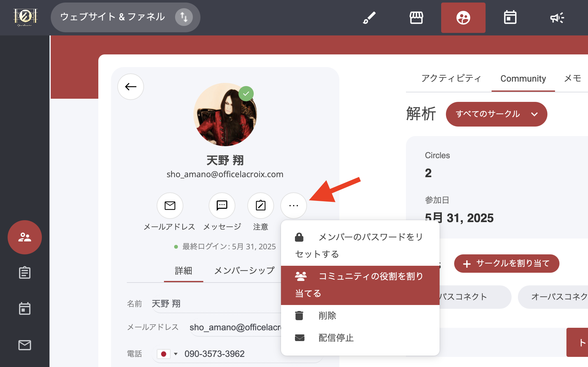

# コミュニティロールの割り当て

### コミュニティロールの割り当て：アクセスと権限の管理

コミュニティ内では、**ロール**を設定してメンバーの権限・責任範囲・関与度をコントロールできます。ロールを使い分けることで、秩序ある参加を促しつつ、必要な管理権限を保持できます。

***

### 利用可能なロール

| ロール               | 概要                                            |
| ----------------- | --------------------------------------------- |
| **メンバー**          | 1つ以上のサークルに参加できる一般メンバー。                        |
| **コミュニティモデレーター**  | **モデレーターバッジ**が付与され、投稿やコメントの監視・管理をサポート。        |
| **コミュニティ管理者**     | **管理者バッジ**が付与され、設定・コンテンツ・コミュニティ全体をフルコントロール可能。 |

#### 主な権限設定例

* **投稿作成**や**コメント返信**を許可／禁止してディスカッションを管理
* **管理者専用の投稿・チャット機能**でプライベートな連絡を確保
* **管理者・モデレーター限定のスレッド**で、主要リーダー間の会話に制限

これらの権限を適切に組み合わせることで、ニーズに合った**構造的で安全な**コミュニティ運営が実現できます。

***

### ロールの割り当て方法

コミュニティロールは**2か所**から割り当てできます。なお、ロールはアクティブなメンバーに対してのみ適用可能です。

#### メンバーポータル（Member Portal）

1. メンバーの CRM プロフィールを開く
2. 右上の 「…」 アイコンをクリック
3. 表示されたメニューから希望するロールを選択して適用

<figure><figcaption></figcaption></figure>

#### 連絡先 CRM（Contact CRM）

1. 画面上部ナビゲーションバーの **連絡先** タブを開く
2. 対象コンタクトの 「…」 アイコンをクリック
3. 同様にロールを選択して適用

<figure><figcaption></figcaption></figure>

> **注意**\
> ロールは「アクティブ」状態のメンバーにのみ設定できます。
