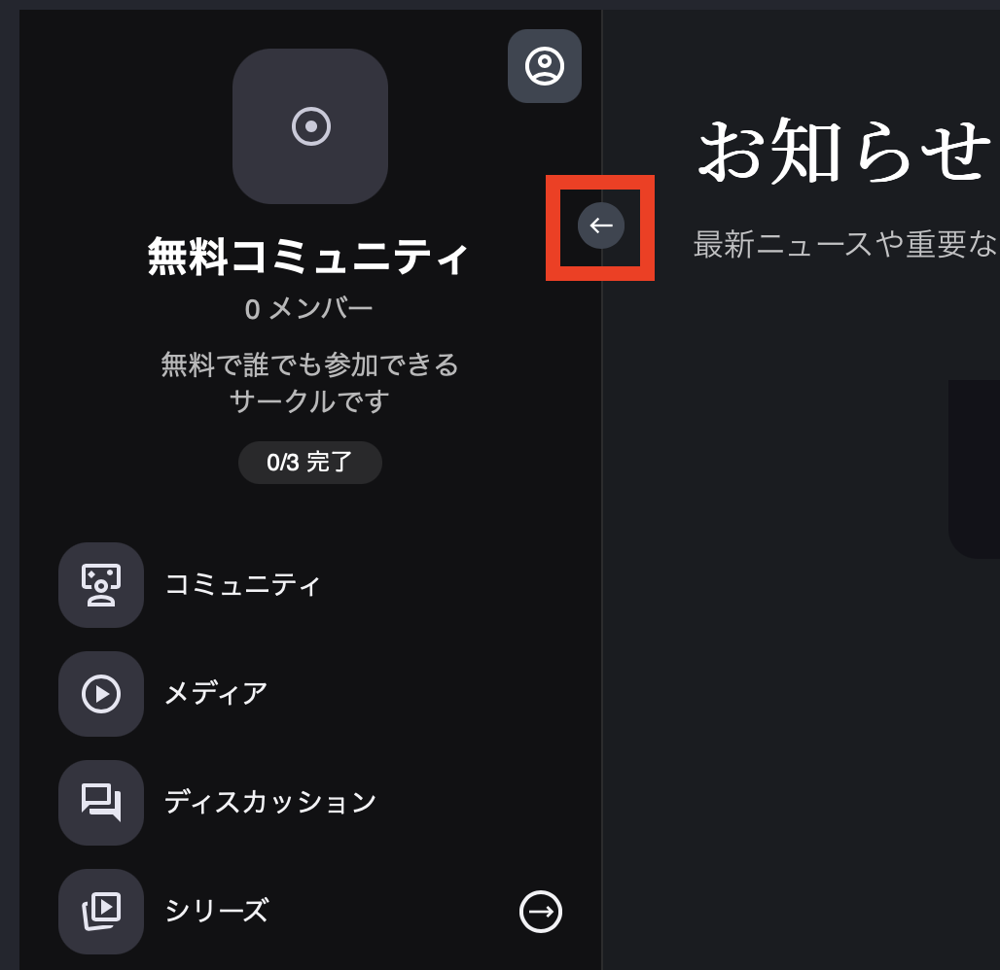
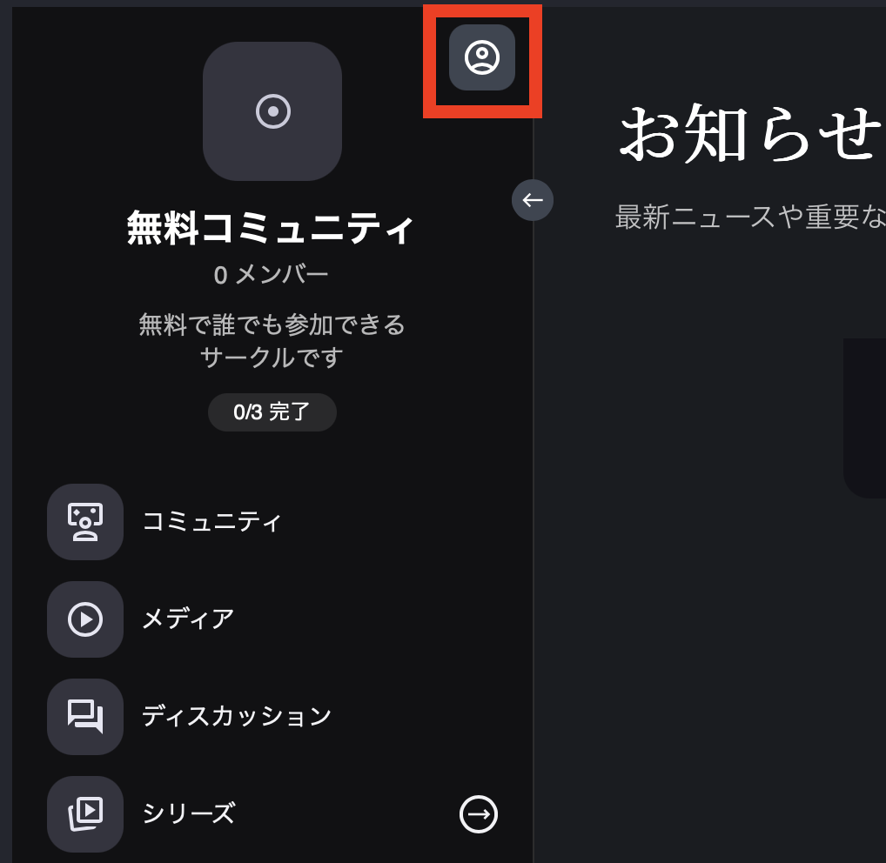

# サークル設定とスタイリング

**サークルを作成したら、次はそれを本当にあなたらしいものにしましょう！** **メインのサークル設定**と**スタイリングオプション**をカスタマイズして、あなたのビジョンに合わせ、メンバーにとって魅力的な空間を作りましょう。外観の調整、アクセスレベルの設定、シームレスな体験の確保など、これらの設定はコミュニティに最適な環境を形作るのに役立ちます。

サークル設定にアクセスするには、ページ上部に移動すると、以下に表示されているカスタマイズオプションが見つかります。

<figure><figcaption></figcaption></figure>

まずはメイン設定から始めましょう。歯車アイコンを選択してください。選択すると新しいウィンドウが表示され、この中で以下の設定が可能です。

* **サークル名**：サークルの名前。
* **サークルURL**：共有や検索のためのサークルURL。
* **サークルメンバーを表示**：サークルに登録しているメンバー数の表示をオン/オフにします。
* **サークルの説明を表示**：サークル名の下に短い説明を追加できます。
* **進捗状況を表示**：メンバーがページコンテンツのステータスを編集・表示できるようにします。
* **アクセスレベル**：各サークルは独自のアクセスレベルを持つことができます。
* **登録が必要**：訪問者はコンテンツを閲覧するためにボタンをクリックして登録する必要があります。
* **サークルカテゴリ**：各サークルに特定のカテゴリを割り当てます。
* **サークルスタイリング**：メインのスタイリングカラー、ロゴ、フォントなどをブランディングに合わせて設定します。

**以下の箇所に、あなたのサークルに適用された「サークル設定」オプションが表示されます。**

添付画像は、その場所を見つけやすいように示した参考図です。

1. サークル名
2. サークルメンバーを表示
3. サークルの説明
4. 進捗状況を表示 — 他のコンテンツでトラッキング機能を有効にしている場合にのみ表示されます。

### サークルカテゴリ

**サークルカテゴリを利用すると、複数のサークルを効率よく整理でき、コミュニティの管理や閲覧がぐっとラクになります。**&#x45;Cサイトで商品をカテゴリ別に並べるように、サークルをカテゴリ別にまとめてくれるフィルタタブを簡単に作成できます。

**サークルカテゴリの作成手順**

1. 画面の「カテゴリを追加」ボタン（①）をクリック
2. カテゴリ名を入力する
   * 例：見込み客の獲得（②）

これだけで、指定したカテゴリにサークルをきれいに分類できます。

**サークル用のカテゴリを作成したら、次はサークルウィジェットを活用してみましょう。**&#x30B5;ークルウィジェットを使うと、ページ、ブログ、ファネル、さらには別のサークル内など、どこにでも簡単に埋め込めるので、コミュニティメンバーが必要な場所からすぐアクセスできます。

**サークルウィジェットの追加手順**

1. 画面左側のタスクバーから**ウィジェット**セクションを開きます。
2. リストをスクロールして**サークル**オプションを探します。
3. 見つけたら、そのウィジェットを表示したい場所へドラッグ＆ドロップするだけです。

**画像の左側には、ページに表示されているサークルが見えます。** サークルの上には、作成されたすべてのカテゴリを表示する**シンプルなフィルタータブ**があります。**サークルカテゴリ**オプションを使用して、すべてのカテゴリを表示するか、特定のカテゴリのみを選択的に表示するかを選べます - **変更**ボタンをクリックして表示設定を調整してください。

### サークルスタイリング

サークルスタイリングには2つの場所からアクセスできます：

1. 上記のように設定歯車から
2. 上部ナビゲーションバーのペイントブラシアイコンを選択

ここでは、サークルの表示とレイアウトの**親スタイリング**オプションを設定できます。

**まず、サイドバースタイルを見てみましょう：** 下の画像に示すように、左側のタスクバーの表示方法を**ワイドビュー**または**コンパクトビュー**から選択でき、レイアウトを好みに合わせて調整できます。


**注意：** ここで選択したオプションは、メンバーがサークルにアクセスする際のデフォルトビューとして設定されます。


### 展開/折りたたみボタンの追加

この設定では、サイドバーナビゲーションを制御する小さな矢印アイコンを有効または無効にできます。有効にすると、このアイコンによりユーザーはサイドバーを全幅に展開したり、よりコンパクトなビューに折りたたんだりできます。これにより柔軟性が提供され、メンバーは詳細なナビゲーション体験とよりクリーンでスペースを節約するレイアウトのどちらかを選択できます。

<figure><figcaption></figcaption></figure> <figure><figcaption></figcaption></figure>

### プロフィールボタンの追加

プロフィールボタンにより、メンバーは個人プロフィールダッシュボードにアクセスでき、情報の更新、購入履歴の確認、アカウント詳細の管理が可能になります。

<figure><figcaption></figcaption></figure> <figure><figcaption></figcaption></figure>

### パディングと角の丸み

#### 小さなスタイリング機能：

微妙ながらも効果的なスタイリングオプションでサークルの外観を向上させましょう。下の画像に示すように、**サークルパディングを調整**してサークルの周りに枠線効果を作成し、希望する外観を実現するためにパディングサイズを微調整できます。

スリークでモダンな印象のために、**角を丸く**することもできます。これは、より柔らかく洗練された美学を好むブランドに最適です。さらに、サイドバーの背景を含む**背景色のカスタマイズ**や、より没入型の体験のためにサークルを**ダークモード**に切り替えることも可能です。

<figure><figcaption></figcaption></figure>

### サークル画像の追加

サークルに画像を追加することで、強力な視覚的アイデンティティを作成できます。ミニマリストな外観のための**シンプルなアイコン**か、ブランディングを強化するための**完全なロゴ画像**のアップロードかを選択できます。

この画像はサークル内で目立つように表示され、メンバーがコミュニティを認識して関わりやすくなります。スタイリッシュなシンボルでも詳細なロゴでも、適切な画像を選ぶことで、全体的なデザインとブランディングの一貫性が確保されます。

さらに、**サイズや背景スタイリング**をカスタマイズして、画像をサークルのレイアウトにシームレスに統合できます。洗練された仕上がりのために、**角の丸み**などの他のスタイリングオプションと組み合わせたり、バランスの取れた洗練された外観のためにパディングを調整したりすることを検討してください。

<figure><figcaption>
サークル画像/ロゴ
</figcaption></figure>

### テキストスタイリング

**テキストスタイリング**オプションは、独自のフォントタイプをサークル全体で使用できるようにすることで、一貫したブランドアイデンティティを維持するのに役立ちます。**サークル名フォント**、**ページ名フォント**、テキストサイズをブランディングに合わせて微調整できます。

さらに、サークル内のページにボタンを追加する際に**ボタンの色**をカスタマイズでき、一貫した視覚的体験を確保します。テキストの色、バッジスタイル、さらには背景設定を調整するオプションにより、サークルの美観を完全にコントロールできます。

<figure><figcaption></figcaption></figure>

### アイコンスタイリング

アイコンはサークルの外観と雰囲気を形作る上で重要な役割を果たします。**アイコンスタイリング**では、**色、背景、枠線**をカスタマイズすることで、メニューアイコンの外観を洗練し、ブランディングと全体的な美観に合わせることができます。

この機能により以下が可能になります：

* ブランドパレットに合わせて**アイコンの色を調整**する。
* クリーンまたは大胆な効果のために**背景色を変更**する。
* アイコンにより多くの構造と定義を与えるために**枠線を追加**する。

これらの要素を微調整することで、コミュニティにとってシームレスで視覚的に魅力的な体験を作成し、ナビゲーションを直感的で魅力的なものにできます。

<figure><figcaption></figcaption></figure>

### グループサブメニュー項目の表示場所は？

グループにサブページを追加する際、サブメニュー項目を表示する3つの異なる方法があり、サークルの構造とユーザーの好みに最適なナビゲーション体験をカスタマイズできます。

利用可能なオプションは以下の通りです：

1. **グループ名の下にインライン表示** – サブメニュー項目がメインメニュー内のグループ名の直下に表示され、クリーンなネスト表示を提供します。
2. **メニューの上にサブメニューをスライド表示** – グループ名をクリックすると、サブメニューが既存のメニューの上にスライドし、ダイナミックでスペース効率の良いナビゲーション体験を作成します。
3. **独自のサイドバーナビゲーション** – サブメニューが別のサイドバーに展開し、サブページナビゲーションのための専用スペースを提供し、視認性とアクセシビリティを向上させます。

以下の画像では、各オプションがどのように表示されるかを確認できます。これにより、レイアウトの好みと全体的なユーザー体験に最も合ったスタイルを決定するのに役立ちます。

**表示レイアウトを変更するには、ブラシアイコンをクリックしてサークルを編集します。** 次に、「グループサブメニュー項目の表示場所」セクションまでスクロールし、ドロップダウンメニューから希望のオプションを選択します。

<figure><figcaption></figcaption></figure>

まずは **「グループ名の下にインライン表示」** オプションを選択しましょう。この設定にすると、グループのタイトルタブ直下に、そのグループに紐づくページがインライン表示されます。表示されるページには「＋」アイコンが付いているので一目でわかります。

<figure><figcaption></figcaption></figure>

### メニュー上にサブメニューをスライド表示

この表示スタイルでは、ネストされたページがメインメニューの上に滑らかにスライドして重なるため、限られたスペースでも動きのあるナビゲーションが実現できます。メインメニューをゴチャつかせずにサブページを整理できる、視覚的にダイナミックな方法です。

* メンバーにはサブメニューがあることを示す **矢印アイコン** が表示され、展開・折りたたみが直感的に行えます。
* 元のメニューに戻りたいときは **「戻る」ボタン** を押すだけで、スムーズにナビゲートできます。

このオプションを使えば、整理されたクリーンなユーザー体験を保ちながら、必要な情報をコンパクトに配置できます。

<figure><figcaption></figcaption></figure>

### 独立サイドバー ナビゲーション

この表示スタイルでは、ネストされたページがすべて専用のスライド式タスクバーに整理され、わかりやすく構造化されたナビゲーションを実現します。

* サイドバーは **画面の左側・右側** のどちらにも配置でき、デザインやユーザー体験に合わせてレイアウトを調整可能です。
* メインメニューをスッキリ保ちながら、必要な情報へすばやくアクセスできます。

<figure><figcaption></figcaption></figure>

### 高度なスタイルカスタマイズ

* このオプションを使うと、メニューバーを **画面の左側／右側** のどちらに配置するかを自由に選択でき、レイアウトにぴったり合わせられます。
* **背景色** を変更してブランドカラーと統一したデザインにしたり、**ボタンの色** を調整してインタラクティブ要素を全体のトーンに自然に溶け込ませることも可能です。

これらのスタイリング機能により、機能性とビジュアルを両立した、洗練されたパーソナライズ体験をコミュニティに提供できます。

<figure><figcaption></figcaption></figure>
