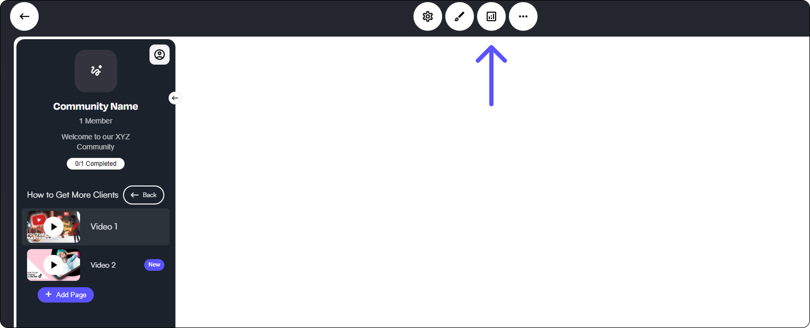

# 分析とエンゲージメント

サークル内の「アナリティクス＆エンゲージメント」タブに簡単にアクセスして、コミュニティ内で起こっているすべての出来事を分かりやすく把握できます。この強力なツールでは、以下のことが可能です。

* **ユーザーのエンゲージメントを追跡する** – トラッキングされたページコンテンツから、現在の進捗状況まで、メンバーのやり取りの様子を確認します。
* **販売の洞察を確認する** – 購入や収益データを監視して、提供内容を最適化します。
* **個々のメンバーの活動を深掘りする** – 特定のメンバーがサークルとどのように関わっているかを深く理解し、コンテンツややり取りを効果的に調整できます。

この機能はあなたを情報で強化しコントロールを可能にし、戦略を洗練してメンバー体験を向上させやすくします。

<figure><figcaption></figcaption></figure>

#### 分析タブ

上部の「アナリティクス」タブをクリックすると、ポップアウト画面が表示され、すべてのアナリティクスとエンゲージメントインサイトに簡単にアクセスできます。この画面では、コミュニティのアクティビティ、メンバーのインタラクション、財務指標など、さまざまなセクションを閲覧できます。

まずは、 **初期の分析概要** を見てみましょう—ここでは、 **主要なデータポイント** が見つかります、以下を含みます：

* **現在のメンバー統計** – 総メンバー数、アクティブな参加、成長トレンドを確認します。
* **継続的な収益** – サブスクリプションベースの収益や財務パフォーマンスに関する洞察を得られます。
* **エンゲージメント指標** – 投稿の完了状況など、メンバーの関与の仕方を追跡します。

このダッシュボードはあなたのサークルのパフォーマンスを総合的に表示し、エンゲージメントを洗練し成長を最適化するための情報に基づく意思決定を支援します。

>)

#### コンテンツタブ

**コンテンツ タブ**では、すべてのメンバーの分析を**俯瞰的に確認**できるため、サークル内のエンゲージメントを監視し、アクティビティを追跡できます。

このツールであなたができること：

* **全体の完了率を確認する** メンバーがあなたのコンテンツとどのようにやり取りしているかを確認します。
* **有料コンテンツの活動を分析する** どのリソースが最もエンゲージメントを生んでいるかを理解します。
* **ユーザートレンドを特定する** コンテンツ配信を最適化しメンバー体験を改善します。

この集中化されたダッシュボードにより、パフォーマンスを評価しサークルのためのデータ駆動型の意思決定を行いやすくなります。

 (1)>)

#### メンバーデータ

メンバータブでは、サークル内の現在のアクティブメンバー全員のリストに直接アクセスできます。ここから以下のことができます。

* **個々のメンバーを選択する** 彼らの活動、購入、やり取りを深く掘り下げます。
* **詳細な洞察を分析する**、コンテンツを調整しメンバー体験を最適化できるようにします。

このツールはエンゲージメントの追跡、パーソナライズされたサポートの提供、サークル内のつながりの強化を容易にします。

 (1)>)

リストからメンバーを選択すると、あなたはにアクセスできます **詳細なプロフィールビュー**、サークル内での彼らのエンゲージメントと活動に関する貴重な洞察を提供します。

アクティブなメンバーのプロフィールで見つかるものは次のとおりです：

* **個人情報** – 名前やメンバーシップ状況を含む基本的なアカウント情報。
* **エンゲージメント履歴** – コンテンツの閲覧、コメント、ディスカッションへの参加などのやり取りのタイムライン。
* **購入履歴** – 該当する場合、過去の取引、サブスクリプション、または有料コンテンツアクセスの内訳。
* **完了率** – 利用可能なコンテンツに対する進捗のスナップショットで、全体的な参加度を把握するのに役立ちます。

 (1)>)

個々のメンバーのプロフィールを閲覧している間、内で **メンバータブ** 管理とコミュニケーションを強化するためのいくつかの管理ツールが利用できます。

ここでできること：

* **メンバーを別のサークルに手動で追加する** – ほんの数クリックでアクセスと関与を拡大できます。
* **メールまたはSMSを送信する** – 更新、発表、または直接サポートのために迅速にメンバーと連絡できます。
* **メモを追加する** – メンバーのエンゲージメント、好み、やり取りに関する重要な詳細や内部コメントを記録します。

これらの機能によりメンバー管理が円滑になり、エンゲージメントを維持しサークル内でパーソナライズされたサポートを提供できます。

#### メンバーをサークルに手動で追加する

追加のサークルにメンバーを手動で追加するには、「+サークルを割り当てる」ボタンを選択します。

ここで、アクティブな他のサークルを選択し、メンバーを直接追加できます。

#### **メンバーにメールまたはSMSを送信する**

メンバーに連絡を取りたい場合は、メールまたはSMSのアイコンを選択するだけでメッセージを送信できます。

メールとSMSの機能は、CRMプロファイルからメッセージを送信する場合とまったく同じように機能するため、シームレスなコミュニケーション体験が保証されます。

個々のユーザー/メンバーにメールまたはSMSを送信する方法については、以下をクリックしてください。

[個別メール送信](https://buildersupport.gitbook.io/help-docs/ja/purattofmu/messjingutowkufur/mru)

[SMS＆WhatsApp](https://buildersupport.gitbook.io/help-docs/ja/purattofmu/messjingutowkufur/sms-whatsapp#individual-sms)
