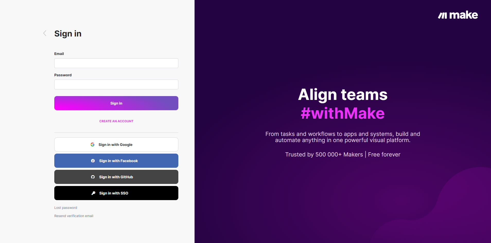

# Make


**Make**は、コードを必要とせずに手作業のプロセスを自動化するためのツールです。彼らは自身を「インターネットの糊」と呼び、顧客がアプリやサービスを相互に接続できるよう支援しています。


### 無料アプリをダウンロード



上記のリンクをクリックすると、MakeアプリをあなたのMakeアカウントに追加するように案内されます。なお、Makeアカウントをお持ちでない場合は、そこでサインアップすることもできます。

<figure><figcaption></figcaption></figure>

### Makeの仕組み

Makeの仕組みを理解するには、まずAPIとは何かを知る必要があります。API（アプリケーション・プログラム・インターフェース）は、ソフトウェアプロバイダー（MailChimp、Shopify、PayPalなど）が提供するもので、開発者が彼らのアプリケーション内のデータにアクセスできるようにするものです。例えば、開発者がShopify APIを通じて新規のShopify注文をすべて検知し、そしてMailChimp APIを通じてそれらの顧客をMailChimpのニュースレターに登録するというようなコードを書くことができます。

<figure><figcaption></figcaption></figure>

Makeは、これらの複雑なAPIをコードなしで利用できるよう、シンプルなブロックに変換し、ドラッグ＆ドロップで簡単に接続できるようにしています。Makeではこれらのブロックを「モジュール」、それらの間の視覚的な接続を「シナリオ」と呼んでいます。

一度設定すれば、Makeは24時間365日稼働し続けます。
