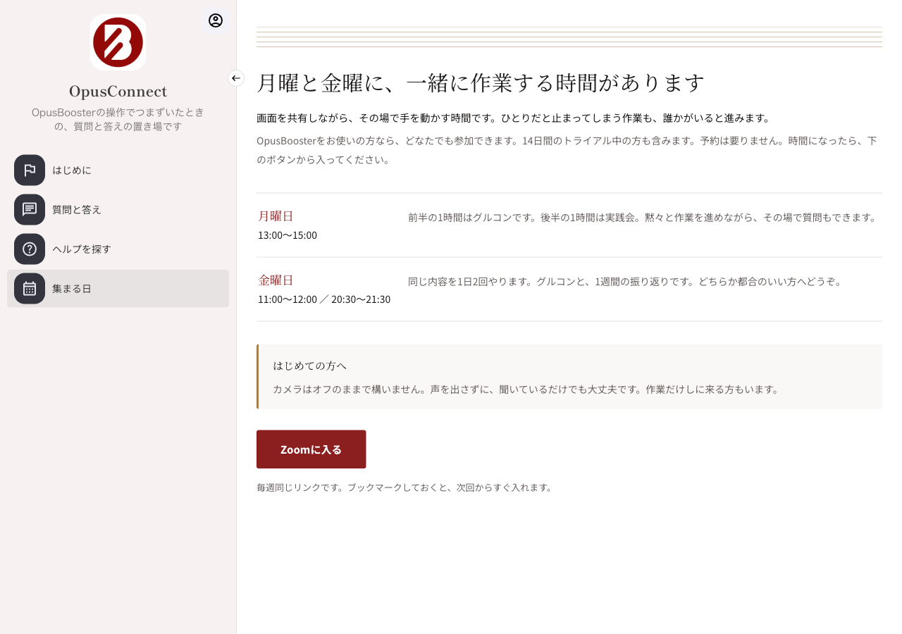

# 集まる日（グルコン＆実践会）のZoomに入る手順

グルコンと実践会は、ユーザーコミュニティ **OpusConnect** の「集まる日」ページから入ります。予約は要りません。時間になったら、ページの **Zoomに入る** ボタンを押してください。


「集まる日」は、**14日間の無料トライアル中の方と、有料プランをご利用中の方**が参加できます。トライアルが終了した方は、プランに申し込むと再び参加できます。


## 開催日時

* **毎週月曜日 13:00〜15:00** — 前半の1時間はグルコン、後半の1時間は実践会です。黙々と作業を進めながら、その場で質問もできます。
* **毎週金曜日 11:00〜12:00／20:30〜21:30** — 同じ内容を1日2回、1時間ずつ開催します。グルコンと、1週間の振り返りです。どちらか都合のいい方へどうぞ。

カメラはオフのままで構いません。声を出さずに、聞いているだけでも大丈夫です。

## 1. OpusConnectを開く

管理画面の上部メニューにある **OpusConnect** を押すか、[https://opusbooster.com/community/opusconnect](https://opusbooster.com/community/opusconnect) を開きます。

ログインを求められたら、画面の一番上にある **ログイン用メールを受け取る** を押してください。パスワードは必要ありません。登録したメールアドレスに届くメールから、そのまま入れます。詳しくは[ログインできないとき](login-help.md)をご覧ください。

## 2. 「集まる日」を開く

左のメニューから **集まる日** を押します。開催日時と、Zoomのボタンがあります。

<figure><figcaption>「集まる日」のページ。時間になったら「Zoomに入る」を押します</figcaption></figure>


「集まる日」が開けず「特別なメンバーシップが必要です」と出る場合は、トライアルの期限が過ぎているか、まだトライアルを始めていない状態です。[料金ページ](https://opusbooster.com/pricing)からプランをご確認ください。


## 3. Zoomに入る

**Zoomに入る** を押すと、Zoomが開きます。毎週同じリンクなので、ブックマークしておくと次回からすぐ入れます。

Zoomには待機室があります。入室すると「ホストが参加を許可するまでお待ちください」と表示されますので、そのままお待ちください。開始時に順番に許可します。

## 入れないとき

* **ログインのメールが届かない** — [ログインできないとき](login-help.md)の「メールが届かないとき」をご覧ください。
* **Zoomのアプリが開かない** — ブラウザーで「ブラウザから参加」を選んでも参加できます。
* **時間になっても待機室から進まない** — 開始直後は順番に許可しています。数分お待ちください。それでも進まないときは、管理画面右下のチャットでお知らせください。

<!-- community:opusconnect -->

**同じところでつまずいた方は**

OpusConnect（OpusBoosterのユーザーコミュニティ）にも、操作でつまずいたときの質問と答えが集まっています。[OpusConnectを開く](https://opusbooster.com/me/opusconnect)（OpusBoosterへのログインが必要です）

