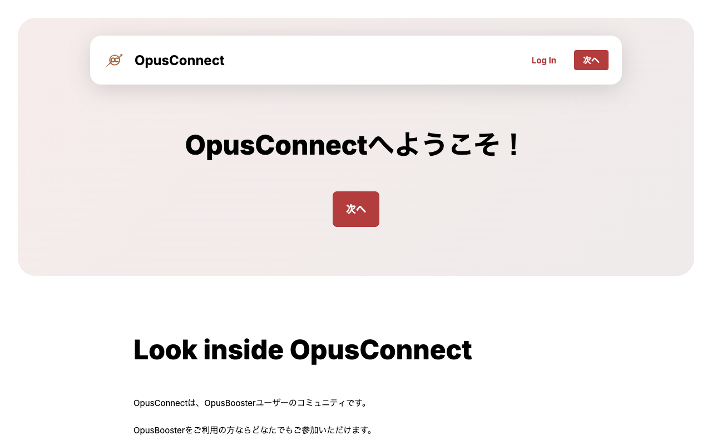
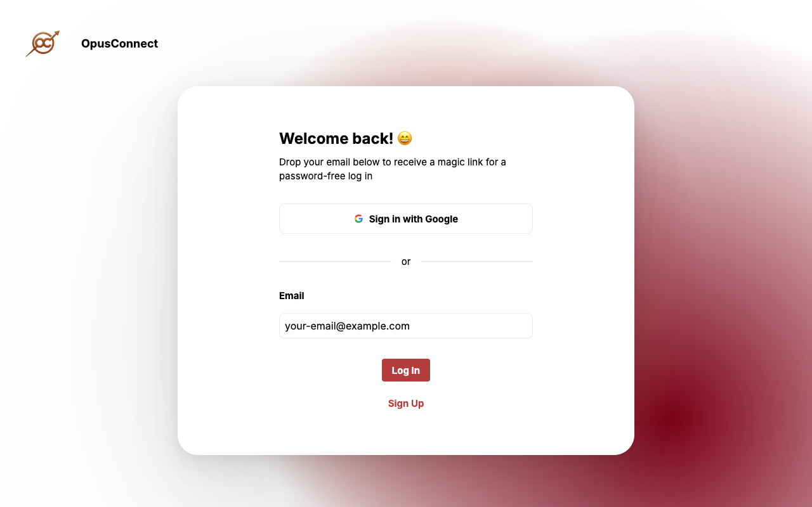
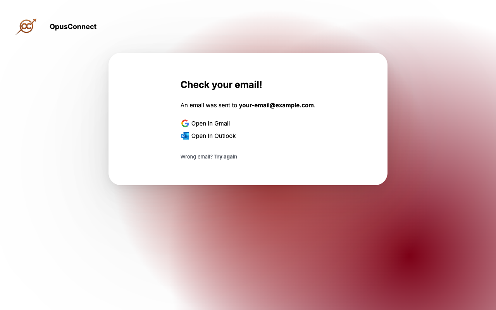

# グルコンや講座のZoomに入る手順

グルコンや講座の案内メールのボタンを押すと、まずログインが必要です。パスワードはいりません。メールアドレスを入力すると、ログイン用のメールが届きます。そのメールのボタンを押せばログインできます。


ログイン画面は英語で表示されます。この記事では、各画面の英語が何を伝えているかもあわせて説明します。


## グルコンの開催日時

グルコンは毎週、次の日時に開催しています。

* **毎週月曜日 13:00〜15:00**
  * 前半の1時間はグルコンです。
  * 後半の1時間は実践会です。黙々と作業を進めながら、その場で質問もできます。
* **毎週金曜日 11:00〜12:00／20:30〜21:30**
  * 同じ内容を1日2回、1時間ずつ開催します。グルコンと、1週間の振り返りを行います。

## 1. 案内メールのボタンを押す

グルコンや講座の案内メールにあるボタンを押すと、次の画面が開きます。右上の **Log In** を押してください。

<figure><figcaption>右上の Log In を押します</figcaption></figure>

## 2. メールアドレスを入力して Log In を押す

ログイン画面が開きます。英語で「メールアドレスを入力すると、パスワードなしでログインできるリンクを送ります」と書かれています。

1. **Email** の欄に、お申し込みのときに使ったメールアドレスを入力します。
2. 下にある赤い **Log In** ボタンを押します。

<figure><figcaption>メールアドレスを入力して Log In を押します</figcaption></figure>

## 3. 届いたメールの Login ボタンを押す

**Log In** を押すと、次の画面に変わります。**Check your email!** は「メールを確認してください」、**An email was sent to** のあとには、送信先のメールアドレスが表示されています。

<figure><figcaption>ログイン用のメールが送信されたことを知らせる画面です</figcaption></figure>


この画面のまま待っていても、先には進みません。メールを開いてください。


1. メールアプリを開きます。Gmailをお使いの場合は、画面の **Open In Gmail** から開くこともできます。
2. 次のメールを開きます。
   * 差出人：no-reply@artrepreneur.jp
   * 件名：Log in to OpusConnect
3. メールの中にある **Login** ボタンを押します。

ログインが完了すると、イベントページからZoomに参加できます。

## メールが届かないとき

* 迷惑メールフォルダや、Gmailのプロモーションタブを確認してください。
* メールの検索欄で「OpusConnect」と検索すると、見つけやすくなります。
* 数分待っても届かない場合は、手順1からやり直してください。入力したメールアドレスが間違っていないかも確認しましょう。
