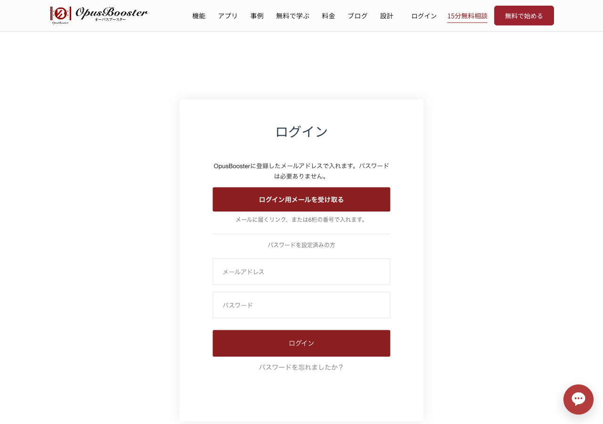
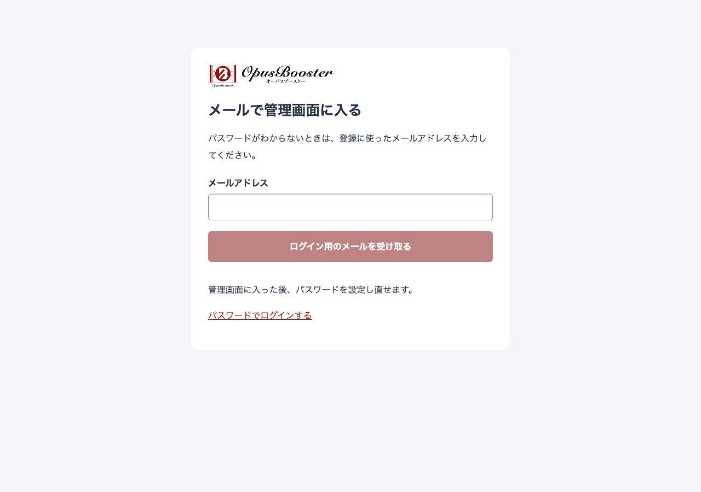

# ログインできないとき（パスワードなしで入る）

OpusBoosterへは、**パスワードなしで入れます**。登録したメールアドレスに届くメールから、そのままログインできます。パスワードを忘れた方も、まだ決めていない方も、この手順で入れます。


「パスワードの設定」というメールが届いている方も、設定しなくてもログインできます。パスワードでログインしたい方は、後述の「パスワードを使いたいとき」をご覧ください。


## 1. ログインページで「ログイン用メールを受け取る」を押す

[ログインページ](https://opusbooster.com/login)を開き、一番上にある **ログイン用メールを受け取る** を押します。

<figure><figcaption>ログインページ。上のボタンがパスワードなしの入口です</figcaption></figure>

## 2. メールアドレスを入れて送る

次の画面で、OpusBoosterに登録したメールアドレスを入力し、**ログイン用のメールを受け取る** を押します。

<figure><figcaption>登録したメールアドレスを入力します</figcaption></figure>


チャレンジの申し込みや決済で別のメールアドレスを使った方は、**OpusBoosterに登録したときのアドレス**を入れてください。


## 3. 届いたメールから入る

「【OpusBooster】ログイン用リンクと6桁の番号」という件名のメールが届きます。入り方は2つあり、どちらでも構いません。

* **メールのリンクを押す** — そのまま管理画面が開きます。
* **6桁の番号を入力する** — メールを別の端末で開いたときなどは、送信後の画面に戻り、メールにある6桁の番号を入力します。

リンクと番号は、送信から短時間だけ有効です。時間が過ぎたときは、手順1からやり直してください。

## メールが届かないとき

次の順で確認してください。

1. 入力したメールアドレスに間違いがないか確認する
2. 迷惑メールフォルダを確認する
3. Gmailをお使いの場合は、プロモーションタブも確認する
4. ログインページから、もう一度メールを送る（同じアドレスに短時間で何度も送ると、しばらく送れなくなります。数分あけてください）

それでも届かないときは、[サポート](getting-support.md)のチャット、または support@opusbooster.com にご連絡ください。こちらで確認します。

## パスワードを使いたいとき

ログインページの **パスワードを忘れましたか？** から、パスワードを設定（再設定）できます。設定後は、メールアドレスとパスワードでもログインできます。

## OpusConnect（コミュニティ）に入るとき

[OpusConnect](https://opusbooster.com/community/opusconnect)を開いてログインを求められたら、画面の一番上にある **ログイン用メールを受け取る** を押してください。手順は上と同じです。一度入ると、同じブラウザーではしばらくログインしたままになります。

<!-- community:opusconnect -->

**同じところでつまずいた方は**

OpusConnect（OpusBoosterのユーザーコミュニティ）にも、操作でつまずいたときの質問と答えが集まっています。[OpusConnectを開く](https://opusbooster.com/me/opusconnect)（OpusBoosterへのログインが必要です）

