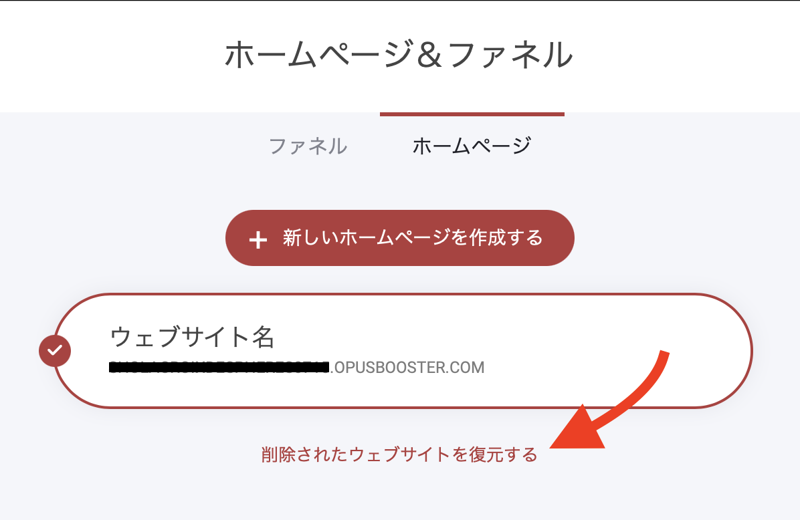

# ロードマップ


予定されているアップデートや最近の追加情報を確認することができます。


### 進行中

### **OpusBooster 最新アップデートのお知らせ**

いつもOpusBoosterをご利用いただきありがとうございます！\
今回のアップデートでは、**コミュニティ機能の強化** や **マーケティング機能のアップグレード** など、多くの新機能が追加されます。\
詳細を以下にご紹介いたします。

***

#### **🚀 新機能のご紹介**

#### **🔹 コミュニティ機能の強化**

OpusBoosterのコミュニティ機能がさらに充実！メンバー同士の交流を促進し、エンゲージメントを高める新機能を追加しました。

* **コメント機能** – 投稿に対するコメントが可能に
* **レビュー機能** – 商品やサービスのレビュー投稿が可能
* **ウォール（掲示板）機能** – メンバーが自由に情報を投稿できる
* **ディスカッション機能** – トピックごとにスレッド形式で会話ができる
* **動画プレイリスト** – 講座やコンテンツを整理しやすく
* **サークルリスト & サークル機能** – グループごとの専用スペースを作成

また、**カスタムリアクション、ミニプロフィール、アクティビティ追跡機能** も追加され、コミュニティの活性化をさらに促進します。

***

#### **🔹 マーケティング機能のアップグレード**

マーケティングオートメーションの機能強化により、より効果的なキャンペーン運用が可能になります。

* **売上追跡機能の強化** – キャンペーンやオートメーションのパフォーマンスを可視化
* **新しいオートメーショントリガー & 目標設定機能** – より細かい顧客行動に対応
* **リストの自動整理機能** – 購読解除者の管理を最適化

***

#### **🔹 Google / Facebook / Appleログイン & ワンタイムコード認証**

ユーザーのログインをよりスムーズにするため、以下の認証方法を導入しました。

* **Googleログイン**
* **Facebookログイン**
* **Appleログイン**
* **ワンタイムコード認証**

これにより、**会員サイトやコミュニティのログインが簡単になり、ユーザー体験が向上** します。

***

#### **🔹 Eコマース機能の強化**

オンラインショップ運営に役立つ新機能を追加しました。

* **商品レビュー機能** – ユーザーが商品レビューを投稿可能
* **数量割引機能** – まとめ買い割引などの設定が可能
* **商品オプション追加機能** – 商品ごとに追加オプションを設定可能
* **購入体験の改善** – よりスムーズな購入フローでコンバージョン率向上

また、**アフィリエイト機能** もアップデート完了後に導入予定です。

***

#### **🔹 新しいテンプレートの追加**

ウェブサイトやファネル作成をより簡単にするため、新しいテンプレートを追加しました。

* **アカデミー向けテンプレート**
* **コミュニティ向けテンプレート**
* **ファネルテンプレート**

***

#### **🔹 ビルダーのアップデート**

ページ作成機能がさらにパワーアップ！デザインの幅が広がります。

✅ **今回のアップデートで導入される新ウィジェット**

* コメント
* レビュー
* ウォール（掲示板）
* ディスカッション
* 動画プレイリスト
* サークルリスト（グループ機能）

✅ **次回のアップデートで追加予定のウィジェット**

* 新しいアイコンセクション
* ブロック／行／列対応スライダー機能
* アニメーション付き見出しウィジェット
* カードウィジェット
* タブウィジェット
* 価格表示ウィジェット
* テーブル（表）ウィジェット

また、**待望のモバイル編集機能** についても近日中に詳細を発表予定です！

***

### **📅 リリース予定時期**

現在、最終調整を進めており、**3月末までのリリースを予定** しています。

皆さまにより快適にご利用いただけるよう、引き続き開発を進めてまいります。\
今後のアップデートも楽しみにお待ちください！

***

## アップデート事項

### 2024年11月

* ファネルシミュレーター - 売上や集客をシミュレーションし、効果的な設計で価値ある行動に集中できる時間を生み出せるようになりました。
* SNS投稿生成機能 - AIが最適なSNS投稿を自動生成し、スケジュール設定も簡単。運用の負担を減らし、重要な活動に集中できるようになりました。

### 2024年9月

* SMS & WhatsAppメッセージング - ユーザーへのSMSとWhatsAppメッセージの送信が可能になり、自動化フローにシームレスに統合できるようになりました。
* CRMのリニューアル - 顧客のアクション履歴や、新デザインを導入。顧客との関係をより深化させ、効果的なフォローアップが可能になりました。

### 2024年4月

* システムメールテンプレート - システムが生成するメールを編集できるようになりました。
* 個別プロフィールのメール送信 - CRMから顧客に直接メールを送信できるようになりました。詳細は[こちら](../platform/email-and-automation/nomru.md)。

### 2023年7月

* 削除したウェブサイトとファネルを確認し、必要に応じてプロジェクトに戻すことができる新機能を追加しました。 \
  \
  これにより、間違って削除したり、後から再利用したいと思った場合でも、安心して作業を進めることができます。 この新機能は「ウェブサイト＆ファネル」エリアの一番下に位置しています。 そこで削除したウェブサイトやファネルの一覧を確認し、必要なものをプロジェクトに戻すことができます。&#x20;

<figure><figcaption>
削除したウェブサイトとファネルの復元
</figcaption></figure>

* メールマーケティング制限を変更しました。\
  \
  メールマーケティングモジュールの送信者レピュテーションの計算方法を変更しました。具体的には、バウンス率と苦情（スパム）率のしきい値を引き上げました。\
  \
  新しい制限は以下の通りです： \
  \
  ・バウンス率 8%(5%から引き上げ) \
  ・スパム/クレーム率 0.3% (0.1%から引き上げ)\
  \
  この変更により、審査が少し緩やかになり、審査に落ちるリスクを減らすことができます。これまで通り、クリーンでウォームなEメールリストに質の高いEメールを送信することが、最高の配信性と顧客からのエンゲージメントを確保する最善の方法です。弊社では、悪用防止とすべてのお客様の安全を確保するため、業界をリードする監視システムですべてのメール送信アクティビティを引き続き監視しています。

### 2023年1月

* アイコンセットをFontAwesomeの最新バージョンにアップデートしました。
* カゴ落ち対策の自動化を追加しました。詳細は以下の記事をご参照ください。


[kagochi.md](../platform/nettoshoppu/kagochi.md)


### 2022年11月

* ネットショップ - ウェブサイトに注文更新エンドポイントを導入しました。
* ネットショップ - 商品在庫が所定の閾値を下回った場合、ストアオーナーに通知するオプションを導入しました。
* Braintreeをペイメントプロセッサーとして使用する場合の3Dセキュアトランザクションの取り扱いを改善しました。
* ネットショップ - オーダービューで注文を一括でアーカイブできるようになりました。
* ウェブサイト API - ウェブサイトの登録メンバーをメールで検索するエンドポイントを新たに導入しました。

### 2022年9月

* メールマーケティング - 連絡先を一括で配信停止できる機能を追加しました。
* すべてのプランで会員数が無制限になりました。

