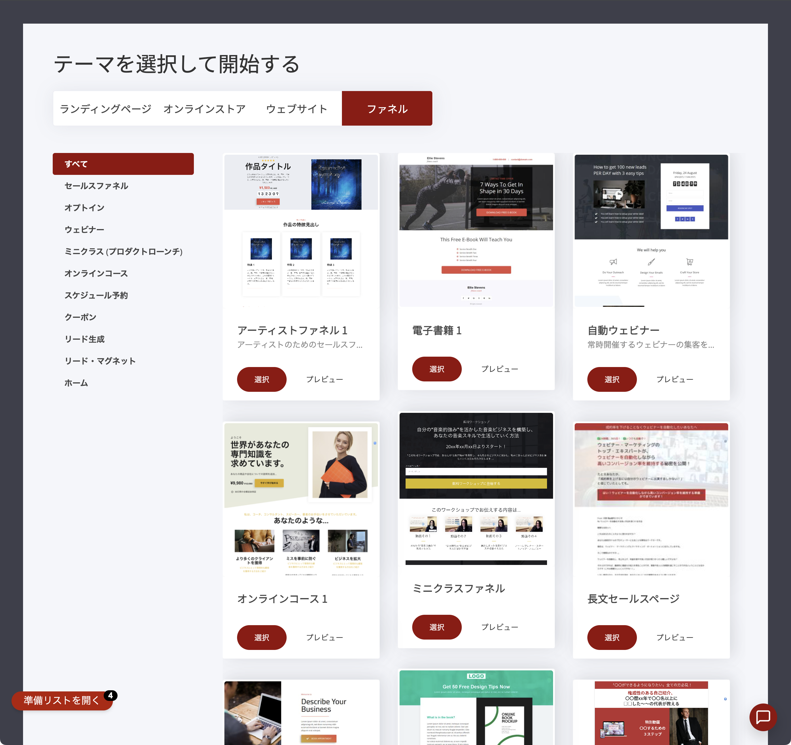
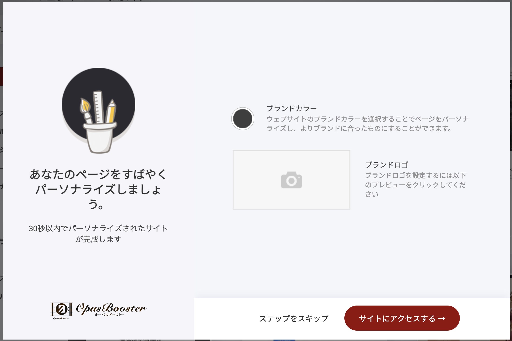

# ✅ 最初の7日間チェックリスト

OpusBoosterを使い始めたら、まずこの7日間の流れに沿って土台を整えましょう。1日あたり30分〜1時間ほどの想定です。もちろん、1日で数日分まとめて進めても構いません。

「やりたいこと」がすでに決まっている方は、[目的別サクセスマップ](success-map.md)と並行して使ってください。この7日間は「どのゴールの人にも共通する土台作り」です。

## Day 1｜テンプレートを選んで、公開できる状態にする

**今日のゴール: OpusBoosterで何ができるかを理解し、サブドメインでページが表示される状態にする**

* [ ] アカウント作成後に表示される「テーマを選択して開始する」画面で、作りたいものに近いカテゴリ（ランディングページ／オンラインストア／ウェブサイト／ファネル）からテンプレートを選ぶ
* [ ] 「ウェブサイト」または「オンラインストア」を選んだ場合は、続けて表示される設定ウィザードでブランドカラー・ロゴを設定する（30秒ほどで完了します。あとから変更できるので、迷ったら「ステップをスキップ」でも大丈夫です）
* [ ] [ウェブサイトとファネルについて](platform/getting-started/websites-and-funnels.md)を読み、2つの作り方の違いを理解する
* [ ] [ダッシュボード概要](platform/website-funnel-builder/dashboard-overview.md)で画面の見方を覚える
* [ ] [言語とタイムゾーンの設定](platform/website-funnel-builder/language-timezone.md)を日本に合わせる

<figure><figcaption>テンプレート選択画面。ランディングページ・オンラインストア・ウェブサイト・ファネルからカテゴリを選びます</figcaption></figure>

<figure><figcaption>設定ウィザード。ブランドカラーとロゴを設定すると、30秒でパーソナライズされたサイトが完成します</figcaption></figure>


独自ドメインはまだ必要ありません。テンプレートを選んだ時点で、OpusBoosterのサブドメインですでにページが公開できる状態になっています。独自ドメインへの切り替えはDay 4で扱います。


## Day 2｜サイトの顔を作る

**今日のゴール: トップページと基本ページを形にする**

* [ ] [ビルダーでページを編集する方法](platform/getting-started/edit-pages-in-builder.md)で編集操作に慣れる
* [ ] [新規ページの追加](platform/website-funnel-builder/add-pages.md)と[新規ブロックの追加](platform/website-funnel-builder/add-blocks.md)でページを組み立てる
* [ ] [フォントの設定](platform/website-funnel-builder/font-settings.md)と[フッター](platform/getting-started/footer.md)でサイト全体の見た目を整える

## Day 3｜メールの土台を作る

**今日のゴール: あなたのドメインから、迷惑メールにならずにメールが届く状態にする**

* [ ] [メールドメインの接続](platform/email-and-automation/email-domain-connection.md)を設定する
* [ ] [メールアカウント認証](platform/email-and-automation/email-account-verification.md)を済ませる
* [ ] 自分宛てに[個別のメール送信](platform/email-and-automation/individual-emails.md)でテスト送信し、受信トレイに届くか確認する

メールの土台は、リスト集め・注文通知・予約リマインダーなど、この後のすべての機能で使います。早めに整えるほど得をします。


メールドメインの接続には、独自ドメインが必要です。まだDay 4を済ませていない方は、先にドメインを取得しておくとスムーズです。


## Day 4｜本気で育てると決めたら、独自ドメインをつなぐ

**今日のゴール: あなたのドメインでサイトが表示される状態にする**

* [ ] [カスタムドメインの接続](platform/getting-started/custom-domain.md)の手順どおりにDNSを設定する
* [ ] 反映を待つ間に、[ファビコンとソーシャルシェア画像](platform/website-funnel-builder/favicon-social-share.md)を設定する
* [ ] DNSの設定ついでに、[Google Search Consoleに登録する](platform/getting-started/google-search-console-setup.md)も済ませておく

DNSの反映には数時間〜最大48時間かかることがあります。すぐに表示されなくても慌てなくて大丈夫です（[つまずいたときの確認方法はこちら](extra/troubleshooting.md#domain)）。


まだドメインを持っていない、または「とりあえず動かしながら考えたい」という方は、この日は飛ばしてサブドメインのまま先に進んでOKです。独自ドメインへはあとから切り替えられます。ただし切り替えるとURLが変わり、それまで積み上がった検索評価は多少リセットされます。すでに本気で育てると決めている方は、早めにドメインを決めておくと、この手戻りを避けられます。


## Day 5｜決済と法務を整える（商品を売る予定の方）

**今日のゴール: お金を受け取れる状態にする**

* [ ] [決済サービスとの接続](platform/online-shop/payment-services.md)を設定する
* [ ] [特商法の設定](platform/online-shop/tokushoho-setup-individual.md)（法人の方は[こちら](platform/online-shop/tokushoho-setup-corporate.md)）を済ませる
* [ ] [商品の作成](platform/online-shop/create-products.md)で最初の商品を登録する

まだ売る商品がない方は、この日はスキップして先に進んでOKです。

## Day 6｜最初のファネルを公開する

**今日のゴール: 見込み客の受け皿を1つ公開する**

* [ ] [ファネルの種類一覧（バリューラダー別ガイド）](funnel-designs/types-of-funnels/value-ladder-guide.md)で自分に合う型を選ぶ
* [ ] 迷ったら[オプトインファネル](funnel-designs/types-of-funnels/opt-in.md)から。テンプレートを開いて文言を差し替える
* [ ] [ファネル概要](platform/funnels/funnel-overview.md)で公開までの流れを確認し、公開する

完璧を目指さないのがコツです。まず1つ公開して、あとから[A/Bスプリットテスト](platform/funnels/ab-split-testing.md)で改善していきましょう。

## Day 7｜発信を始めて、次の一歩へ

**今日のゴール: コンテンツ発信の仕組みを動かし、自分のゴールへの道筋を決める**

* [ ] [AIプロフィール設定](blog/ai-profile-settings.md)を済ませる（最初の一度だけ。以降のAI記事生成すべてに効きます）
* [ ] [ブログ集客AI](blog/premium-article-generator.md)で最初の記事を1本作ってみる
* [ ] [目的別サクセスマップ](success-map.md)で、自分のゴールに合わせた次のステップを確認する

---

## 7日間を終えたら

ここまでで、サイト・メール・ドメイン・決済・ファネル・発信という6つの土台が揃いました。ここから先は人によって道が分かれます。[目的別サクセスマップ](success-map.md)から、あなたのゴールの章に進んでください。

途中でつまずいたら、[よくあるつまずきと解決方法](extra/troubleshooting.md)と[サポート](extra/getting-support.md)をどうぞ。
