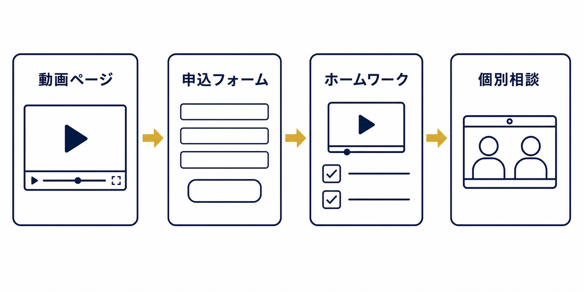
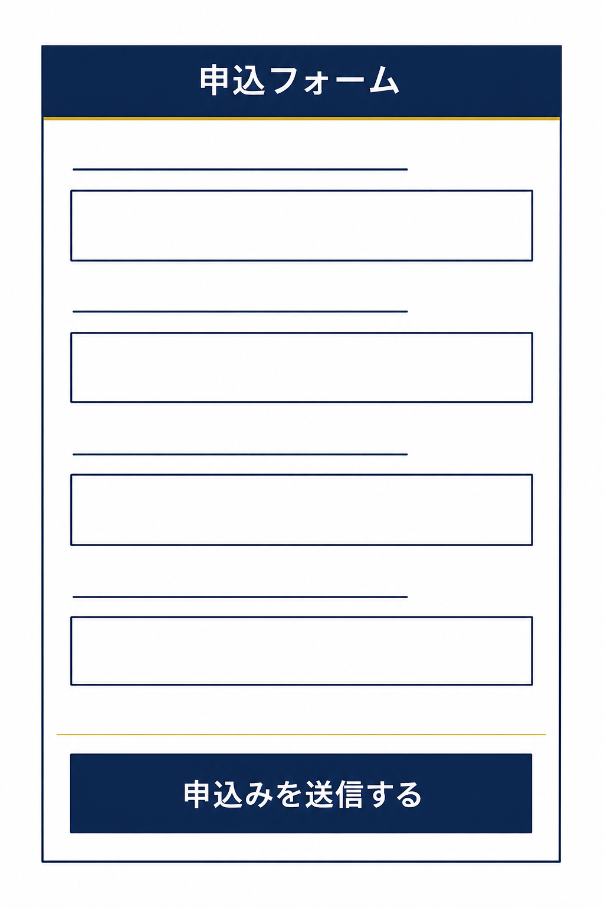
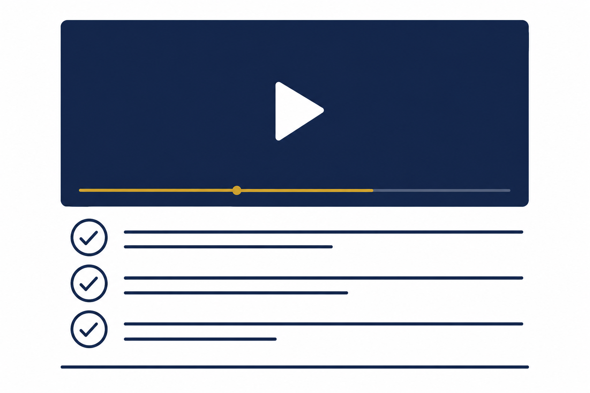
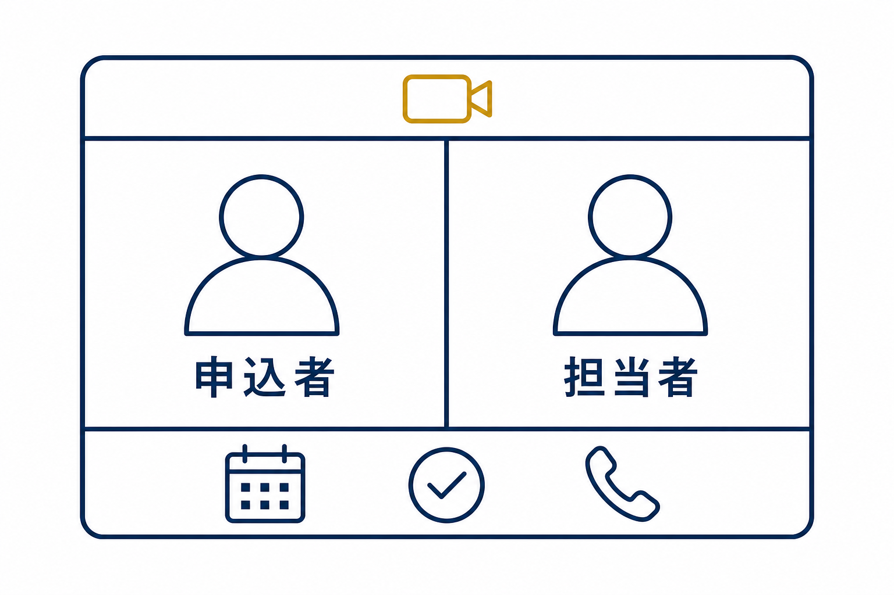

# 申込式ハイチケットファネル（Application Funnel）


申込式ハイチケットファネル（Application Funnel）は、マーケター Russell Brunson(ラッセル・ブランソン)が著書『DotCom Secrets』などでコアファネルのひとつとして位置づける、**高単価商品**を売るためのファネルです。ウェビナーやVSLのような「大勢に一度に売る」形式では成約しきれない価格帯の商品を、「申込 → ホームワーク → 1対1の個別相談」という動線で、1人ずつ確実に売り切るために設計されています。


<figure><figcaption></figcaption></figure>

### 申込式ハイチケットファネルとは？

申込式ハイチケットファネルは、見込み客にまず「**申込者**」になってもらい、そのうえで**1対1の個別相談で直接ご案内して成約につなげる**ファネルです。

背景にあるのは、価格帯による売り方の使い分けです。数万円〜数十万円クラスの商品なら、ウェビナーやVSLのような「一斉に提案する」形式でも成約します。しかしそれを大きく超える価格帯になると、多くの人は動画を見ただけでは決断できず、**より多くの接点——特に人との対話——が必要**になります。そこで、1対1の対話を前提にファネルを組むのがこの型です。

この型が生まれたアメリカでは電話セールスが主流だったため、原典では「セールスコール(電話)」として説明されますが、**今の日本ではZoomなどのオンラインミーティングで行うのが一般的**です。「無料個別相談」「戦略セッション」といった名称で案内されるものが、まさにこのステップにあたります。大事なのは電話かオンラインかという手段ではなく、**1対1で対話すること**そのものです。

このファネルの本質は「**見込み客をできるだけ早く1対1の対話に連れていき、質の高い商談を作る**」ことにあります。申込フォームとホームワークを通過した見込み客は、相談が始まる前にすでに教育され、購入の心構えができた状態になっています。

典型的な流れは次の4段階です。

1. **動画ページ:** ファネルの入口で、あなた自身や顧客の**成功事例(ケーススタディ)動画**を視聴してもらい、メールアドレスを取得します。動画の下に「申込み」ボタンを配置します。
2. **申込フォーム:** 「申込み」ボタンから遷移する質問形式のフォームです。質問への回答で、成約につながりやすい見込み客を絞り込みます。
3. **ホームワーク:** 申込後に案内する60〜90分のウェビナー/動画トレーニングです。商品理解を深め、購入への懸念を先回りして解消します。
4. **個別相談（オンライン/電話）:** ホームワークを終えた申込者と1対1で話し、最後のご案内をして成約につなげます（マーケティング用語では「クロージング」と呼ばれるステップです）。

### ファネル概要

このファネルは以下の4ステップで構成されています。

* 動画ページ（ケーススタディ/成功事例）
* 申込フォーム
* ホームワーク
* 個別相談（オンライン/電話）

### 動画ページ

動画ページは、コンテナウィジェットを土台に複数の要素を組み合わせて構築されています。ここでの目的は、**成功事例(ケーススタディ)動画**を視聴してもらい、メールアドレスを獲得することです。

ケーススタディ動画には、次の3パターンがあります。

1. **あなた自身の成功事例** — 自分の事業で出した成果
2. **クライアントワークの成功事例** — 他社のために出した成果
3. **顧客の成功ストーリー** — お客様の声・インタビュー

動画ページには、**動画埋め込みウィジェット**と「**今すぐ申し込む**」ボタンを配置します。訪問者は「動画を視聴 → メールアドレス登録 → 申込みボタン」の順に進みます。

<figure><figcaption></figcaption></figure>


**ヒント:** ファネルデザインのどの要素も、お好みに合わせて自由に編集できます。ケーススタディ動画は「**短く(5〜15分)**」作るのが鍵です。ウェビナーのように90分かけると、申込みにたどり着く前に離脱されてしまいます。短い尺の中に、実績と推薦の声を凝縮して信頼性を高めましょう。


### 申込フォーム

この例では、申込フォームをシンプルな構成にしています。**フォーム自体はシンプルに**保ちながら、**質問の中身で成約しやすい見込み客を絞り込む**のがこのステップの設計思想です。

申込フォームでよく使われる質問の例:

* **今すぐ始める準備はできていますか？**（行動準備性の確認）
* **自分に投資する意思はありますか？**（投資意思の確認）
* **あなたの目標は何ですか？**（目標の明確さの把握）
* **今、何があなたを妨げていますか？**（懸念・障害の把握）

<figure><figcaption></figcaption></figure>


**ヒント:** 申込フォームには「合わない人への自動対応」も設計に含めましょう。回答内容から成約確率が低いと判断できる申込者には、個別相談ではなく別の無料リソースを自動送信して案内する——相手の時間も自分の時間も無駄にしないための、定番の設計です。


### ホームワーク

申込フォーム送信後に案内する、**60〜90分のウェビナー/動画トレーニング**コンテンツです。個別相談の前に「宿題」としてじっくり視聴してもらうことで、見込み客の理解と熱量を相談当日に最適な状態まで引き上げます。

ホームワークの3つの役割:

1. **教育** — 商品・サービスの詳細と、それがもたらす新しい機会を伝える
2. **懸念の解消** — 本人の心の中の懸念(内的)と、周囲からの反対(外的)の両方を先回りして払拭する
3. **欲求の増幅** — 商品がない未来の痛みと、商品がある未来の変化を具体的に描く

ホームワークをきちんと完了した申込者は、個別相談が始まった時点で**すでに決断する準備ができている**——これがこのステップを挟む最大の理由です。

<figure><figcaption></figcaption></figure>

### 個別相談（オンライン/電話）

ホームワーク視聴後、申込者と1対1で話して成約につなげる最終ステップです。ZoomなどのオンラインミーティングでもOKですし、電話でも構いません。チーム体制に応じて、2つの進め方が使い分けられます。

**1. 1人で対応する場合（4つの質問で導く進め方）:**

* 相談から成約までを1人で担当する体制向け
* 4つの質問で申込者のゴールと障害を整理し、商品を「その解決手段」としてご案内する
* 売り込むというより、相手に自分の言葉で目標と課題を語ってもらい、自然に決断へ導く進め方です

**2. 2人で分担する場合（事前ヒアリング担当+相談担当の分業）:**

* 「日程調整と事前ヒアリングを行う担当」と「個別相談で成約までを担う担当」で分業する体制（英語ではそれぞれ「セッター」「クローザー」と呼ばれます）
* 事前ヒアリング担当が、目標や状況を聞き取って「本当にお役に立てる相手か」を見極めてから、相談担当が本題の商談に入る
* より高単価の商品や、申込数が多い場合に威力を発揮します

<figure><figcaption></figcaption></figure>


**ヒント:** この型の強みは、価格帯が上がっても**同じ流れがそのまま機能する**ことです。数十万円の商品で作った動線を、実績と商品力の成長に合わせてそのまま上位価格帯に引き上げていけます。あなたが扱う商品の価格レンジを意識して、このファネルを使うかどうかを判断してください。


---

## いつ使うべきファネルか？

申込式ハイチケットファネルが特に力を発揮するのは、次のようなケースです。

* **高単価商品を販売したいとき** — グループウェビナーやVSLでは成約しきれない価格帯
* **コーチング、マスターマインド、コンサルティング、代行サービス**など、個別サポートが中心の商品
* **1対1の対話が成約の決め手になる商品** — あなた(またはチーム)の時間を高単価で売りたいとき

一方で、低〜中単価の商品であれば、個別相談を挟まないウェビナーファネルやVSLファネルの方が効率的です。商品の価格帯と、1件あたりにかけられる対応時間から逆算して選びましょう。

OpusBoosterの申込式ハイチケットファネルテンプレートは、この「動画ページ + 申込フォーム + ホームワーク + 個別相談」の構造をそのまま実装するためのものです。
