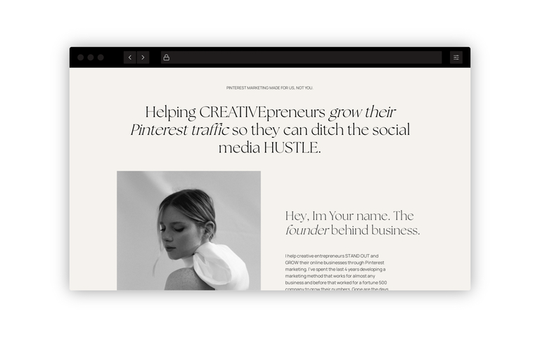
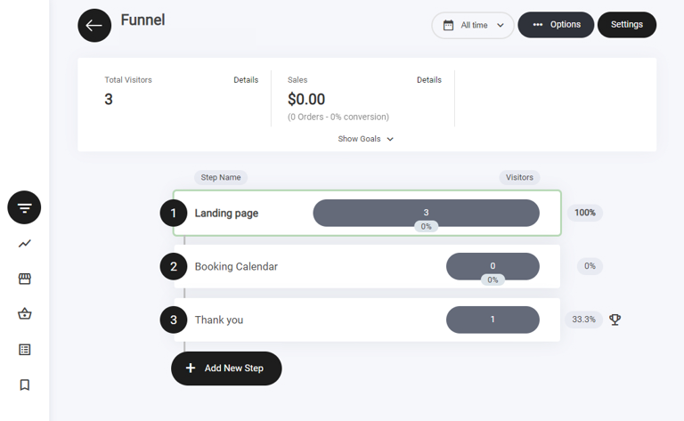
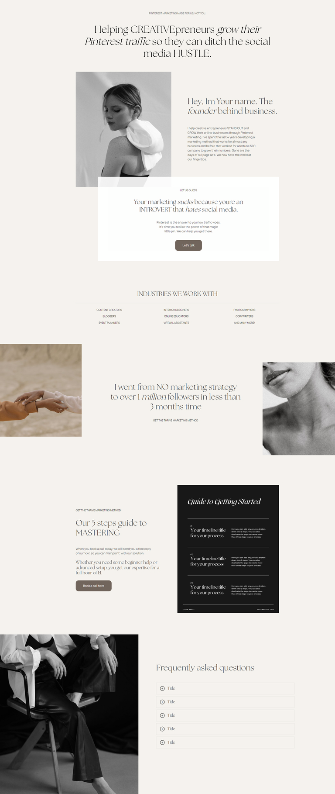
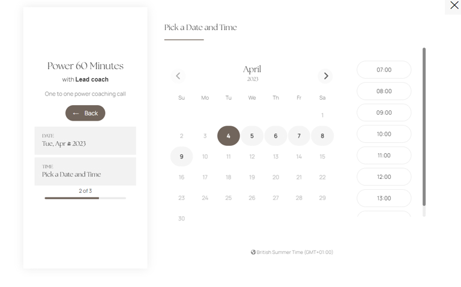
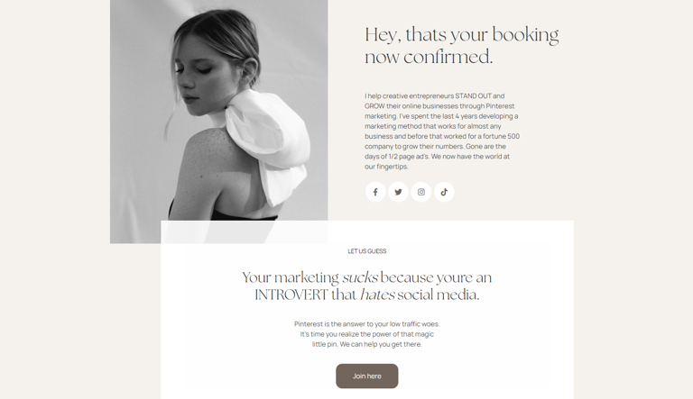

# 予約ブッキングファネル

<figure><figcaption></figcaption></figure>

## 予約ファネルとは

3ステップの予約ファネルは、ユーザーを予約完了へと導く一連のステップです。ファネルの目的は、ユーザーがサービス提供者とのミーティングのスケジュール調整や予約を、できるだけ簡単かつわかりやすく行えるようにすることです。

典型的な3ステップの予約ファネルは、次のステップで構成されます。

**ステップ1：ランディングページ**\
ファネルの最初のステップは、提供するサービスに関する情報を伝え、予約プロセスへの期待を高めるランディングページです。ランディングページは明確・簡潔で視覚的に魅力的であるべきで、ユーザーに予約を促す目立つコールトゥアクション（CTA）を備えている必要があります。ランディングページには、顧客の推薦文やレビューなどのソーシャルプルーフを含めて、ユーザーとの信頼関係を築くこともできます。

**ステップ2：予約ポップアップ**\
ファネルの2番目のステップは、ランディングページのCTAをクリックしたときに表示される予約ポップアップです。ポップアップはシンプルで使いやすく、ユーザーの連絡先情報、予約の希望、その他関連する詳細を取得できる、明確で簡潔なフォームを備えているべきです。

**ステップ3：サンキューページ**\
ファネルの3番目で最後のステップは、ユーザーの予約を確定し、必要な次のステップを案内するサンキューページです。サンキューページは視覚的に魅力的で、利用してくれたユーザーへの感謝のメッセージを含めるべきです。また、次回の予約に使える割引コードや、関連するサービス・商品へのリンクなど、追加のリソースやインセンティブを提供することもできます。

全体として、3ステップの予約ファネルは、予約プロセスを合理化し、ユーザーの障壁を減らす効果的な方法です。

### ファネルのステップ

ビルダー内では、この3ステップのファネルが表示され、機能させるために必要なすべてのステップが揃っています。

ファネルステップの右側にはトロフィーアイコンが表示されます。これはファネルステップの目標（ゴール）を示します。例えば、訪問者がランディングページでアクションを起こすと、目標に到達したことになります。すべての目標は、ファネル分析タブで確認できます。

<figure><figcaption></figcaption></figure>

### ファネルの概要

このファネルは、次のステップで構成されます。

* ランディングページ
* 予約カレンダー
* サンキューページ

### ランディングページ

<figure><figcaption></figcaption></figure>

ランディングページは多くの要素で構築されており、それらはコンテナ内に配置されています。ここでの主な目的はリードの獲得です。次のステップに進んでもらえるよう、行動を促すのに十分な情報を提供します。リード情報の取得には予約ウィジェットを使用しており、ユーザーが日付と時間を選択すると次のステップに進みます。

ファネルのフォーマットとレイアウトデザインは複数のコンテナに分割されており、すべての情報が正しく表示され、何より読みやすく理解しやすいようになっています。すべてのテンプレートには、何を書けばよいかの参考になるシンプルなテキストが用意されています。

### 予約を行う

<figure><figcaption></figcaption></figure>

訪問者がランディングページ上のいずれかのボタンをクリックすると、シンプルなポップアップで予約ウィジェットが表示されます。予約が完了すると、最終ステップに進みます。

### サンキューページ

<figure><figcaption></figcaption></figure>

実施している予約キャンペーンの種類によって、サンキューページに必要な情報は異なります。この予約ファネルの例では、最新の商品ローンチを宣伝して見込み客を獲得することが目的です。CTAボタンにリンクを追加して、参加者をコミュニティへ誘導しています。
