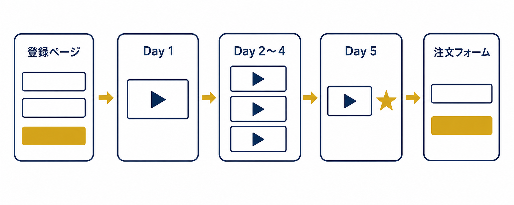
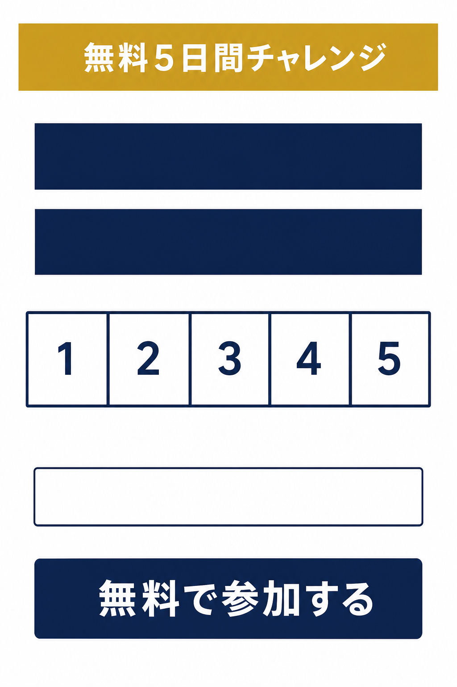
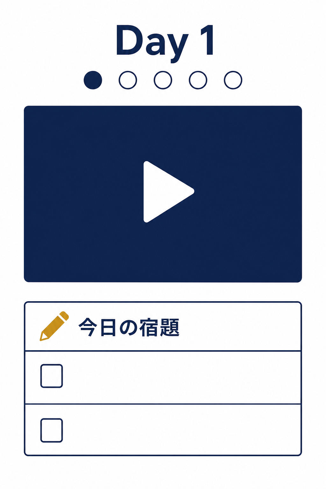
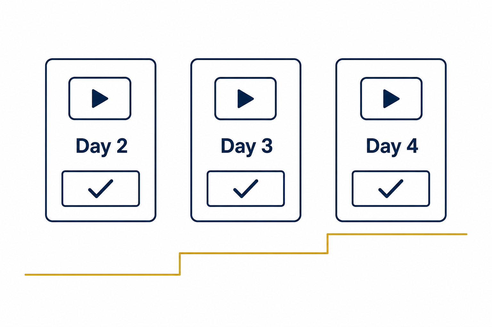
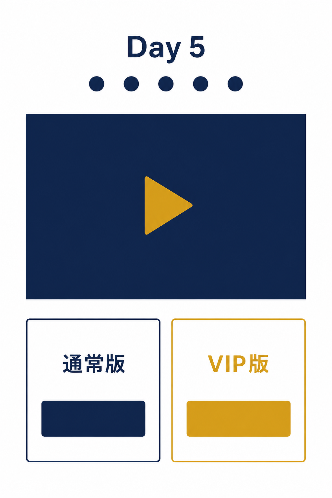
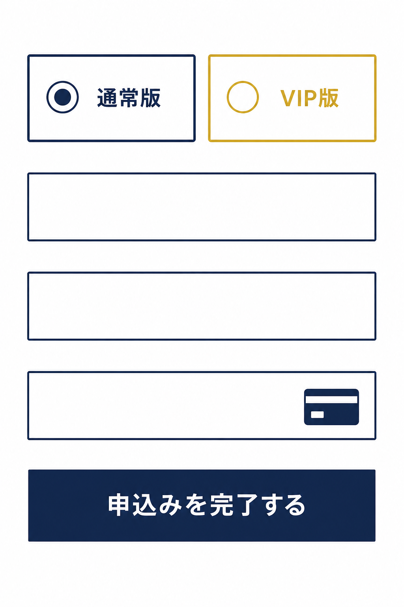

# チャレンジファネル（Challenge Funnel）


チャレンジファネルは、マーケター Pedro Adao(ペドロ・アダオ)が体系化し、Russell Brunson(ラッセル・ブランソン)も自社のマーケティングで積極的に採用したことで広まった、**5日間の無料チャレンジ企画**を軸にしたファネルです。あなたのことをまだ知らない見込み客を、**わずか5日間で「熱量の高い買い客」に変える**ことを狙って設計されています。


<figure><figcaption></figcaption></figure>

### チャレンジファネルとは？

チャレンジファネルは、**5日間にわたって毎日1本ずつ動画トレーニングを配信**し、参加者に**具体的な成果物**を必ず持ち帰ってもらう形のファネルです。

最大の特徴は、「学んでもらう」ではなく「**完成させてもらう**」ことにあります。ウェビナーやVSLが「教育してから販売する」ファネルだとすれば、チャレンジファネルは「**参加者が実際に手を動かして何かを完成させてから販売する**」ファネルです。5日間を終えた参加者は「いい話を聞いた」ではなく「**この5日間で、私はこれを作り上げた**」と言える状態になっています。この達成体験こそが、次の商品への強力な動機になります。

もうひとつの特徴は、参加のハードルの低さと熱量の高さの両立です。「無料の5日間チャレンジ」は広告経由の新規の見込み客でも気軽に参加でき、毎日の動画と宿題を通じて、5日間でエンゲージメントが一気に積み上がります。SNSで話題になりやすい「企画モノ」としての拡散力も魅力です。

典型的な流れは次の5段階です。

1. **登録ページ:** 無料5日間チャレンジへの参加登録を獲得します。
2. **Day 1 動画（トレーニング+宿題）:** 「動画を見る → 宿題をやる」のシンプルな構成で、初日から小さな成果物を作ってもらいます。
3. **Day 2〜4 動画（段階的なスキル構築）:** 毎日1つずつ成果物を積み上げ、参加者のスキルと熱量を段階的に高めます。
4. **Day 5 動画（総まとめ+メインオファー）:** 5日間の総仕上げと同時に、本命商品を提示します。
5. **注文フォーム（通常版+VIP版の選択）:** Day 5 から遷移する決済ページです。

### ファネル概要

このファネルは以下の5ステップで構成されています。

* 登録ページ
* Day 1 動画（トレーニング+宿題）
* Day 2〜4 動画（段階的なスキル構築）
* Day 5 動画（総まとめ+メインオファー）
* 注文フォーム（通常版+VIP版の選択）

### 登録ページ

登録ページは、コンテナウィジェットを土台に複数の要素を組み合わせて構築されています。ここでの目的は、**無料5日間チャレンジへの参加登録**を獲得することです。

テーマ設定のコツは「**広く網をかけつつ、5日後の成果を具体的に約束する**」ことです。たとえば「5日間で、あなたのビジネスの集客の仕組みを作り上げる」のように、①多くの人が自分ごとにできる広さと、②5日後に何が完成しているかの具体性、の両方を持たせます。訪問者がフォームに登録すると、Day 1 の動画リンクがメールで届きます。

<figure><figcaption></figcaption></figure>


**ヒント:** ファネルデザインのどの要素も、お好みに合わせて自由に編集できます。テーマは、あなたの本命商品への入口になるものを選びましょう。「このチャレンジで最初の一歩が完成する → 続きを本格的にやりたい人は本命商品へ」という接続が自然に描けるテーマが理想です。


### Day 1 動画

登録直後、または開始日に届く最初の動画です。構成は「**動画を見る → 宿題をやる**」のシンプルな1ステップ。動画でその日のテーマを教え、動画の最後に「今日の宿題」を出します。

Day 1 の宿題は「**1時間以内に完了できるサイズ**」に収めるのが鉄則です。初日に「できた！」という小さな成功体験を作れるかどうかで、Day 2 以降の継続率が大きく変わります。

<figure><figcaption></figcaption></figure>

### Day 2〜4 動画

2日目から4日目にかけて毎日届く動画で、参加者が段階的にスキルを構築していきます。設計の核は「**毎日、何かをひとつ実装する**」こと。座学ではなくハンズオンで、Day ごとに1つの具体的な成果物を作る構造にします。

たとえば集客をテーマにしたチャレンジなら、次のような積み上げ方です。

* **Day 2:** 最初のランディングページを完成させる
* **Day 3:** 提供するオファー(特典)を設計する
* **Day 4:** フォローアップのメールを用意する

<figure><figcaption></figcaption></figure>


**ヒント:** 各 Day の宿題も「1時間以内に完了できるサイズ」を守りましょう。大事なのは、参加者自身が毎日「**完成した**」と言える状態を作ることです。宿題が重すぎると脱落者が増え、Day 5 のオファーに到達する人が減ってしまいます。


### Day 5 動画

最終日に届く動画で、ここが**メインオファーの提示**ポイントです。5日間の総まとめをしたうえで、通常版と高単価のVIP版の両方を提示するのが定番の形です。

5日間全体のコンセプトは「**魚を与えるのではなく、釣り方を教える**」こと。5日間で釣り方の基本を身につけ、実際に小さな成果物を完成させた参加者に対して、「ここから先を本格的に深めたい方には、こちらの本命コースがあります」と自然に案内します。押し売りではなく、達成体験の延長線上にある「次のステップ」としてオファーが機能します。

<figure><figcaption></figcaption></figure>


**ヒント:** Day 5 だけは他の日より長めに作ります。ウェビナーのオファーパートに相当する重要な回なので、20〜40分の尺を取り、「5日間の総まとめ → 価値の積み上げ → 通常版とVIP版の提示」を丁寧に行ってください。


### 注文フォーム

Day 5 動画の最後にある申込みボタンをクリックした参加者がたどり着く、決済のためのページです。通常版とVIP版の選択、オーダーバンプ(チェックボックス1つでの追加購入)、OTO(購入直後の追加オファー)、サンキューページまでを1セットとして設計するのが定番です。

注文フォームに到達した参加者は、**5日間の動画と宿題を通じてあなたの教えを実践し、実際に成果物を完成させた状態**です。通常のリードマグネット経由の見込み客とは比較にならない熱量と信頼感で、このページに到達しています。

なお、チャレンジ自体を無料ではなく**少額の有料**(参加しやすい価格帯)にする設計もあります。参加費で広告費を回収しつつ、「お金を払った参加者」だけを集めることで完走率と本命商品の成約率を高める、という考え方です。

<figure><figcaption></figcaption></figure>

---

## いつ使うべきファネルか？

チャレンジファネルが特に力を発揮するのは、次のようなケースです。

* **新規の見込み客を、短期間で熱量の高い買い客に変えたいとき** — 広告経由のコールドな客層との相性が良い型です
* **高単価商品(コーチング・コミュニティ・本格コース)への動線を作りたいとき** — 5日間の達成体験が、本命商品への最高の入口になります
* **ウェビナーやVSLより濃い「体験型のエンゲージメント」を提供したいとき** — 見るだけでなく、手を動かしてもらう企画です
* **SNSやコンテンツマーケティングで「話題になる無料企画」を打ちたいとき** — 期間限定の祭り感が拡散を生みます

一方で、5日分の動画・宿題・毎日の運営(参加者の質問対応など)を用意する必要があるため、ウェビナーやVSLより準備コストは高めです。本命商品がしっかり固まってから取り組むのがおすすめです。

OpusBoosterのチャレンジファネルテンプレートは、この「登録ページ + 5日間の動画 + Day 5 のオファー + 注文フォーム」の構造をそのまま実装するためのものです。
