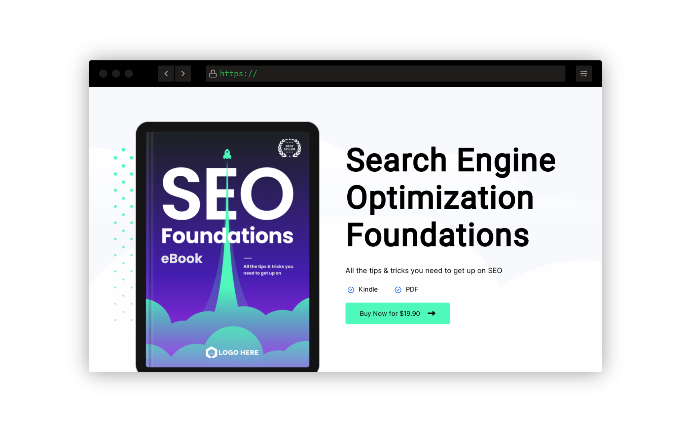
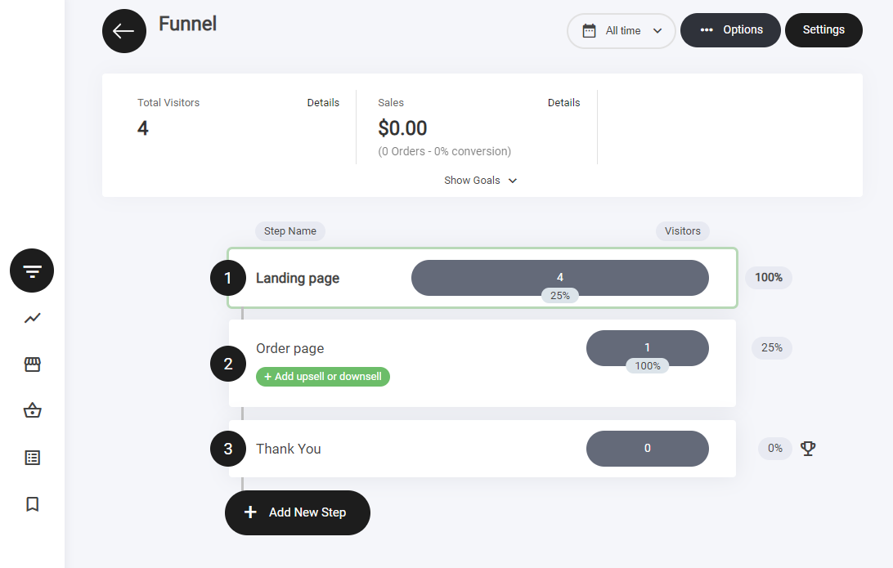
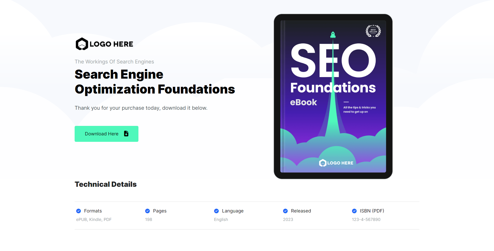

# デジタルダウンロードファネル

<figure><figcaption></figcaption></figure>

## 概要

デジタルダウンロードファネルは、主に次の3つのステップで構成されます。

1. ランディングページ
2. 注文ページ
3. サンキューページ

### デジタルダウンロードファネルとは

デジタルダウンロードの3ステップファネルは、電子書籍、コース、ソフトウェアなどのダウンロード可能なデジタル商品を販売するためにオンラインビジネスが使用する販売戦略です。ファネルは通常、次の3つのステップで構成されます。

**ステップ1：ランディングページ**\
見込み顧客が広告やリンクをクリックしたときに最初に目にするページです。ランディングページの主な目的は、訪問者の注意を引き、デジタルダウンロード商品の情報や価格を提示して、次のステップに進むよう促すことです。

**ステップ2：販売／チェックアウトページ**\
見込み顧客が「購入」や「ダウンロード」ボタンをクリックすると、販売／チェックアウトページに移動します。このページには、商品の詳細、追加情報、デジタルダウンロードの支払いオプションが含まれます。

**ステップ3：サンキューページ**\
顧客が購入を完了すると、サンキューページに移動します。このページは購入を確定し、購入した商品をダウンロードするためのCTA（コールトゥアクション）を提供します。あるいは、商品をメールで送付する方法もあります。

デジタルダウンロードの3ステップファネルの目的は、顧客に行動を促して購入を完了してもらう、スムーズで効果的な販売プロセスを作ることです。プロセスを3つの明確なステップに分けることで、見込み顧客を購入プロセスへ導き、成約の可能性を高められます。

### ファネルのステップ

ビルダー内には、このファネルを機能させるために必要なすべてのステップが揃っています。

<figure><figcaption></figcaption></figure>

ファネルステップの横にあるトロフィーアイコンは目標達成を示し、訪問者が正常にアクションを起こしたことを表します。

**目標の追跡について：**

* **主要アクションでトリガーされます** – フォームの送信、CTAのクリック、購入などが該当します。
* **ファネル分析で確認できます** – 達成されたすべての目標は、ファネル分析タブで確認できます。

コンバージョンを監視し、ファネルのパフォーマンスを最適化するのに最適な方法です。

### ランディングページ

<figure><figcaption></figcaption></figure>

ランディングページは多くの要素で構築されており、それらはコンテナ内に配置されています。ここでの主な目的は、リードの獲得と販売です。次のステップに進んでもらえるよう、行動を促すのに十分な情報を提供します。

デジタルダウンロードファネルのフォーマットとレイアウトデザインは複数のコンテナに分割されており、すべての情報が正しく表示され、何より読みやすく理解しやすいようになっています。すべてのテンプレートには、何を書けばよいかの参考になるシンプルなテキストが用意されています。

### 注文ページ

<figure><figcaption></figcaption></figure>

訪問者がランディングページのボタンをクリックすると、次のステップとして商品が表示される注文ページに移動します。

この注文ページの例では、2ステップチェックアウトを採用しています。訪問者は支払いステップに進む前に、まず個人情報を入力します。この構成は自由に変更できます。2ステップチェックアウトを採用する理由は、途中で離脱した場合でも、カート放棄のフォローアップやメールなどのオートメーションキャンペーンで後追いできるためです。

### サンキューページ

<figure><figcaption></figcaption></figure>

ユーザーがチェックアウトを正常に完了すると、サンキューページにリダイレクトされます。このページでは購入を確定し、次のステップの詳細を案内し、追加のリソースやボーナスを提供するとよいでしょう。他のコースや関連商品をアップセルする機会にもなります。さらに、サンキューページには、デジタルファイルをダウンロードするためのCTAボタンを必ず含めましょう。
