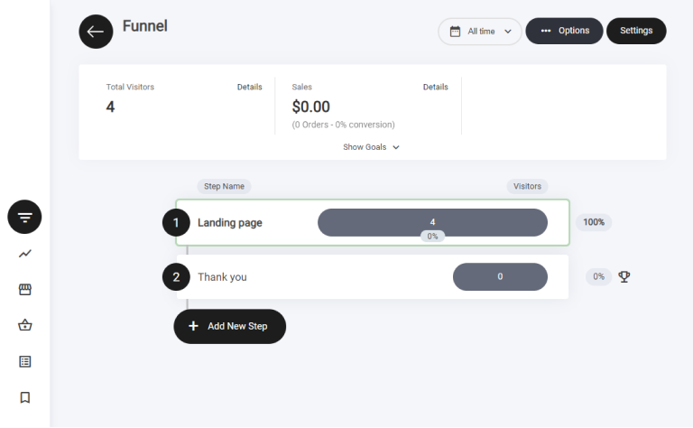
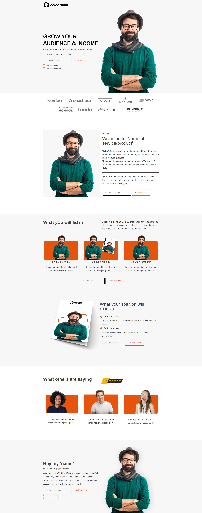

# リードジェネレーション


リード獲得ファネルのテンプレートは、2つのファネルステップで構成されています。

1. ランディングページ
2. サンキューページ


<figure><figcaption></figcaption></figure>

### リード獲得ファネルとは？

リード獲得の2ステップファネルは、訪問者をリード（見込み客）に変えるための2段階のマーケティング戦略です。

最初のステップでは、無料の電子書籍や割引クーポンなどのオファーやインセンティブで訪問者の注意を引き、行動を促します。訪問者はオファーを受け取るために、メールアドレスなどの連絡先情報を提供します。

訪問者がこの最初のステップを踏むとリードとなり、メールリストやCRMに見込み客として追加されます。

2つ目のステップは、このリードを育成し、購買の意思決定へと導くことです。ターゲットを絞った一連のメール、SNS広告、その他のマーケティング手法を通じてリードとの信頼関係を築くことで実現できます。

この2段階のアプローチは、リード獲得のプロセスを2つの明確な段階に分けることで、より効率的・効果的にするための設計です。まず注意を引いて興味を生み出すことに集中し、その後はリードとの関係構築に専念できるため、最終的により多くのコンバージョンや売上につながります。

<figure><figcaption></figcaption></figure>

### ファネルのステップ

ビルダー内では、ランディングページとサンキューページの2つのステップとして表示されます。


ステップの横にある**トロフィーアイコン**は**ファネル目標**を示します。訪問者がランディングページでのフォーム送信など、重要なアクションを完了したことを意味します。

**ファネル分析における目標の仕組み：**

* **ユーザーの行動によってトリガーされる** – 訪問者がフォームの送信や購入など、設定したアクションを行うと、システムが目標の達成を記録します。
* **分析タブで確認できる** – すべてのファネル目標は**ファネル分析**セクションで追跡できます。

コンバージョンを監視し、パフォーマンスを最適化するのに役立つ機能です。


### ファネル概要

このファネルは以下のステップで構成されています。

* ランディングページ
* サンキューページ

ランディングページは、コンテナウィジェットを土台に多くの要素を組み合わせて構築されています。ここでの主な目的は、将来のプロモーションに向けたリードの獲得です。リード情報の取得には**フォームウィジェット**を使用します。ユーザーがフォームに記入すると次のステップへ進みます。この過程でメールアドレスを取得し、メールリストに追加します。

リード獲得ランディングページのレイアウトは、すべての情報が正しく、何より読みやすく理解しやすいように複数のコンテナに分割されています。すべてのテンプレートには、何を書けばよいかの手がかりになる簡単なサンプルテキストが入っています。

<figure><figcaption></figcaption></figure>


**注意：** ファネルデザインのどの要素も、お好みに合わせて自由に編集できます。


### サンキューページ

実施するリード獲得キャンペーンの種類によって、必要なサンキューページの内容が決まります。

この例では、ランディングページの目的は将来のプロモーションに向けてリードを獲得し、メールリストを構築することでした。あわせてコミュニティにも参加してもらえるように、CTAボタンにコミュニティ参加用のリンクを設定しています。

<figure><figcaption></figcaption></figure>
