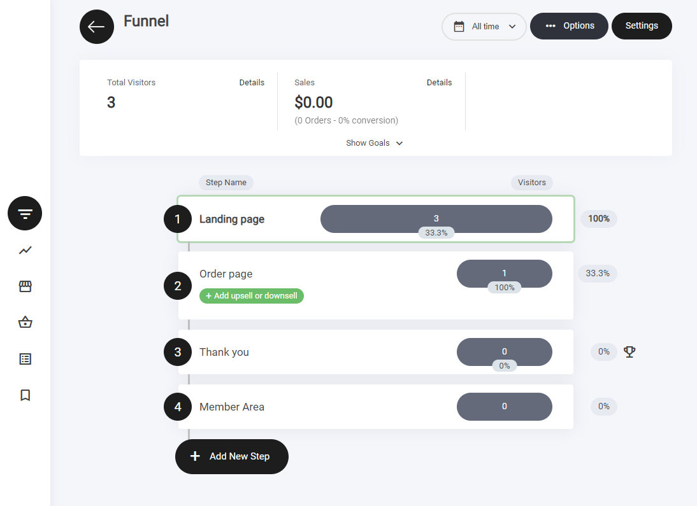
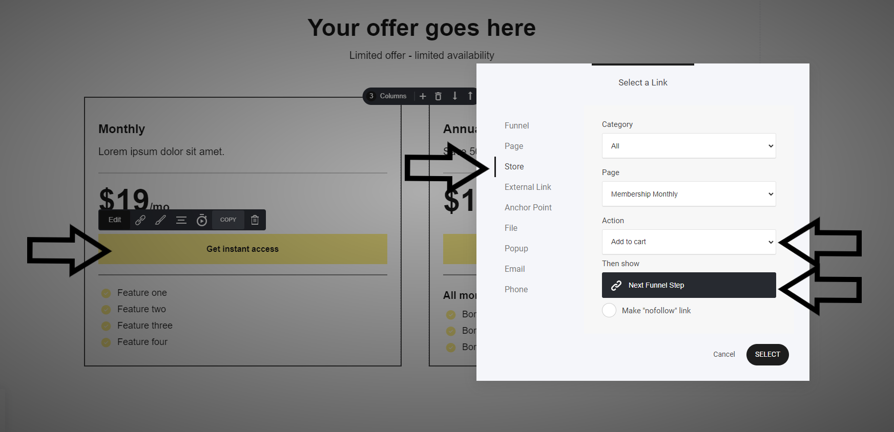
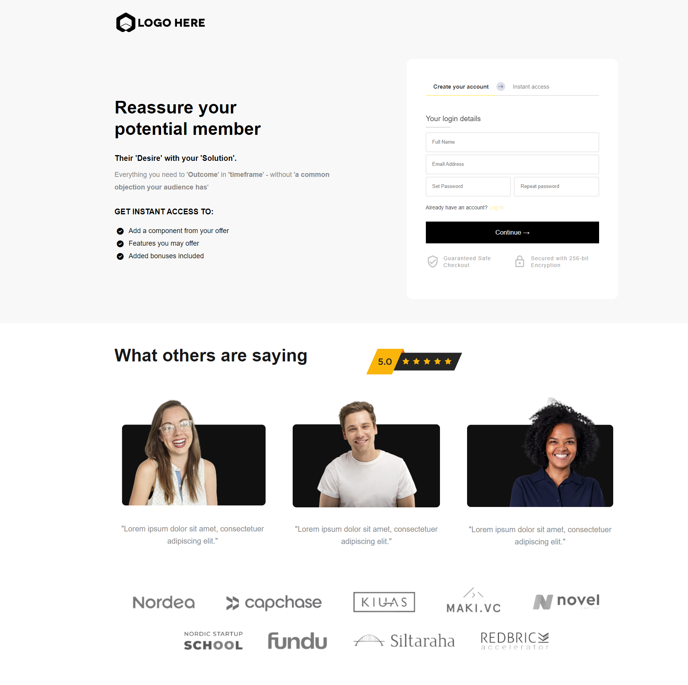
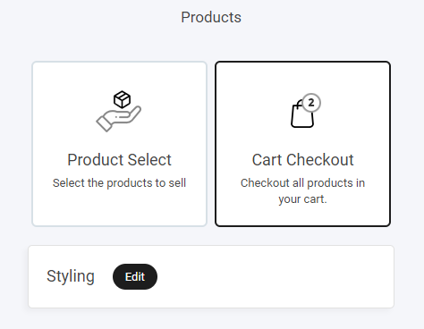
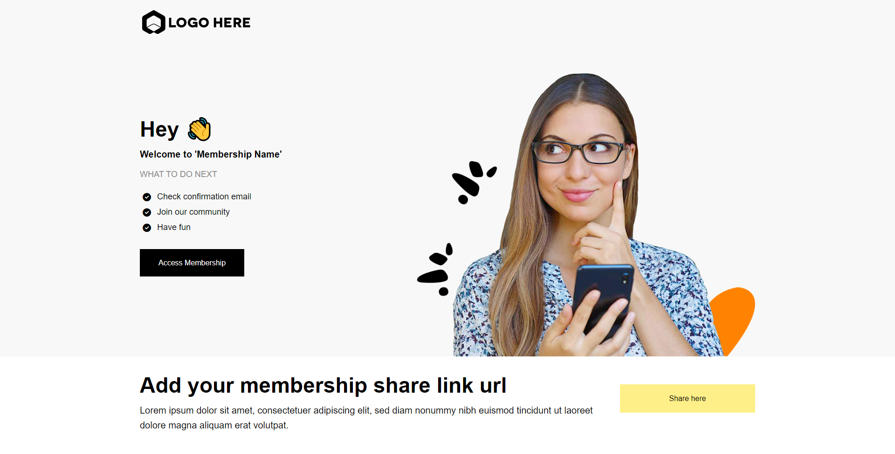
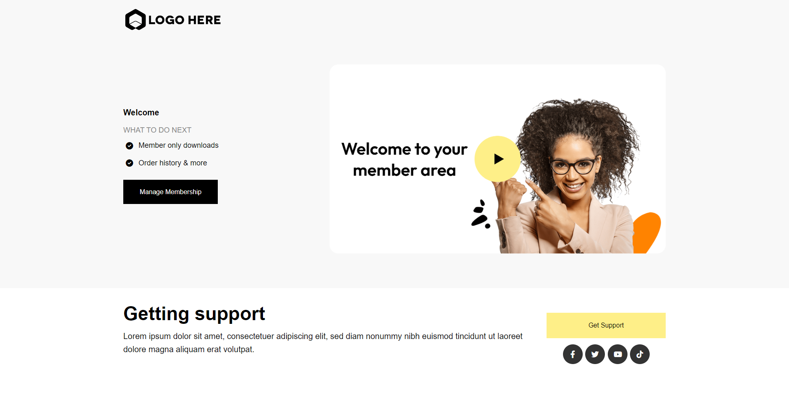
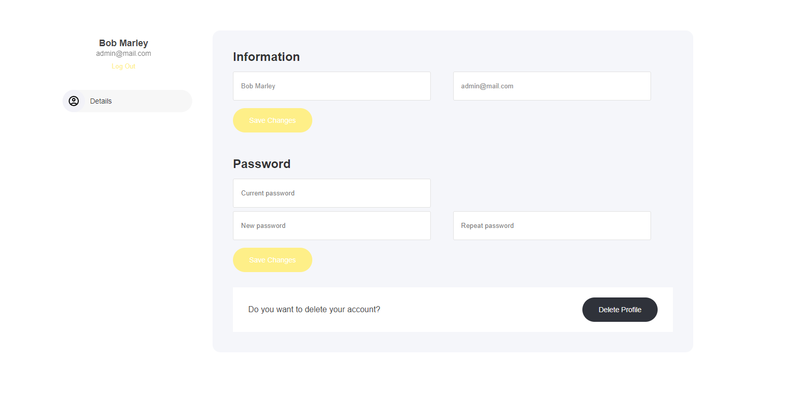

# メンバーシップファネル

<figure><figcaption></figcaption></figure>

## メンバーシップファネルとは

メンバーシップファネルは、会員制の商品やサービスを販売するためにオンラインビジネスが使用する販売戦略です。ファネルは通常、次の4つのステップで構成されます。

**ステップ1：ランディングページ**\
見込み会員が広告やリンクをクリックしたときに最初に目にするページです。ランディングページの主な目的は、訪問者の注意を引き、会員プログラムについてもっと知りたいと思わせることです。このページでは通常、会員特典、機能、料金プランに関する情報を提供します。

**ステップ2：注文ページ**\
見込み会員が「参加する」や「登録する」ボタンをクリックすると、注文ページに移動します。このページには、会員プログラムに関する追加情報とチェックアウト手続きが含まれます。

**ステップ3：サンキューページ**\
会員が購入を完了すると、サンキューページにリダイレクトされます。このページは購入を確定し、会員エリアへアクセスするためのコールトゥアクション（CTA）を提供します。

**ステップ4：会員エリア**\
ファネルの最終ステップで、会員が会員プログラムにアクセスできる場所です。会員エリアには通常、販売時に約束した限定コンテンツ、特典、機能が含まれます。

メンバーシップファネルの目標は、見込み会員に行動を促して有料会員になってもらう、シームレスで効果的な販売プロセスを作ることです。プロセスを明確なステップに分けることで、見込み会員を購入プロセスに導き、会員プログラムを通じて継続的な収益を得られる可能性を高められます。

## ファネルのステップ

ビルダー内では、この4ステップのファネルが表示され、機能させるために必要なすべてのステップが揃っています。

<figure><figcaption></figcaption></figure>

ファネルステップの横にある**トロフィーアイコン**は**目標達成**を示し、訪問者が正常にアクションを起こしたことを表します。

**目標の追跡について：**

* **主要アクションでトリガーされます** – フォームの送信、CTAのクリック、購入などが該当します。
* **ファネル分析で確認できます** – 達成されたすべての目標は、ファネル分析タブで確認できます。

コンバージョンを監視し、ファネルのパフォーマンスを最適化するのに最適な方法です。

## ファネルの概要

このファネルは、次のステップで構成されます。

* ランディングページ
* 注文ページ
* サンキューページ
* 会員エリア

## ランディングページ

<figure><figcaption></figcaption></figure>

ランディングページは多くの要素で構築されており、それらはコンテナ内に配置されています。ここでの主な目的はリードの獲得です。次のステップに進んでもらえるよう、行動を促すのに十分な情報を提供します。

メンバーシップファネルのフォーマットとレイアウトデザインは複数のコンテナに分割されており、すべての情報が正しく表示され、何より読みやすく理解しやすいようになっています。すべてのテンプレートには、何を書けばよいかの参考になるシンプルなテキストが用意されています。

**注意：** ファネルデザインのどの要素も、お好みに合わせて完全に編集できます。

このテンプレートの例では、次の2種類の会員プランを販売しています。

1. 月額プラン
2. 年額プラン

訪問者がボタンをタップしたときに、選択したアイテムを直接カートに追加する設定にしています。

<figure><figcaption></figcaption></figure>

## 注文ページ

<figure><figcaption></figcaption></figure>

訪問者がランディングページのボタンをクリックすると、次のステップとして商品が表示される注文ページに移動します。

この注文ページの例では、**2ステップチェックアウト**を採用しています。訪問者は支払いステップに進む前に、まず個人情報を入力します。この構成は自由に変更できます。2ステップチェックアウトを採用する理由は、途中で離脱した場合でも、**カート放棄**のフォローアップやメールなどの**オートメーションキャンペーン**で後追いできるためです。

カートチェックアウトオプションを使用すると、前述のとおり、ユーザーがボタンをタップした時点でアイテムが自動的にカートに追加されます。

<figure><figcaption></figcaption></figure>

## サンキューページ

<figure><figcaption></figcaption></figure>

ユーザーがチェックアウトを正常に完了すると、サンキューページにリダイレクトされます。このページでは購入を確定し、次のステップの詳細を案内し、追加のリソースやボーナスを提供するとよいでしょう。他のコースや関連商品をアップセルする機会にもなります。さらに、会員が会員プログラムを始めやすくなるよう、会員エリアへのナビゲーションを含めることをおすすめします。

## 会員エリア

<figure><figcaption></figcaption></figure>

ファネルの最終ステップは、実際の会員エリアです。ここで会員は限定コンテンツにアクセスし、利用を開始します。

## 会員管理

<figure><figcaption></figcaption></figure>

サイト・ファネル内のすべての会員は、自分専用の会員管理エリアにもアクセスできます。

ここでは、個人情報の更新、会員限定エリアへのアクセス、購入した商品やダウンロードの確認など、さまざまな管理を行えます。
