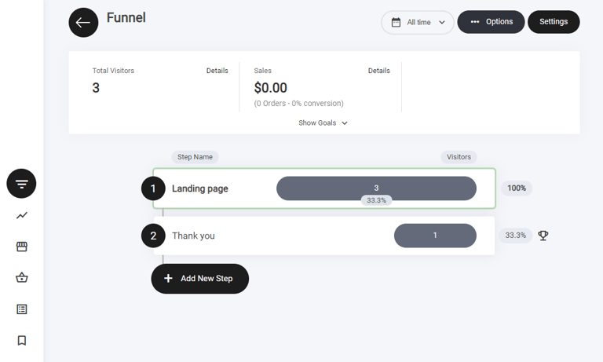
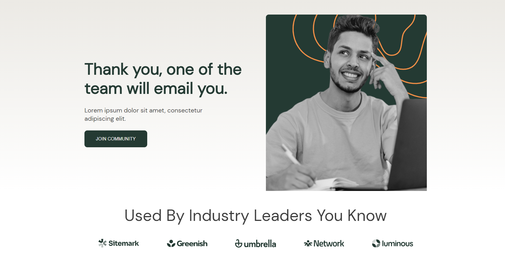
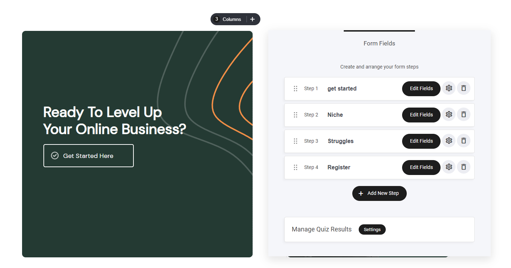

# オンボーディング


オンボーディングファネルのテンプレートは、2つのファネルステップで構成されています。

1. ランディングページ
2. サンキューページ


<figure><figcaption></figcaption></figure>

### オンボーディングファネルとは？

オンボーディングファネルは、ユーザーが製品やサービスに慣れるまでの一連のステップです。その目的は、ユーザーが製品やサービスを効果的に使い始められるように導き、混乱・フラストレーション・離脱の可能性を減らすことです。

この2ステップのオンボーディングファネルでは、最初のステップにクイズを、2番目のステップにサンキューページを使用しています。仕組みは次のとおりです。

**ステップ1：クイズ** – ファネルの最初のステップは、ユーザーの製品・サービスに対するニーズや好みを把握するためのクイズです。クイズでは、ユーザーの目標、類似の製品・サービスの利用経験、これまでに直面した課題などを尋ねます。回答に基づいて、製品やサービスを効果的に使うためのパーソナライズされた提案を提示できます。

**ステップ2：サンキューページ** – ユーザーがクイズを完了すると、サンキューページにリダイレクトされます。このページはユーザーの「使ってみよう」という決断を後押しする役割を持ちます。クイズへの参加に感謝するメッセージや、製品・サービスのメリットを強調する内容を載せるとよいでしょう。チュートリアルやカスタマーサポートへのリンクなど、追加のリソースを案内することもできます。

最初のステップにクイズ、2番目のステップにサンキューページを配置した2段階のオンボーディングファネルは、ユーザーを惹きつけ、製品・サービスの利用開始を促す効果的な方法です。パーソナライズされた提案とメリットの提示によって、混乱・フラストレーション・離脱を減らすのに役立ちます。

### ファネルのステップ

ビルダー内では、2段階のファネルとして表示されます。機能するために必要なステップがすべて揃っています。

<figure><figcaption></figcaption></figure>


ファネルステップの横にある**トロフィーアイコン**は**目標達成**を示し、訪問者がファネル内でアクションを正常に完了したことを表します。

**目標の確認方法：**

* **主要なアクションでトリガーされる** – フォームの記入、CTAのクリック、購入などが対象です。
* **ファネル分析で確認できる** – すべての目標達成は**ファネル分析タブ**で追跡できます。

コンバージョンの測定とパフォーマンス最適化に役立つ機能です。


### ファネル概要

このファネルは以下のステップで構成されています。

* ランディングページ
* サンキューページ

### ランディングページ

ランディングページは、コンテナウィジェットを土台に多くの要素を組み合わせて構築されています。ここでの主な目的はリードの獲得です。訪問者が行動を起こしたくなるだけの十分な情報を提供し、リード情報の取得には**クイズウィジェット**を使用します。ユーザーがクイズ（アンケート）に回答すると次のステップへ進みます。この過程でメールアドレスを取得し、メールリストに追加します。

オンボーディングファネルのレイアウトは、すべての情報が正しく表示され、何より読みやすく理解しやすいように複数のコンテナに分割されています。

<figure><figcaption></figcaption></figure>

### サンキューページ

実施するオンボーディングキャンペーンの種類によって、サンキューページに必要な情報が変わります。

この例では、ランディングページの目的は新しい製品ローンチのリードを獲得してメールリストを構築することでした。サンキューページでは、確認メールを送信したことを伝え、ボタンウィジェットを追加してコミュニティに参加してもらうためのリンクを設けています。

<figure><figcaption></figcaption></figure>

<figure><figcaption></figcaption></figure>

クイズの作成方法について詳しくは、クイズ＆アンケートのページをご覧ください。
