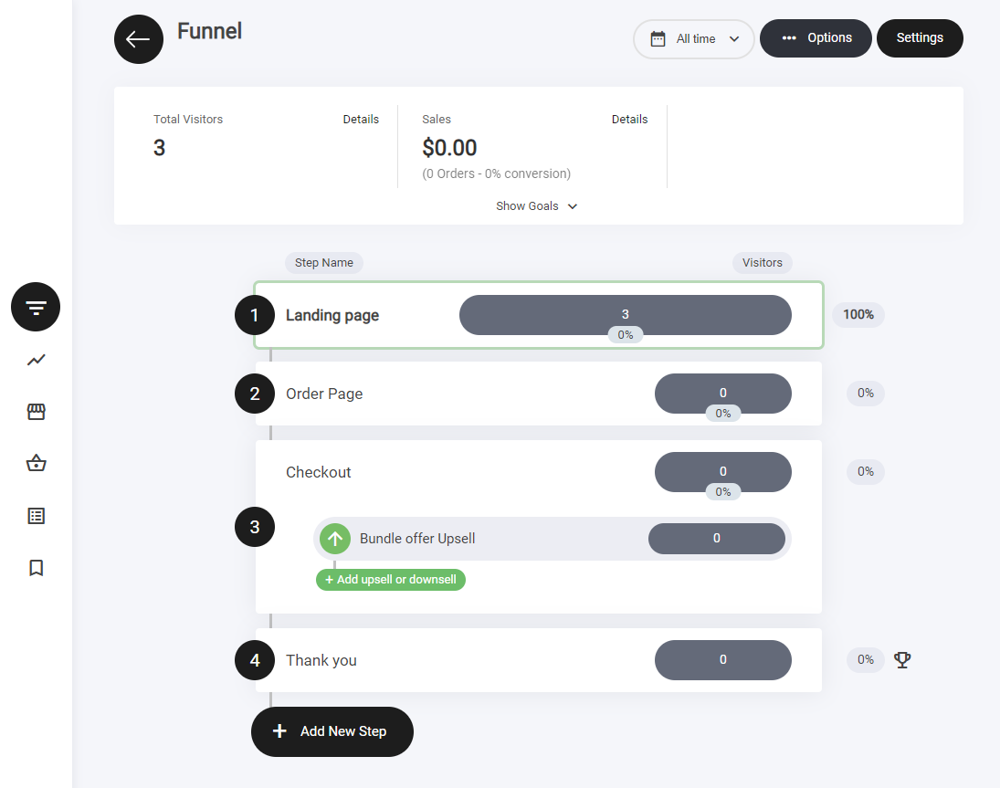
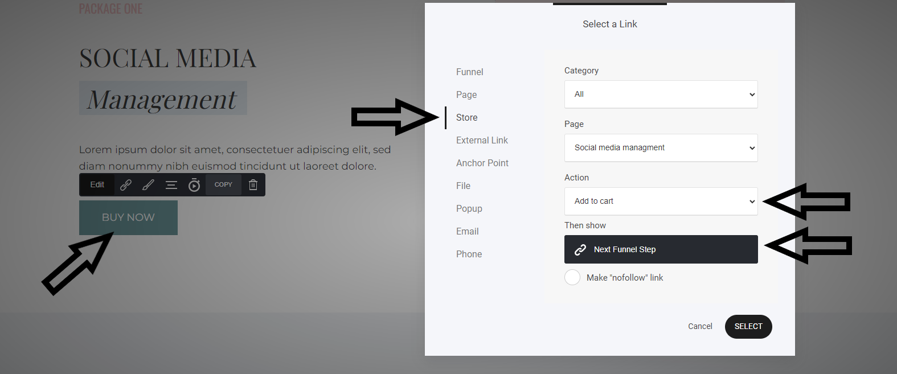
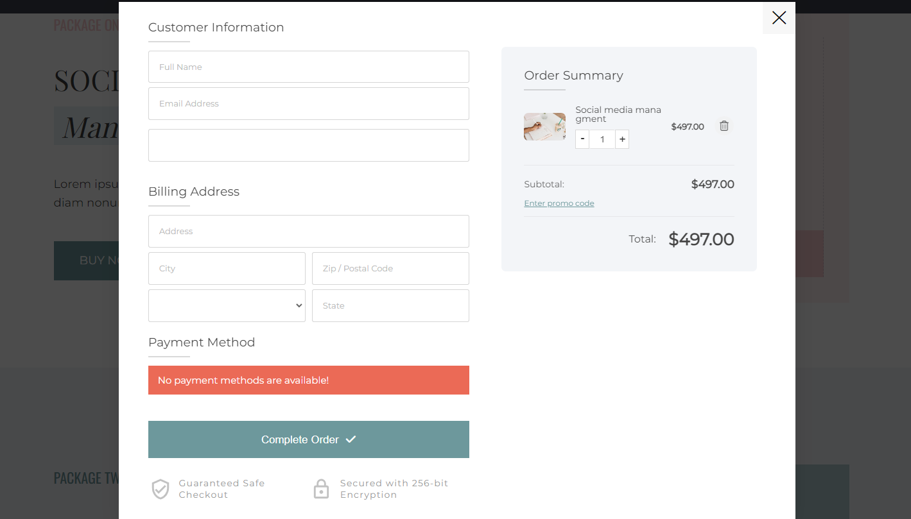

# オプトインファネル

<figure><figcaption></figcaption></figure>

## オプトインファネルとは

オプトインファネルは、リードを獲得し、メールリストを成長させるために設計されたマーケティング戦略です。ユーザーが価値あるコンテンツやオファーと引き換えにメールアドレスを提供する、4ステップの構成で機能します。

<figure><figcaption></figcaption></figure>

**ステップ1：ランディングページ**

最初のステップは、メールアドレスの取得を目的とした入力フォームを備えたランディングページです。ページには、メールアドレスと引き換えに価値あるオファーや特典を約束する見出しを含めるべきです。必要に応じて、名前や電話番号の入力欄を追加することもできます。

<figure><figcaption></figcaption></figure>

**ステップ2：注文ページ**

フォームを送信すると、ユーザーはオファーの詳細情報が掲載された注文ページへ移動します。このページには、価格、提供する価値、オファーに付随する追加のメリットなどの詳細を含めるべきです。明確なコールトゥアクション（CTA）ボタンで、チェックアウトへの進行を促します。

<figure><figcaption></figcaption></figure>

<figure><figcaption></figcaption></figure>

**ステップ3：チェックアウト（アップセル付き）**

決済処理を行うチェックアウトページには、支払い情報の入力フォームが必要です。アップセル商品は、メインのオファーを補完する商品やアップグレードです。限定オファーとして提示し、ユーザーにとって大きな追加価値を提供するものにしましょう。

<figure><figcaption></figcaption></figure>

<figure><figcaption></figcaption></figure>

<figure><figcaption></figcaption></figure>

**ステップ4：サンキューページ**

最後のステップでは、購入を確定し、感謝の気持ちを伝えます。このページでは購入へのお礼を伝えるとともに、類似の商品やサービスに関する追加のリソースやおすすめを提供するとよいでしょう。メールリストへの登録やコミュニティへの参加など、継続的な顧客関係の構築につながる次のアクションを提示します。

<figure><figcaption></figcaption></figure>
