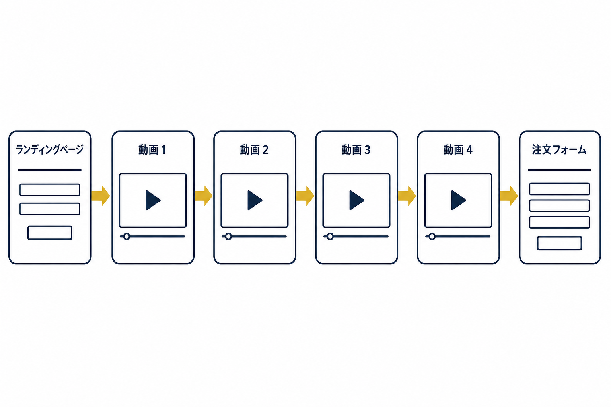
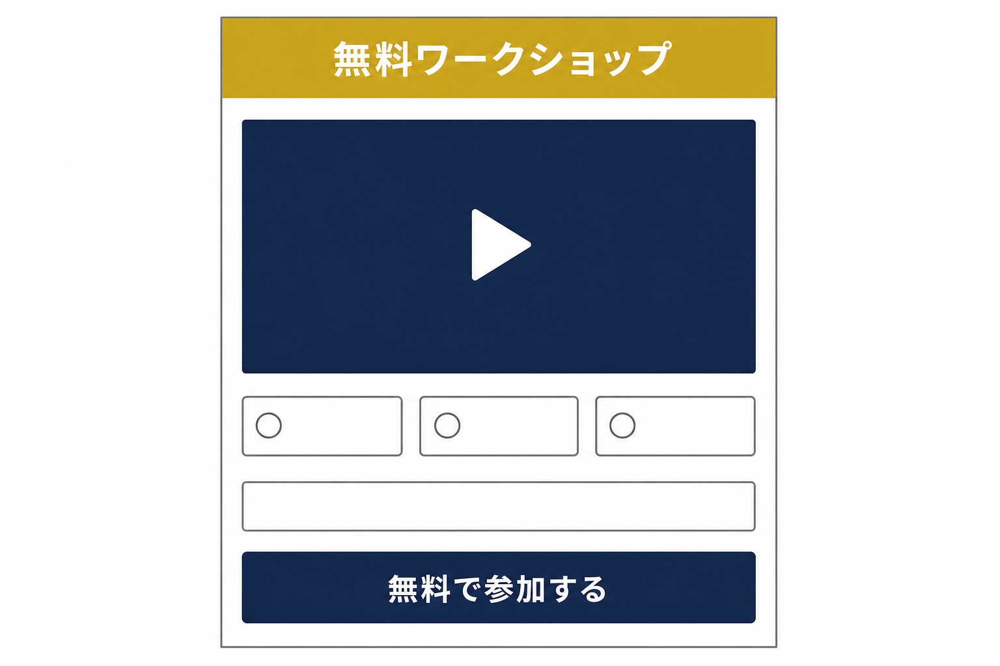
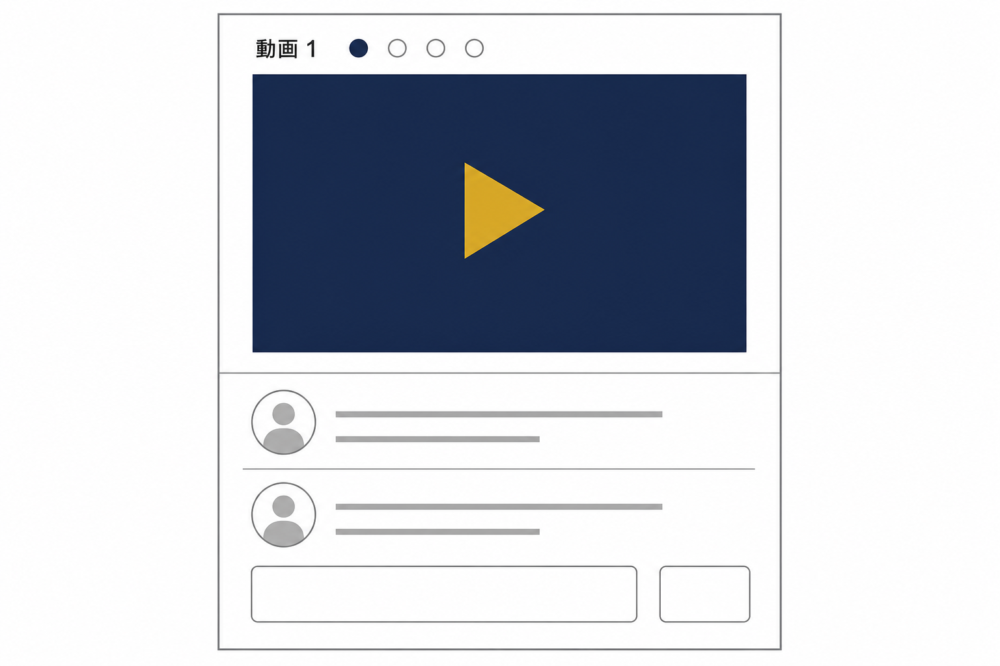
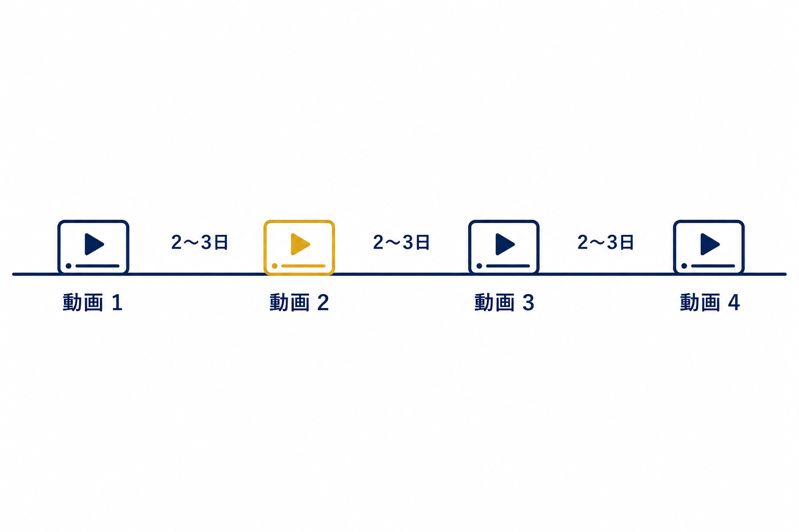
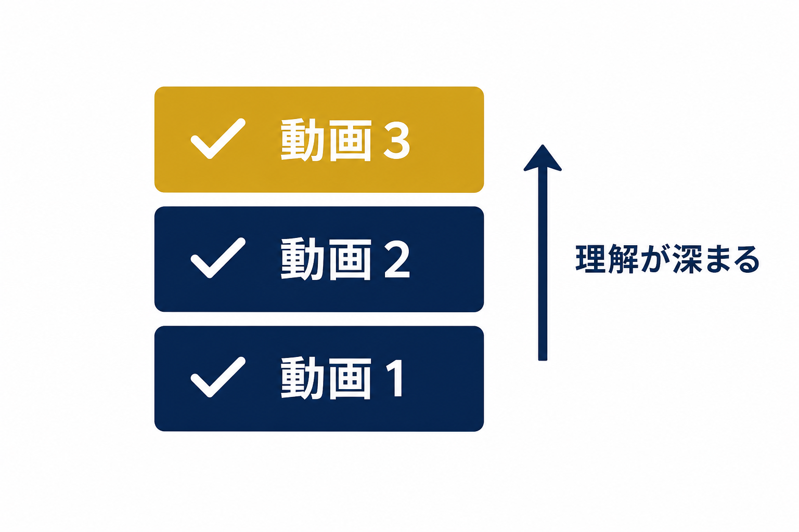
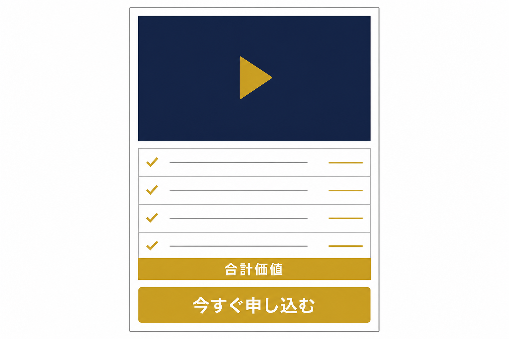
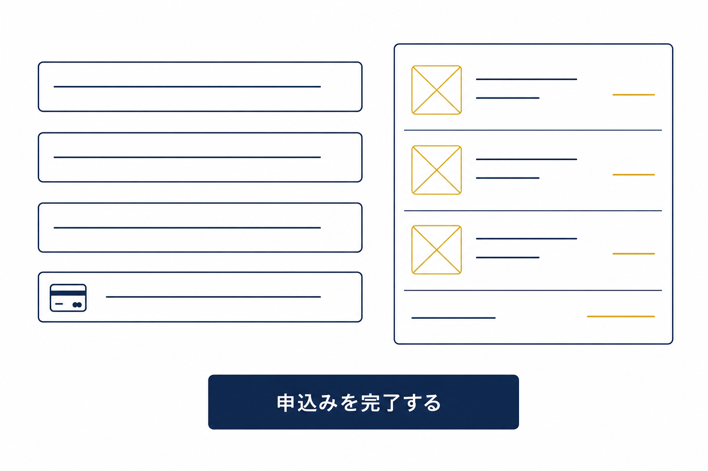

# 商品ローンチファネル（Product Launch Funnel）


商品ローンチファネル(PLF)は、マーケター Jeff Walker(ジェフ・ウォーカー)が「Product Launch Formula」として体系化した、**動画シリーズを数日間にわたって配信する**形のプレゼンテーションファネルです。Jeff Walker はこれを「横倒しのセールスレター(sideways sales letter)」と呼び、Russell Brunson(ラッセル・ブランソン)は「横倒しのパーフェクトウェビナー」とも表現しています。セールスの内容を複数日に分けて受け取ってもらうことで、1本の動画では作れない信頼と熱量を高めてからオファーを提示します。


<figure><figcaption></figcaption></figure>

### 商品ローンチファネルとは？

商品ローンチファネルは、4本の動画シリーズを数日間かけて順番に公開し、最後の動画でオファーを提示して販売する構成のファネルです。1回のウェビナー(90分)で完結させるパーフェクトウェビナーに対して、PLFは同じ流れ——フック、ストーリー、教え、オファー——を**複数日に引き伸ばした**「**時間差消費型**」だと考えると理解しやすいでしょう。

数日間にわたって動画を受け取り続けた視聴者は、商品の背景と中身を深く理解し、発信者への信頼を積み上げた状態でオファーに出会います。コーチング、オンラインコース、コミュニティといった「教育が必要な中〜高単価商品」のローンチと特に相性のよい型です。

典型的な流れは次の4段階です。

1. **ランディングページ:** 「無料ワークショップ」への参加登録をリードマグネットとして提示します。PDF配布型のリードマグネットと違い、**動画ワークショップそのものをオファーする**のがこのファネル最大の特徴です。
2. **動画1(原体験+最初のフレームワーク):** あなた自身がこの商品にたどり着いた転機のストーリーと、商品の中核をなす最初の概念を伝えます。
3. **動画2・動画3(第2・第3のフレームワーク):** 数日おきに、中核メソッドの続きを順番に公開していきます。各動画のページにはコメント欄を設置し、参加者同士の対話を促します。
4. **動画4(価値の提示+オファー):** ここまでの3本を振り返ったうえで、価格・価値・特典を提示してクロージングし、注文フォームへ誘導します。

### ファネル概要

このファネルは以下の6ステップで構成されています。

* ランディングページ（無料ワークショップのオファー）
* 動画 1（原体験+最初のフレームワーク）
* 動画 2（第2のフレームワーク）
* 動画 3（第3のフレームワーク）
* 動画 4（価値の提示+オファー）
* 注文フォーム

### ランディングページ

ランディングページは、コンテナウィジェットを土台に複数の要素を組み合わせて構築されています。ここでの目的は、**「無料ワークショップ」への参加登録**を獲得することです。

通常のリードマグネットファネルの「PDFをダウンロードしてもらう」オファーと違い、PLFのランディングページは「**動画ワークショップに申し込んでもらう**」設計になります。訪問者がフォームに情報を入力すると、登録者に動画1のリンクがメールで届きます。

<figure><figcaption></figcaption></figure>


**ヒント:** ファネルデザインのどの要素も、お好みに合わせて自由に編集できます。ワークショップの**開催日時を複数の候補から選択してもらう**形式にすると、「自分の予定に合わせて参加できる」と感じてもらえるため、登録率が上がりやすくなります。


### 動画 1（原体験+最初のフレームワーク）

登録直後、または配信初日に届く最初の動画です。この動画には2つの要素を含めます。

1. **原体験のストーリー** —— あなた自身がこの商品(メソッド)を必要とするようになった転機。何に悩み、何に気づき、何が変わったのか。
2. **最初のフレームワーク** —— 商品の中核をなす最初の概念・方法論。

動画ページには、**動画埋め込みウィジェット**と**コメントセクション**を配置します。参加者が互いにコメントを書き合うこと自体が、ワークショップとしての一体感とエンゲージメントを高める仕組みになります。

<figure><figcaption></figcaption></figure>


**ヒント:** 動画1の長さは、ウェビナーのように90分にする必要はありません。15〜30分程度の「濃い1本」にまとめ、参加者が確実に見切れるサイズに収めるのがセオリーです。複数日に分けて見てもらう設計だからこそ、1本1本は短めに。


### 動画 2（第2のフレームワーク）

数日後(通常は2〜3日後)に届く2本目の動画です。動画1が「あなたの原体験」なら、動画2は「**その気づきを体系化した最初の実践メソッド**」を伝えるパートです。

視聴者はこの動画で「これは本物の情報だ」と感じ始め、コメント欄での議論も活発になっていきます。

<figure><figcaption></figcaption></figure>

### 動画 3（第3のフレームワーク）

さらに数日後に届く3本目の動画で、商品の中核をなす最後のフレームワークを公開します。

ここまでの3本を通じて、視聴者は次のものを順番に受け取ったことになります。

* あなた個人の物語(動画1)
* 最初のメソッド(動画2)
* 最後のメソッド(動画3)

「横倒しのセールスレター」——つまり、セールスレターが持つ導入・ストーリー・教育のパートが、この3本で完成します。あとはオファーを提示するだけの状態です。

<figure><figcaption></figcaption></figure>

### 動画 4（価値の提示+オファー）

最終日に届く4本目の動画が、**オファーを提示する瞬間**です。この動画でやることは4つあります。

1. ここまでの3本を振り返る(視聴者に「学んできたこと」を思い出してもらう)
2. **価値の積み上げ(スタック)** を提示する——商品に含まれる要素を一つずつ開示し、価値の合計を見える化する
3. 価格・特典・保証を提示する
4. 購入ボタンから**注文フォーム**へ誘導する

<figure><figcaption></figcaption></figure>


**ヒント:** 動画4だけは他の3本より長めに作ります。ウェビナーのオファーパートに相当する重要な回なので、20〜40分の尺を取り、価値の積み上げ・価格開示・保証・締め切り(カートクローズ)を丁寧に行ってください。ここを短くしすぎると成約率が大きく下がります。


### 注文フォーム

動画4の最後にある購入ボタンをクリックした視聴者がたどり着く、決済のためのページです。商品名、決済情報、顧客情報を入力し、申込みを完了します。

注文フォームに到達した視聴者は、**すでに3本以上の動画を通じてあなたの教えを深く受け取った状態**です。通常のリードマグネット経由の見込み客よりも、はるかに高い熱量と理解度でこのページに到達しています。

<figure><figcaption></figcaption></figure>

---

## いつ使うべきファネルか？

商品ローンチファネルが特に力を発揮するのは、次のようなケースです。

* **中〜高単価の商品を「教育込みで」販売したいとき** —— ウェビナーファネルと並ぶ最有力の選択肢です
* **複数日に分けて体験してもらう価値のある商品** —— コーチング、オンラインコース、コミュニティのローンチなど
* **新商品のリリースで、締め切りを設けたカートクローズ型の売上を最大化したいとき**

一方で、すでにライブで90分話すことに慣れている場合は、1回で完結するウェビナーファネルの方が立ち上げが速い、という使い分けが一般的です。

OpusBoosterの商品ローンチファネルテンプレートは、この「4本の動画+注文フォーム」の構造をそのまま実装するためのものです。
