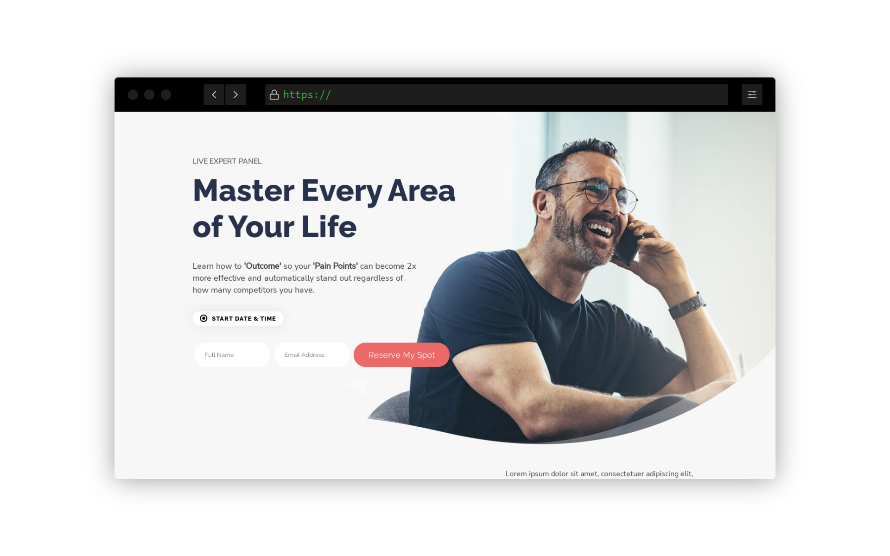
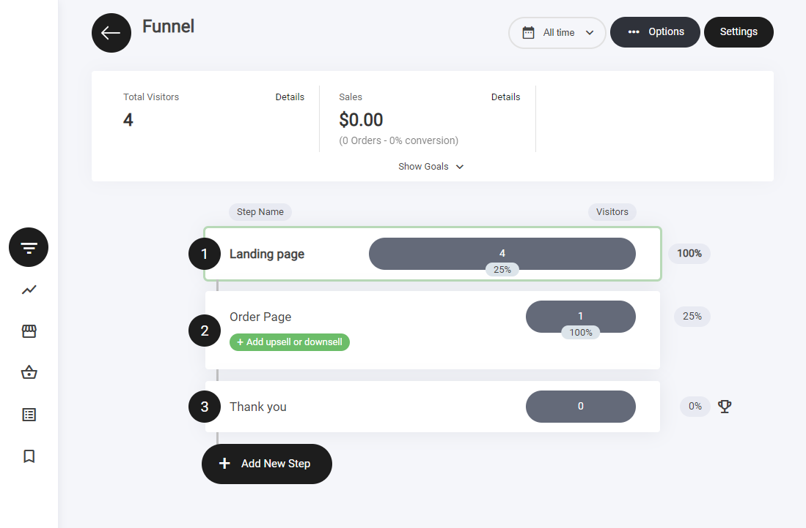
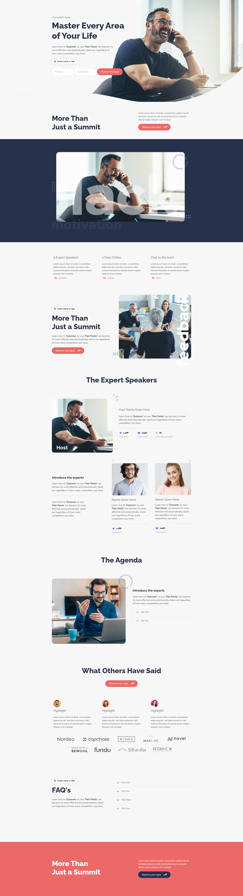
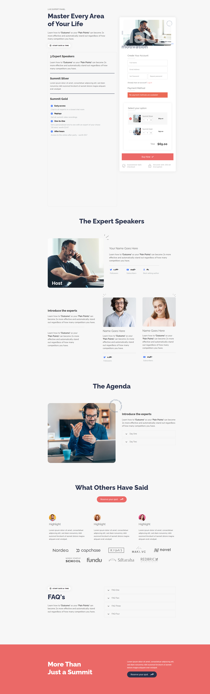
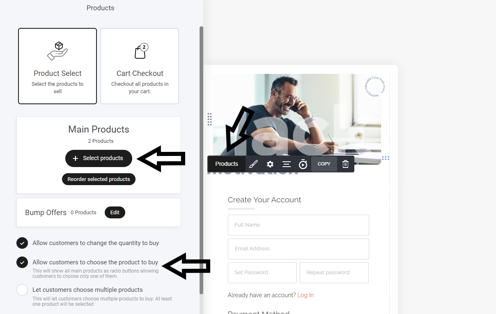
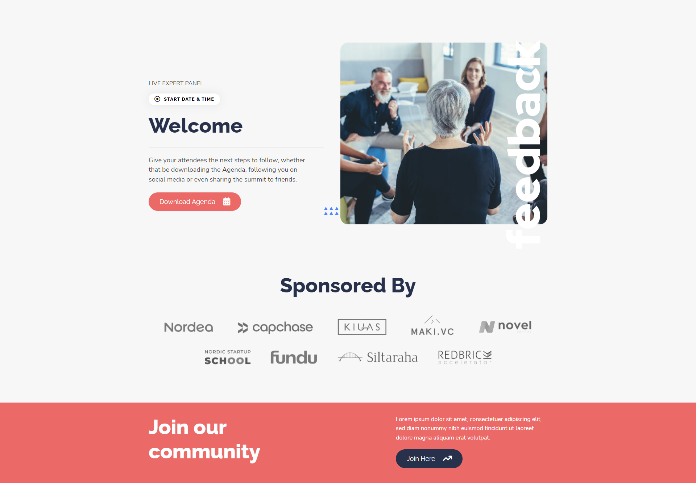

# サミットファネル

<figure><figcaption></figcaption></figure>

## サミットファネルとは

3ステップのサミットファネルは、オンライン開催または会場開催のサミット（大型イベント）を宣伝・販売するためにオンラインビジネスが使用する販売戦略です。ファネルは通常、次の3つのステップで構成されます。

**ステップ1：ランディングページ**\
見込み参加者が広告やリンクをクリックしたときに最初に目にするページです。ランディングページの主な目的は、訪問者の注意を引き、サミットへの登録を促すことです。このページでは通常、日時、場所、登壇スピーカーの一覧、扱うトピック、よくある質問への回答など、サミットに関する情報を提供します。

**ステップ2：注文ページ**\
見込み参加者が「登録する」や「参加する」をクリックすると、注文ページに移動します。このページには、サミットとチェックアウトプロセスに関する追加情報が含まれます。また、上位チケットへのアップグレードを提示することで、スピーカーとの個別コーチングや限定コンテンツへのアクセスなどの特典を提供できます。このページではスピーカーを改めて紹介し、参加するメリットを強調します。

**ステップ3：サンキューページ**\
参加者が登録と支払いを完了すると、サンキューページに移動します。このページは登録を確定し、サミットへのアクセス方法に関する案内を受け取るためにメールを確認するよう促すコールトゥアクション（CTA）を提供します。

3ステップのサミットファネルの目的は、見込み参加者にサミットへの登録を促す、シームレスで効果的な販売プロセスを作ることです。プロセスを明確なステップに分けることで、見込み参加者を登録プロセスへ導き、成約の可能性を高められます。さらに、追加機能や限定コンテンツ付きのアップグレードオプションを提供することで、サミットから追加の収益を生み出すこともできます。

## ファネルのステップ

ビルダー内では、この3ステップのファネルが表示され、機能させるために必要なすべてのステップが揃っています。

<figure><figcaption></figcaption></figure>

ファネルステップの横にあるトロフィーアイコンは目標達成を示し、訪問者が正常にアクションを起こしたことを表します。

**目標の追跡について：**

* **主要アクションでトリガーされます** – フォームの送信、CTAのクリック、購入などが該当します。
* **ファネル分析で確認できます** – 達成されたすべての目標は、ファネル分析タブで確認できます。

コンバージョンを監視し、ファネルのパフォーマンスを最適化するのに最適な方法です。

## ファネルの概要

このファネルは、次のステップで構成されます。

* ランディングページ
* 注文ページ
* サンキューページ

## ランディングページ

<figure><figcaption></figcaption></figure>

ランディングページは多くの要素で構築されており、それらはコンテナ内に配置されています。ここでの主な目的はリードの獲得です。次のステップに進んでもらえるよう、行動を促すのに十分な情報を提供します。

サミットファネルのフォーマットとレイアウトデザインは複数のコンテナに分割されており、すべての情報が正しく表示され、何より読みやすく理解しやすいようになっています。すべてのテンプレートには、何を書けばよいかの参考になるシンプルなテキストが用意されています。

**注意：** ファネルデザインのどの要素も、お好みに合わせて完全に編集できます。

## 注文ページ

訪問者がランディングページのボタンをクリックすると、次のステップとして商品が表示される注文ページに移動します。

<figure><figcaption></figcaption></figure>

このテンプレートの例では、より高価格の追加商品を用意することで、カートの売上を増やせるようにしています。チェックアウトには2つの商品が表示され、ユーザーはどちらのオプションを選ぶかを選択できます。

マルチプロダクトカートのチェックアウトオプションを使用すると、標準プランと上位プランなど、価格の異なる複数の商品から選んでもらう構成にできます。

<figure><figcaption></figcaption></figure>

## サンキューページ

前述のとおり、参加者が登録と支払いを完了すると、サンキューページに移動します。このページは登録を確定し、サミットへのアクセス方法に関する案内を受け取るためにメールを確認するよう促すコールトゥアクション（CTA）を提供します。

<figure><figcaption></figcaption></figure>
