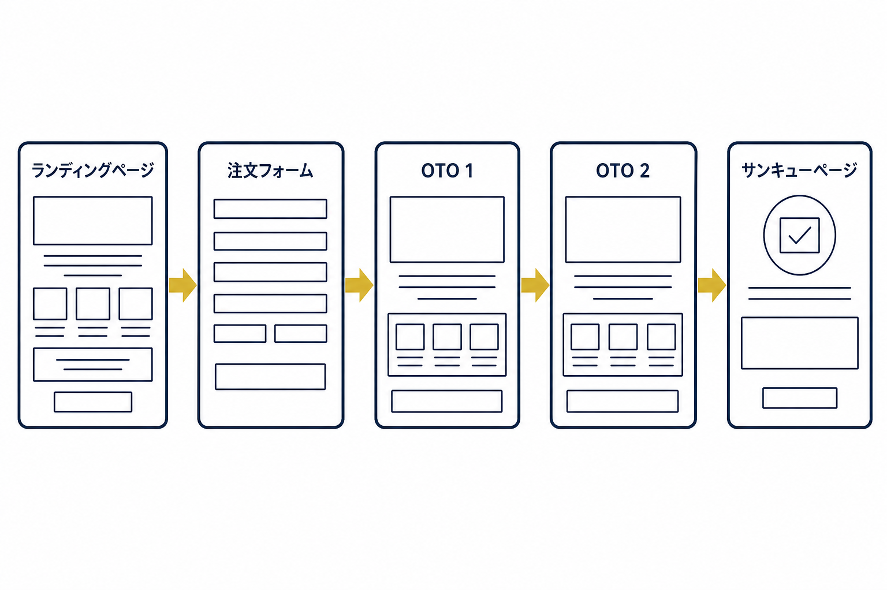
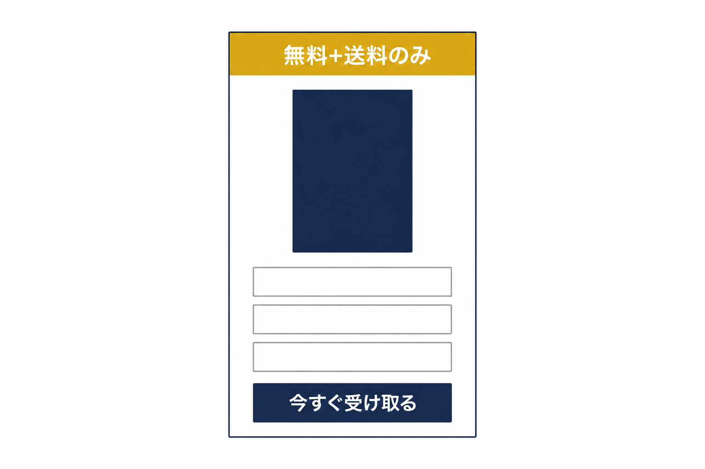
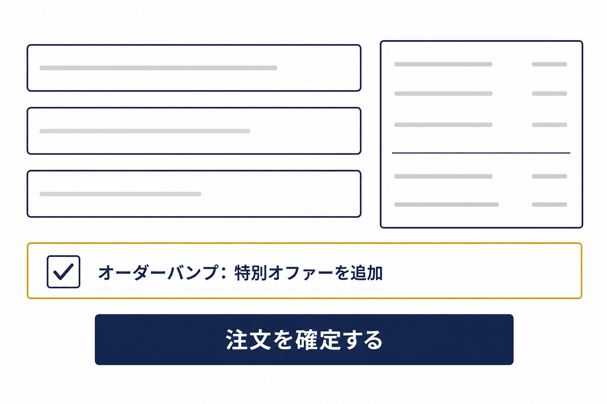
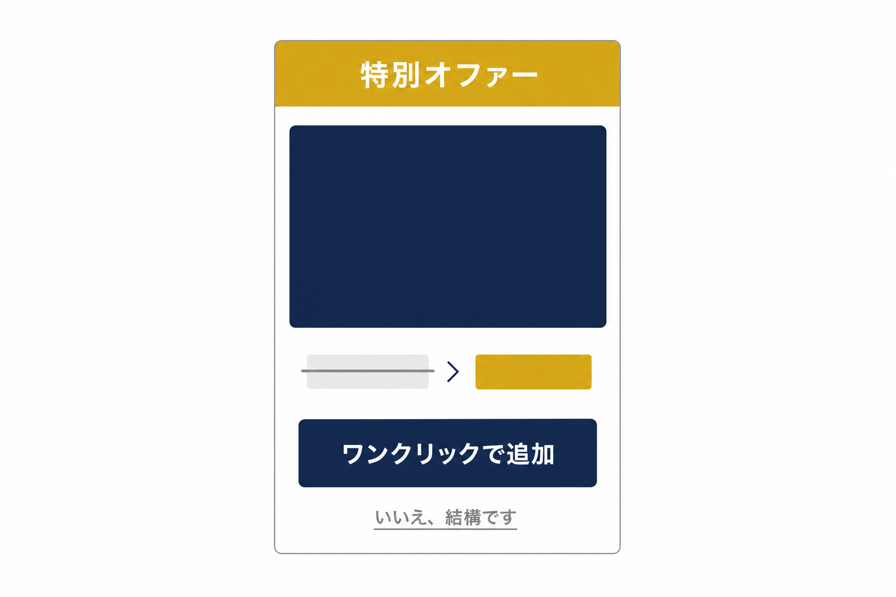
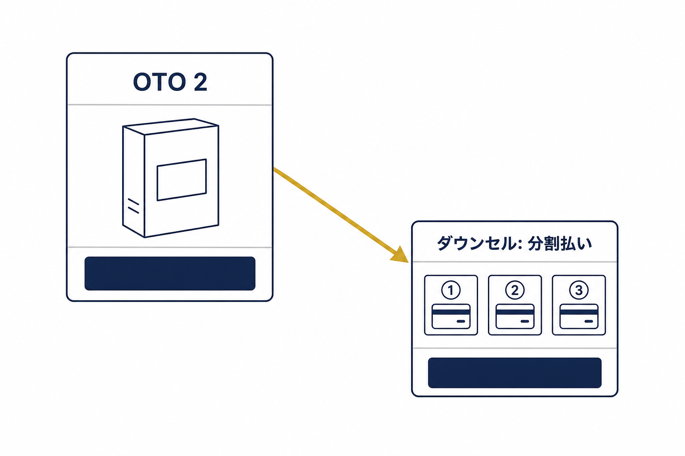
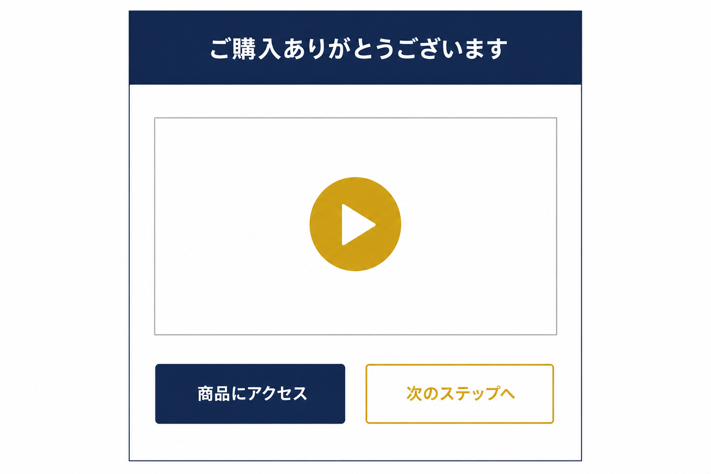

# トリップワイヤーファネル


トリップワイヤーファネルは、マーケター Russell Brunson(ラッセル・ブランソン)が著書『DotCom Secrets』で広めた「バリューラダー」の最下層に位置するファネルです。メールアドレスの獲得ではなく、**はじめての見込み客に「クレジットカードを取り出す経験」をしてもらう**ことを目的とします。


<figure><figcaption></figcaption></figure>

### トリップワイヤーファネルとは？

トリップワイヤーファネルは、まだ関係の浅い見込み客を「リストの読者」から「**買い客(一度でも購入した人)**」へと転換するためのファネルです。無料+送料、あるいは数百円〜千円台の低価格商品を入口にして、まず小さな購入体験をしてもらう——そのうえで、より上位の商品(講座・コミュニティ・高単価サービス)へと段階的に案内していく、バリューラダーの入口として機能します。

一度でも財布を開いたお客様は、まだ何も買っていない読者に比べて、次の商品を購入する可能性が大幅に高いことが知られています。トリップワイヤーファネルの本当の狙いは、入口商品の売上そのものではなく、**この「最初の一線」を越えてもらうこと**にあります。

### ファネル概要

このファネルは以下の5ステップで構成されています。

* ランディングページ
* 注文フォーム
* OTO 1（One-Time Offer）
* OTO 2
* サンキューページ

さらに発展形として、「入口オファー → 低価格商品 → 本命商品 → 分割払いのダウンセル → 高単価商品」と積み上げていく構成が知られています。OpusBoosterのトリップワイヤーファネルテンプレートは、その土台となる5ステップを実装するためのものです。

### ランディングページ

ランディングページは、コンテナウィジェットを土台に複数の要素を組み合わせて構築されています。ここでの目的は2つ——**メールアドレスを獲得すること**、そして「**無料+送料**」または「**低価格商品**」のオファーを提示して、最初の取引への入口を作ることです。

構成はモバイルでも読みやすい1カラムの縦長レイアウトが基本で、冒頭でオファー(何が・いくらで・なぜお得か)を明確に提示します。訪問者がフォームに情報を入力すると、次のステップへ進みます。

<figure><figcaption></figcaption></figure>


**ヒント:** ファネルデザインのどの要素も、お好みに合わせて自由に編集できます。低価格で販売するよりも、送料のみを負担してもらう「**無料+送料**」の形の方が反応が良いケースが多い、というのがこのファネル類型でよく知られた経験則です。「無料」という言葉の持つ力を活かせるオファー設計を検討してみてください。


### 注文フォーム

この例では、注文フォームを1ステップで購入が完了するシンプルな構成にしています。ここで重要なのが「**オーダーバンプ(Order Bump)**」です。

オーダーバンプとは、注文フォーム内に置かれたチェックボックス1つで追加商品を購入できる仕組みのことです。メイン商品の購入動線を妨げずに、関連性の高い商品(例: オーディオ版、テンプレート集、ライブ講座へのアクセス権など)を「ついで買い」として提案でき、**平均注文額を大きく引き上げる**効果があります。オーダーバンプは1つに限らず、2つ設置する構成もよく使われます。

<figure><figcaption></figcaption></figure>

### OTO 1（One-Time Offer）

注文完了直後に表示される、追加購入用のページです。「**購入した直後こそ、お客様の熱量が最も高い瞬間**」——これがワンタイムオファーの根拠になっている原則です。

メイン商品に関連する商品(上位版、バンドル、コースなど)を、通常より有利な特別価格で「今だけ」提案します。構成は「商品価値の訴求 → 特別価格の提示 → ワンクリックで購入」の流れが基本です。

<figure><figcaption></figcaption></figure>


**注意:** OTOは「**ワンクリックで購入が完了する**」設計が必須です。決済情報の再入力を求めると、離脱率が大きく上がります。また、「いいえ、結構です」のリンクは購入ボタンより控えめに配置するのがセオリーです。


### OTO 2

OTO 1で「いいえ」が選ばれた場合(または購入後)に表示される、第2のアップセルです。ポイントは、OTO 1とは**別の切り口**の商品を提示すること。たとえばOTO 1が「メイン商品の上位版」なら、OTO 2は「関連する別テーマのコースやコミュニティ」といった具合です。

また、OTO 2で価格がネックになって断られるケースに備えて、**分割払いのダウンセル**(例:「一括ではなく3回払いでいかがですか?」)を用意しておくと、取りこぼしを減らせます。OpusBoosterのテンプレートでは、ダウンセルをOTO 2の代替ページとして設定できます。

なお、OTOは毎回ゼロから作る必要はありません。自社の高単価商品を、関連性の出るファネルで**繰り返し使い回す**のが効率的な運用方法です。

<figure><figcaption></figcaption></figure>

### サンキューページ

最終ステップはサンキューページです。購入への感謝を伝え、商品へのアクセス情報と、次のアクションを案内します。

発展的な使い方として、サンキューページに**動画(ウェビナー)を埋め込む**パターンがあります。購入直後の熱量が高いタイミングで、60〜90分程度のウェビナー動画を視聴してもらい、その中で中〜高単価の商品を案内する——サンキューページを「次のセールスへの入口」として活用する考え方です。

OpusBoosterのテンプレートでは、サンキューページに動画埋め込みウィジェットと、次の商品へのリンクやカレンダー予約ボタンを配置することで、この構造をそのまま再現できます。

<figure><figcaption></figcaption></figure>
