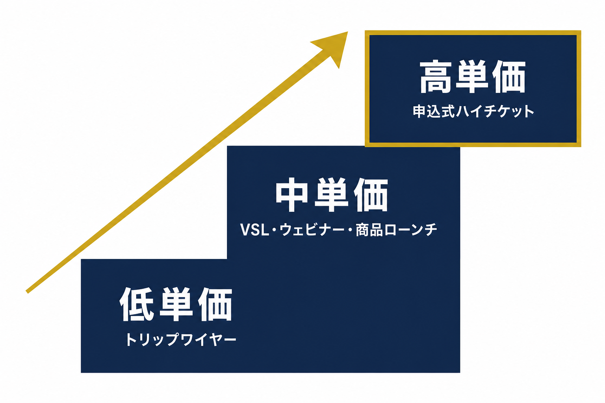

# ファネルの種類一覧（バリューラダー別ガイド）


OpusBoosterで利用できるファネルタイプを、マーケター Russell Brunson(ラッセル・ブランソン)が著書『DotCom Secrets』で提唱する「**バリューラダー(Value Ladder)**」のレイヤーに沿って一覧で紹介します。各ファネルはそれぞれ独立して機能するので、「下から順番に登る」ことも可能ですが、**自分のビジネスに今必要な1つから始める**のが正攻法です。


<figure><figcaption></figcaption></figure>

### 3つのコアファネル早見表

数あるファネルの中でも、「売る」ためのコアになるのは次の3つです。商品の価格帯によって使い分けます。

| ファネル | 価格帯 | 使用場面 |
| --- | --- | --- |
| [トリップワイヤーファネル](tripwire-funnel.md) | 低単価 | バリューラダーの底辺。「買い客」を作る入口 |
| [VSLファネル](vsl-funnel.md)／[ウェビナーファネル](webinar.md) | 中単価 | バリューラダーの中核。教育付きで売る |
| [申込式ハイチケットファネル](application-funnel.md) | 高単価 | バリューラダーの頂点。1対1の個別相談で売り切る |

境界になるのは「**動画やウェビナーを見ただけで決断できる価格かどうか**」です。ある水準を超える高単価商品は、大勢に一斉に提案する形式では成約しきれず、1対1の対話が必要になります。逆に、その水準までの商品は、ウェビナーやVSLで効率よく販売できます。

---

## ファネルを7つのレイヤーで分類

### 🎯 1. リード獲得レイヤー（見込み客のメールアドレスを集める）

見込み客の連絡先を獲得し、メールリストを構築するためのファネル群です。無料の特典(リードマグネット)と引き換えに登録してもらう形が基本で、すべてのマーケティングの最前線に位置します。

| ファネル名 | 目的 |
| --- | --- |
| [リードジェネレーション](lead-generation.md) | 見込み客の連絡先情報を獲得する2ステップファネル |
| [オプトイン](opt-in.md) | メールリスト登録専用のシンプルなファネル |
| [デジタルダウンロード](digital-download-funnel.md) | 電子書籍などのデジタル商品を配布・販売 |

### 💰 2. 販売レイヤー（低〜中単価の商品を売る）

メールアドレスを獲得したリードを、**実際に財布を開く**「**買い客**」に変えるファネル群です。リード獲得の直後に低単価商品への入口を用意して「買い客化」し、そこから中単価へと引き上げていく設計が定石です。

| ファネル名 | 価格帯 |
| --- | --- |
| [トリップワイヤーファネル](tripwire-funnel.md) | 低単価（無料+送料〜千円台の入口商品） |
| [VSL（ビデオセールスレター）ファネル](vsl-funnel.md) | 中単価（1本のセールス動画で完結） |
| [商品ローンチファネル](product-launch-funnel.md) | 中単価（4本の動画シリーズで販売） |

まずはバリューラダーの底辺——[トリップワイヤーファネル](tripwire-funnel.md)——から始めるのが定石です。低単価でも一度購入したお客様は、まだ何も買っていない読者よりはるかに次の商品を買いやすくなります。

### 📚 3. 教育・エンゲージメントレイヤー（価値を提供して信頼を構築）

リストやSNSフォロワーに**具体的な成果**を提供し、購買前の信頼と熱量を作るファネル群です。ポイントは「教える」だけでなく「**完成させてもらう**」体験まで踏み込むこと。参加者が「これを作り上げた」と言える状態が、次の商品への最強の動機になります。

| ファネル名 | 形式 |
| --- | --- |
| [ウェビナーファネル](webinar.md) | 90分のライブ/録画プレゼンテーション |
| [チャレンジファネル](challenge-funnel.md) | 5日間の無料チャレンジ企画 |

### 💎 4. ハイチケット個別セールスレイヤー（高単価を1対1で売り切る）

高単価商品は、ウェビナーやVSLでは成約しきれず、**1対1の個別相談(オンライン/電話)でのご案内**が必要です。コーチング、コンサルティング、代行サービスなど、バリューラダーの頂点に置く商品のためのレイヤーです。

| ファネル名 | 価格帯 |
| --- | --- |
| [申込式ハイチケットファネル](application-funnel.md) | 高単価（申込フォーム+個別相談で販売） |

### 📅 5. プロファイル・予約レイヤー（ブランド・予約の導線を作る）

SNSのプロフィールリンクや、個別相談の予約など、**ブランドの中核となる導線**を作るファネル群です。

| ファネル名 | 目的 |
| --- | --- |
| [ヒーロー](hero.md) | 複数のリンクを1ページにまとめる、SNSプロフィール向け |
| [アポイントメント予約](appointment-booking.md) | 面談や相談の予約を受け付ける |
| [オンボーディング](onboarding.md) | クイズを使って新しいユーザーを製品・サービスに導く |

### 🎓 6. コンテンツ提供レイヤー（コース・会員制の運営）

購入後の顧客に**継続的な価値**を提供し、顧客生涯価値(LTV)を最大化するためのファネル群です。フロントエンドの販売ファネルとは独立して機能します。

| ファネル名 | 目的 |
| --- | --- |
| [オンラインコースファネル](online-course-funnel.md) | オンラインコースの販売・受講動線を作る |
| [メンバーシップファネル](membership-funnel.md) | 会員制コンテンツへの入会を促す |

### 🚀 7. イベントレイヤー（サミット・特別イベントの開催）

オンラインイベント(サミット)のように、**短期間に大量のトラフィックとリストを集める**ためのファネル群です。

| ファネル名 | 目的 |
| --- | --- |
| [サミットファネル](summit-funnel.md) | オンラインイベント（サミット）の集客用 |

---

## 自分のビジネスに必要なファネルは？

バリューラダーの原則に従えば、今のフェーズから逆算して選ぶのが近道です。

1. **メールアドレスだけ集めたい段階** → [リードジェネレーション](lead-generation.md)／[オプトイン](opt-in.md)
2. **低単価の入口商品でリストを「買い客」に変えたい段階** → [トリップワイヤーファネル](tripwire-funnel.md)
3. **教育込みで中単価を売りたい段階** → [ウェビナー](webinar.md)／[商品ローンチ](product-launch-funnel.md)／[VSL](vsl-funnel.md)
4. **5日間の体験で濃いエンゲージメントを作りたい段階** → [チャレンジファネル](challenge-funnel.md)
5. **高単価を1対1で売りたい段階** → [申込式ハイチケットファネル](application-funnel.md)

「今のビジネスフェーズがどこであっても、**必要なのはたった1つのファネル**」——これはRussell Brunsonが著書の中で繰り返し伝えるメッセージです。全部を一度に作る必要はありません。今のあなたに必要な1つを選んで、まずそれを完成させましょう。

各ファネルの詳しい構成と使い方は、表内のリンクからそれぞれの解説ページをご覧ください。
