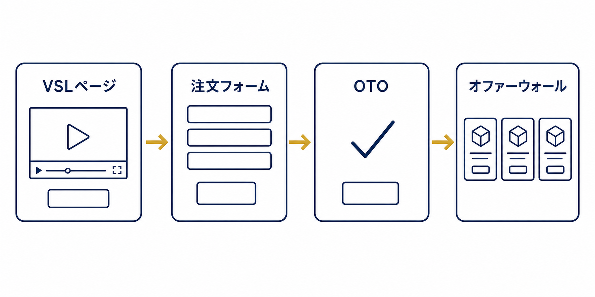
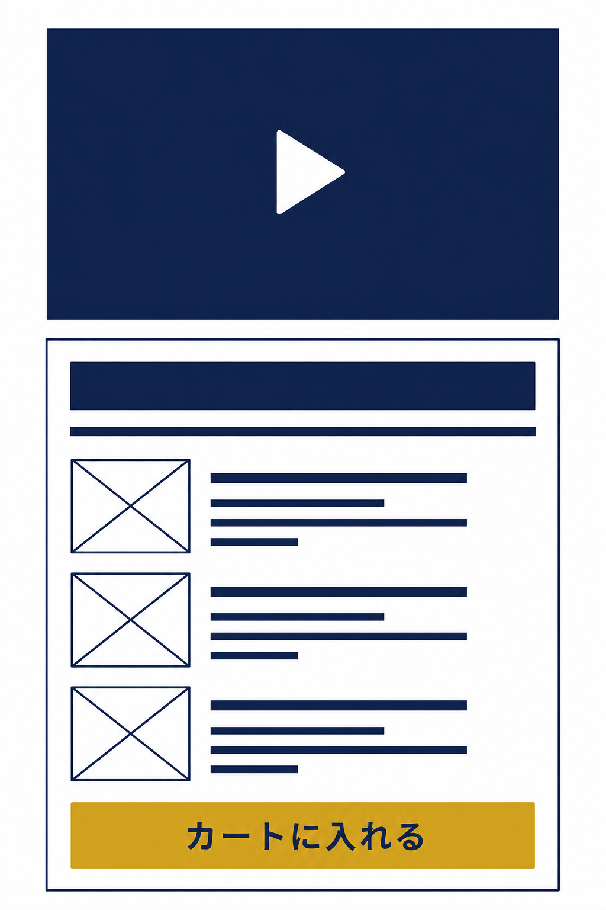
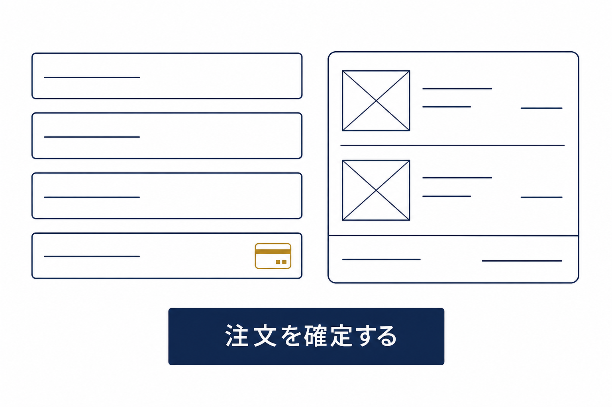
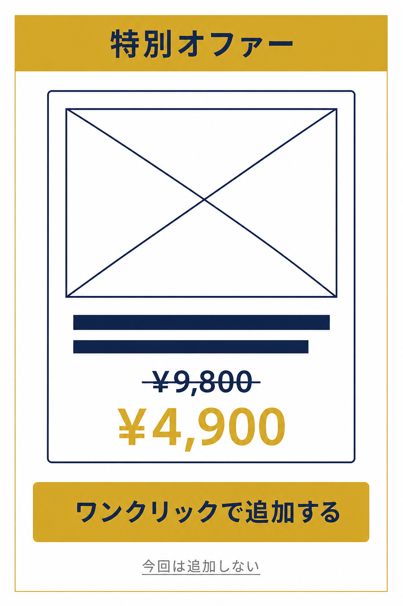
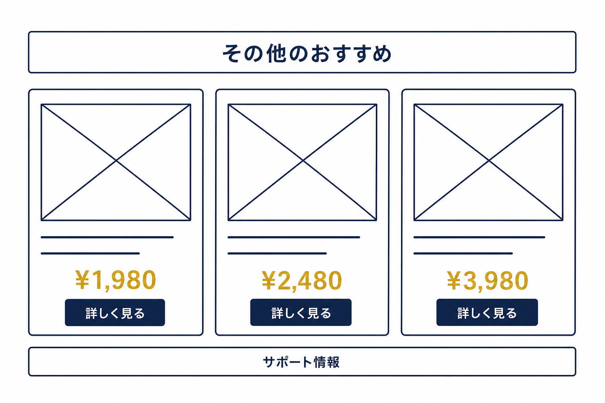

# VSL（ビデオセールスレター）ファネル


VSLファネル（Video Sales Letter Funnel）は、マーケター Russell Brunson(ラッセル・ブランソン)がコアファネルのひとつとして位置づける、「**1本のセールス動画**」で完結する直接レスポンス型のファネルです。90分のライブプレゼン+Q&Aで構成されるウェビナーファネルに対して、VSLファネルは「録画された1本の動画+注文フォーム+OTO+オファーウォール」というシンプルな構成で成約までつなぎます。


<figure><figcaption></figcaption></figure>

### VSLファネルとは？

VSLファネルは、「**1本のセールス動画**」を中心に据えたファネルです。ライブで90分話すウェビナーファネルに対して、VSLファネルは録画済みの動画1本と注文フォームだけで販売動線が完結するため、より少ないステップ・より短い動線で成約までつなぐことができます。

動画の中身には、ウェビナーと同じ「**フック → ストーリー → オファー**」のフレームワークが使われます。つまりVSLは、ウェビナーの動画部分だけを取り出して圧縮した形だと考えると理解しやすいでしょう。語るべき核心は、あなた自身の転機のストーリー(エピファニーブリッジ)です。専門用語を並べるのではなく、「かつて視聴者と同じ場所にいたあなたが、何に気づいて、どう変わったのか」を伝えることが、この動画の中心になります。

典型的な流れは次の4段階です。

1. **VSLページ:** セールス動画を直接埋め込んだ、ファネルの入口となるセールスページです。動画のすぐ下に注文ボタンと「動画の内容を予告する要約ボックス」を配置するのが定石です。
2. **注文フォーム:** 動画下の「カートに入れる」ボタンから遷移する、1ステップで購入が完了する決済ページです。
3. **OTO(ダウンセル付き):** 注文直後に表示される追加購入ページです。断られた場合に備えて、分割払いや低価格版のダウンセルも併設します。
4. **オファーウォール:** 関連する複数の商品・オファーを一覧で提示する、ファネルの最終ステップです。

### ファネル概要

このファネルは以下の4ステップで構成されています。

* VSLページ（セールス動画+要約ボックス）
* 注文フォーム
* OTO（ダウンセル付き）
* オファーウォール

### VSLページ

VSLページは、コンテナウィジェットを土台に複数の要素を組み合わせて構築されています。ここでの目的は、「**1本のセールス動画**」で商品の価値提案をすべて完結させ、視聴者を「カートに入れる」ボタンへ誘導することです。

このページのレイアウトの核になるのが、動画の直下に置く「**要約ボックス**」です(考案者の名前から「Brunson Box」「ビデオスポイラーボックス」とも呼ばれます)。動画の中から興味と好奇心を引き出す要素を抜き出して見せることで、視聴者に「この動画は最後まで見る価値がある」と感じさせ、視聴時間を延ばす仕組みです。

要約ボックスに入れる4つの要素:

1. **ヘッドライン** — 動画の話題を凝縮した、注意を引く見出し
2. **サブヘッドライン** — 信頼性を高め、好奇心をさらに増す補足文
3. **画像+フィーチャーヘッドライン(3〜4個)** — 商品の中身を象徴する画像と、価値を表すキーワード
4. **「カートに入れる」ボタン** — 購入動線を一箇所に集約

<figure><figcaption></figcaption></figure>


**ヒント:** ファネルデザインのどの要素も、お好みに合わせて自由に編集できます。VSL動画は、誇張ではなく「実感のこもったストーリー」で構成するのが鍵です。ウェビナーと違ってQ&Aがない分、動画の中のストーリーからオファーへの流れをより凝縮して作り込む必要があります。


### 注文フォーム

この例では、注文フォームを1ステップで購入が完了するシンプルな構成にしています。商品名、料金、顧客情報、決済情報を1ページ内で入力できるようにまとめてあります。VSL動画のすぐ下の「カートに入れる」ボタンから、このフォームへ直接遷移させます。

注文フォームには、商品説明とプライスウィジェットを組み合わせて、申込み直前に購入者の納得感を高めています。あわせて、価格に対する価値訴求(アンカリング効果)を入れることで、成約率の底上げが期待できます。

<figure><figcaption></figcaption></figure>


**ヒント:** 注文フォームに「**オーダーバンプ**」(チェックボックス1つで関連商品を追加購入できる仕組み)を配置する構成もよく使われます。たとえば低価格のメイン商品に、より高単価のトレーニングコースをアップグレードとして添える、といった組み合わせが定番です。


### OTO（ダウンセル付き）

注文完了直後に表示される、追加購入用のワンクリック・ページです。根拠になっているのは「**購入直後こそ、お客様の反応が最も高い瞬間**」という原則です。OTOで断られた場合に備えて、ダウンセルを併設するのがこのファネルの標準形です。

**OTOの中身:**

* メイン商品より高単価のアップグレード商品（例: 物理版、上位コース、コミュニティアクセス）
* 通常価格より有利な特別価格を、ワンクリックで購入できる動線

**ダウンセルの中身**（OTOで断られた場合）:

* 分割払いプラン（一括払いの代わりに複数回払いを提案）
* 低価格の代替商品（デジタル版、ライト版）

<figure><figcaption></figcaption></figure>


**注意:** OTOは「ワンクリックで購入が完了する」設計が必須です。また、「いいえ、結構です」のリンクは購入ボタンより小さく、目立たない場所に配置するのがセオリーです。


### オファーウォール

ファネルの最終ステップは「**オファーウォール**」です。商品をひとつ購入したお客様に「他にもこんな商品があります」と関連商品を一覧で提示するページで、複数の商品を扱っている場合に、バリューラダーの他の商品へと誘導する動線として機能します。

オファーウォールでよく使われる構成要素:

* **関連商品のサムネイル+価格+短い説明文** × 3〜6個
* **「詳しく見る」リンク**（それぞれの個別セールスページへ）
* **顧客サポート情報**（電話番号、ライブチャットなど）

<figure><figcaption></figcaption></figure>

---

## いつ使うべきファネルか？

VSLファネルが特に力を発揮するのは、次のようなケースです。

* **1本の動画で完結する商品を販売したいとき** — ウェビナーのようなQ&Aが不要な商品や、ライブ開催のリソースがないとき
* **低〜中単価の商品を、ウェビナーより短い動線で売りたいとき**
* **リストや広告トラフィックに十分なリードがいる状態で、1本の動画で一気に販売したいとき**
* **ウェビナーと同じ「フック → ストーリー → オファー」の構造を、録画で回したいとき**

セールス動画の直下に注文フォームを置くこのレイアウトは、数多くのテストで最も高いコンバージョンを出してきた型として知られています。ウェビナーファネルを補完する常設のセールス動線としても強力です。

OpusBoosterのVSLファネルテンプレートは、この「VSLページ+注文フォーム+OTO+オファーウォール」の構造をそのまま実装するためのものです。
