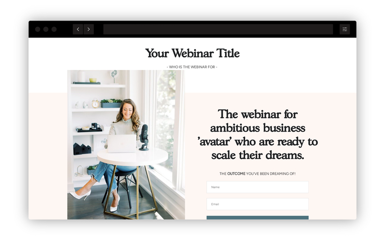
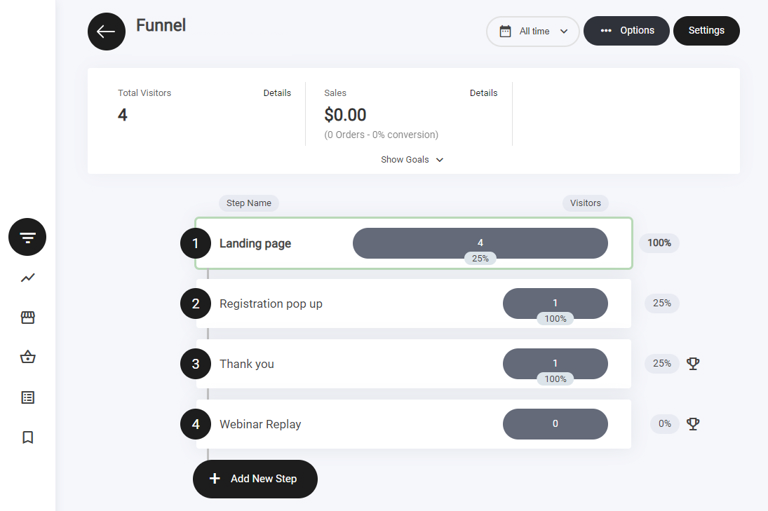
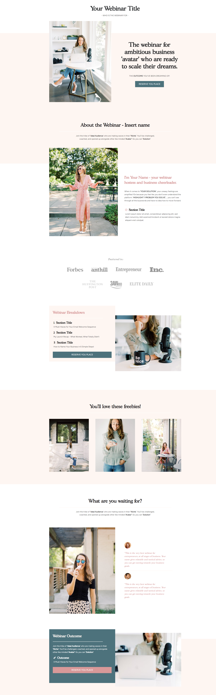
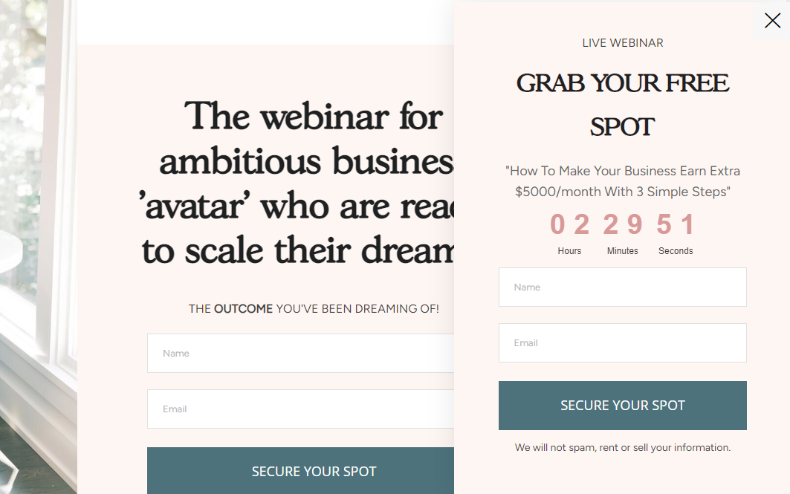
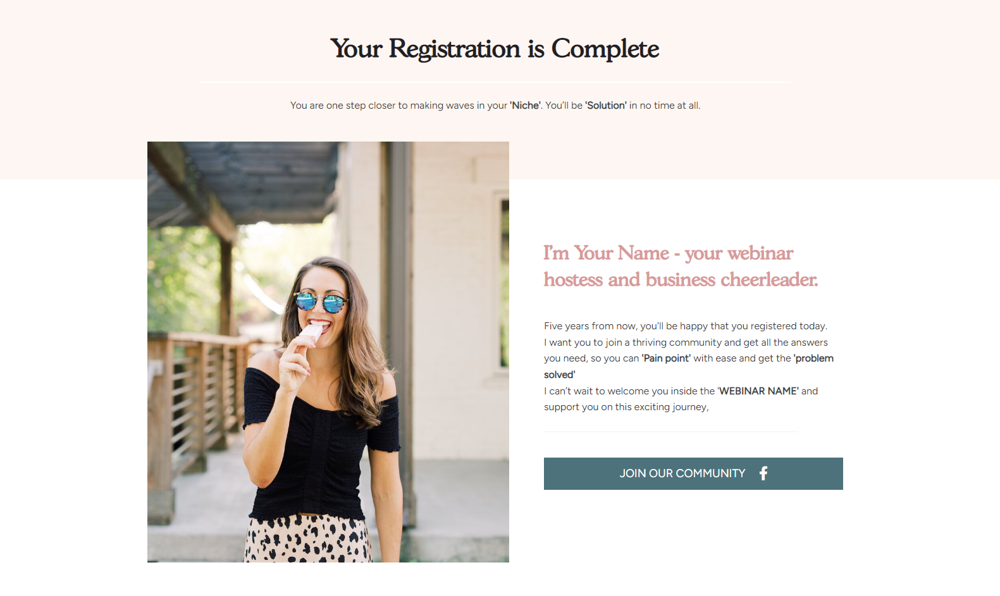
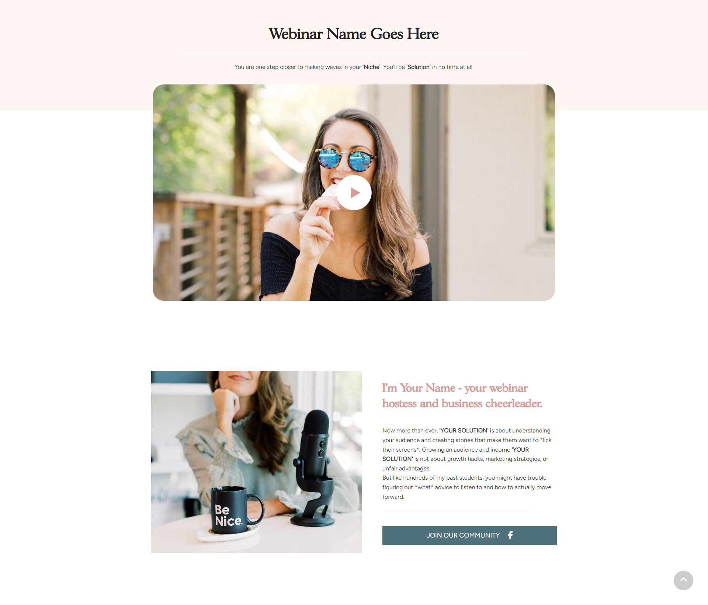

# ウェビナー


ウェビナーファネルのテンプレートは、4つのファネルステップで構成されています。

1. ランディングページ
2. 登録ポップアップ
3. サンキューページ
4. ウェビナーリプレイ


<figure><figcaption></figcaption></figure>

### ウェビナーファネルとは？

ウェビナーファネルは、潜在顧客を引きつけてウェビナーの参加者に変えることを目的としたマーケティング戦略です。4ステップのウェビナーファネルは、一般的に次のステップで構成されます。

1. **ランディングページ：** ファネルの最初のステップです。ウェビナーの内容、参加するメリット、参加者が学べることを伝えるページを作成します。ランディングページには明確な行動喚起（CTA）を置き、訪問者を登録へ誘導します。
2. **登録ポップアップ：** 訪問者がランディングページのCTAをクリックすると、名前やメールアドレスなど必要な情報を入力できる登録ポップアップが表示されます。潜在的な参加者の情報を取得するための重要なステップです。
3. **サンキューページ：** 訪問者が情報を送信すると、サンキューページにリダイレクトされます。このページでは登録への感謝を伝え、今後の流れ（ウェビナーへの参加方法など）を案内します。あわせて、メールオートメーションで確認メールを送ることもできます。
4. **ウェビナーリプレイページ：** ファネルの最終ステップで、ウェビナー実施後に使用します。ライブを見逃した参加者が録画版を視聴できるページです。ウェビナー中に紹介した商品やサービスの案内にも活用できます。

この4ステップのウェビナーファネルに沿って進めることで、潜在顧客を効果的にウェビナー参加者へ、そして最終的には有料顧客へと導くことができます。

### ファネルのステップ

ビルダー内では、上記4つのステップがすべて揃った状態で表示されます。

<figure><figcaption></figcaption></figure>


**注意：** 訪問者が**ランディングページ**でアクションを完了すると、ファネル内の**目標**を達成したことになります。

**目標の確認方法：**

* **特定のアクションでトリガーされる** – フォームの送信やCTAのクリックなど、訪問者がマイルストーンに到達すると目標達成としてカウントされます。
* **ファネル分析タブで確認できる** – すべての目標を追跡し、コンバージョンを測定できます。

ファネルのパフォーマンスを分析・最適化するための強力な手段です。


### ファネル概要

このファネルは以下のステップで構成されています。

* ランディングページ
* 登録ポップアップ
* サンキューページ
* ウェビナーリプレイ

### ランディングページ

ランディングページは、コンテナウィジェットを土台に多くの要素を組み合わせて構築されています。ここでの主な目的は、ウェビナーのリードを獲得することです。訪問者が次のステップへ進みたくなるだけの十分な情報を提供し、リード情報の取得には**フォームウィジェット**を使用します。ユーザーがフォームに入力すると次のステップへ進みます。この過程でメールアドレスを取得し、メールリストに追加します。

ウェビナーファネルのレイアウトは、すべての情報が正しく表示され、何より読みやすく理解しやすいように複数のコンテナに分割されています。すべてのテンプレートには、何を書けばよいかの手がかりになる簡単なサンプルテキストが入っています。

<figure><figcaption></figcaption></figure>


**注意：** ファネルデザインのどの要素も、お好みに合わせて自由に編集できます。


### 登録ポップアップ

この例では、登録ポップアップを画面の右下に表示するように配置しています。表示方法は複数あり、実施するウェビナーキャンペーンの種類によって、ポップアップに載せる情報も変わります。

この例のポップアップにはタイマーウィジェットを入れて、登録の重要性とウェビナーの開催日を強調しています。あわせて、必要なフォームフィールドも配置しています。

<figure><figcaption></figcaption></figure>


ランディングページにはボタンとフォームウィジェットの両方があることに気付いたかもしれません。ファネルの優れた点は、上から下だけでなく、下から上にも機能することです。ユーザーが特定のアクションを取ったら、ファネル内の任意のステップへ移動させることができます。ランディングページのフォームの場合、フォームが記入されたらポップアップをスキップして、そのままサンキューページへ送っています。


### サンキューページ

実施するウェビナーキャンペーンの種類によって、サンキューページに必要な情報が変わります。

この例では、ランディングページの目的はウェビナーのリードを獲得してメールリストを構築することでした。サンキューページでは、確認メールを送信したことを伝え、ボタンウィジェットを追加してコミュニティに参加してもらうためのリンクを設けています。

<figure><figcaption></figcaption></figure>

### ウェビナーリプレイ

ウェビナーを開催した後は、見逃した人向けの再視聴用、あるいは販売促進用としてリプレイを公開したいケースが多くあります。リプレイページの構成は非常にシンプルで、動画の埋め込みと、コミュニティ参加への行動喚起で構成されています。必要に応じて、販売したい商品を埋め込むこともできます。

<figure><figcaption></figcaption></figure>
